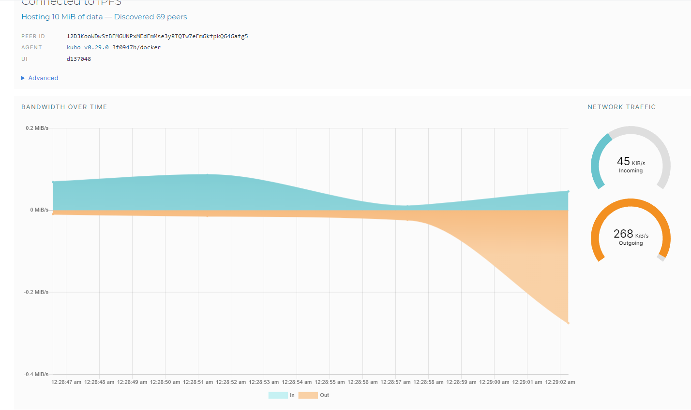

# Task 1: Set Up an IPFS Gateway Using Docker

As you can see, I have 69 peers. 45 kib/s for incoming network traffic and 268 kib/s outgoing traffic.

The CID (or hash) of the file is "QmV7BWXTb2w9tUeuJh5hdyFkzGPfpNKwCazVDGN1oarBxF"

URLS:
- https://ipfs.io/ipfs/QmV7BWXTb2w9tUeuJh5hdyFkzGPfpNKwCazVDGN1oarBxF?filename=index.html
- https://ipfs.io/ipfs/QmV7BWXTb2w9tUeuJh5hdyFkzGPfpNKwCazVDGN1oarBxF
- https://ipfs.infura.io/ipfs/QmV7BWXTb2w9tUeuJh5hdyFkzGPfpNKwCazVDGN1oarBxF

But unfortunatelly it fails to load the links, giving timeout error. As I understand it's because we loaded file at local machine, instead of loading to ipfs servers.

# Task 2: Set Up Project on Fleek.co

IPFS: https://ipfs.io/ipfs/bafybeigbvef7nyfm4okrc4jbvielivmpv2c26fzab3irffw5pofxzjeoaq/

DOMAIN: https://melodic-jelly-swift.on-fleek.app/
