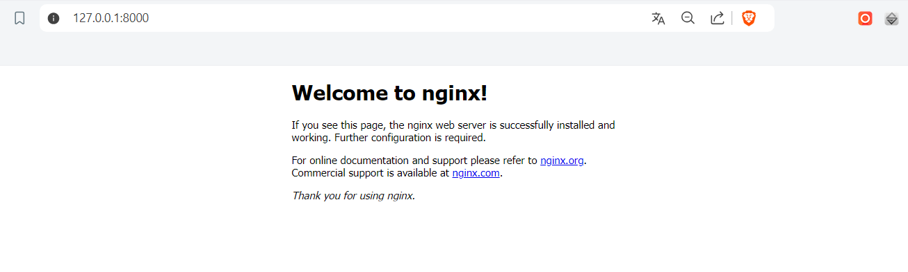

# Terraform version

Terraform v1.9.5-dev
on linux_amd64

# Installation

I'm working with WSL, so I decided to install terraform on Linux:

I decided to install terraform using snaps. It's easy and comes pre-configured in Ubuntu

```
$ sudo snap install terraform --classic
terraform 1.9.5 from Snapcrafters✪ installed
```

Now terraform is ready:

```
$ terraform -version
Terraform v1.9.5-dev
on linux_amd64
+ provider registry.terraform.io/kreuzwerker/docker v3.0.2

Your version of Terraform is out of date! The latest version
is 1.9.5. You can update by downloading from https://www.terraform.io/downloads.html
```

The terraform tutorial requires Docker, so it's time to install it:

```
# Add Docker's official GPG key:
$ sudo apt-get update
$ sudo apt-get install ca-certificates curl
$ sudo install -m 0755 -d /etc/apt/keyrings
$ sudo curl -fsSL https://download.docker.com/linux/ubuntu/gpg -o /etc/apt/keyrings/docker.asc
$ sudo chmod a+r /etc/apt/keyrings/docker.asc

# Add the repository to Apt sources:
$ echo \
  "deb [arch=$(dpkg --print-architecture) signed-by=/etc/apt/keyrings/docker.asc] https://download.docker.com/linux/ubuntu \
  $(. /etc/os-release && echo "$VERSION_CODENAME") stable" | \
  sudo tee /etc/apt/sources.list.d/docker.list > /dev/null
$ sudo apt-get update

# Install the Docker packages.
$ sudo apt-get install docker-ce docker-ce-cli containerd.io docker-buildx-plugin docker-compose-plugin

# Check docker
$ sudo docker run hello-world
```

Since the hashicorp doesn't takes requests from Russia, we need to set provider like in [yandex tutorial](https://yandex.cloud/ru/docs/tutorials/infrastructure-management/terraform-quickstart):

Firstly I changed to the `/home/user/` directory and created `.terraformrc` file.

``` 
$ cd
$ nano ~/.terraformrc
```

After that I paste following text in it:

```
provider_installation {
  network_mirror {
    url = "https://terraform-mirror.yandexcloud.net/"
    include = ["registry.terraform.io/*/*"]
  }
  direct {
    exclude = ["registry.terraform.io/*/*"]
  }
}
```

That's it, now we can run `terraform init` command :)

# Experiments with terraform

### Build

Following tutorial I initialized the project using `terraform init` command

Then I applied NGINX server using `terraform apply` command



```
$ docker ps
CONTAINER ID   IMAGE          COMMAND                  CREATED              STATUS              PORTS                  NAMES
a52465df08e0   39286ab8a5e1   "/docker-entrypoint.…"   About a minute ago   Up About a minute   0.0.0.0:8000->80/tcp   tutorial
```

```
$ terraform state list
docker_container.nginx
docker_image.nginx
```

As we can see NGINX server is hosted

### Change

Let's update configuration:

```
resource "docker_container" "nginx" {
  image = docker_image.nginx.latest
  name  = "tutorial"
  ports {
    internal = 80
-   external = 8000
+   external = 8080
  }
}
```

Now we need to apply changes using `terraform apply`

```
docker_container.nginx: Destroying... [id=b985438fca32756541e2bda4766e41d39430a20e8c17cae2f8013d3a69588317]
docker_container.nginx: Destruction complete after 1s
docker_container.nginx: Creating...
docker_container.nginx: Creation complete after 0s [id=08b2c99a9f9866811b42c1d765b0246fc22cc7a8a8905dc0b83477e8963ceb5b]

Apply complete! Resources: 1 added, 0 changed, 1 destroyed.
```

```
$ docker ps
CONTAINER ID   IMAGE          COMMAND                  CREATED              STATUS              PORTS                  NAMES
a42842dc9441   39286ab8a5e1   "/docker-entrypoint.…"   About a minute ago   Up About a minute   0.0.0.0:8080->80/tcp   tutorial
```

As we can see port changed

### Variables

Let's add more dynamicity and flexibility using variables. Create new file for variables `variables.tf`

``` 
variable "container_name" {
  description = "Value of the name for the Docker container"
  type        = string
  default     = "ExampleNginxContainer"
}
```

And now use this variable in `main.tf`:

```
resource "docker_container" "nginx" {
  image = docker_image.nginx.image_id
- name  = "tutorial"
+ name  = var.container_name
  ports {
    internal = 80
    external = 8080
  }
}
```

Let's apply changes:

```
$ terraform apply
$ docker ps
CONTAINER ID   IMAGE          COMMAND                  CREATED          STATUS          PORTS                  NAMES
69b70c1d1a23   39286ab8a5e1   "/docker-entrypoint.…"   42 seconds ago   Up 41 seconds   0.0.0.0:8080->80/tcp   ExampleNginxContainer
```

We can see that name applied.

Now I will apply the config, but overriding variable container:

```
$ terraform apply -var "container_name=YetAnotherName"
$ docker ps
CONTAINER ID   IMAGE          COMMAND                  CREATED         STATUS         PORTS                  NAMES
443521851a44   39286ab8a5e1   "/docker-entrypoint.…"   5 seconds ago   Up 5 seconds   0.0.0.0:8080->80/tcp   YetAnotherName
```
It changes

### Outputs

I created new config for output values `output.tf`, and paste following to it:

```
output "container_id" {
  description = "ID of the Docker container"
  value       = docker_container.nginx.id
}

output "image_id" {
  description = "ID of the Docker image"
  value       = docker_image.nginx.id
}
```

After that I applied changes:

```
$ terraform apply
... 
Apply complete! Resources: 1 added, 0 changed, 1 destroyed.

Outputs:

container_id = "d0db5f8ee3522094603f9010e7f3a283ee4340c1931165bfd779523c05176677"
image_id = "sha256:39286ab8a5e14aeaf5fdd6e2fac76e0c8d31a0c07224f0ee5e6be502f12e93f3nginx"

$ terraform output
container_id = "d0db5f8ee3522094603f9010e7f3a283ee4340c1931165bfd779523c05176677"
image_id = "sha256:39286ab8a5e14aeaf5fdd6e2fac76e0c8d31a0c07224f0ee5e6be502f12e93f3nginx"
```

As we can see those variables can be find after the applying the config

### Destroy

Now we are done, let's destroy everything. 

```
$ docker ps
CONTAINER ID   IMAGE     COMMAND   CREATED   STATUS    PORTS     NAMES
```

After `terraform destroy` command server is down

# Challenges

I have found following challenges during installation process:

1. When I tried to install terraform using oficial instructions I faced many problems. So I decided to find another easier way to install terraform. It was using snaps.

2. Since hashicorp doesn't accept requests from russia, there are two ways how to resolve this. Using vpn or set provider. I have some problems with my vpn, so I decided to set provider. 