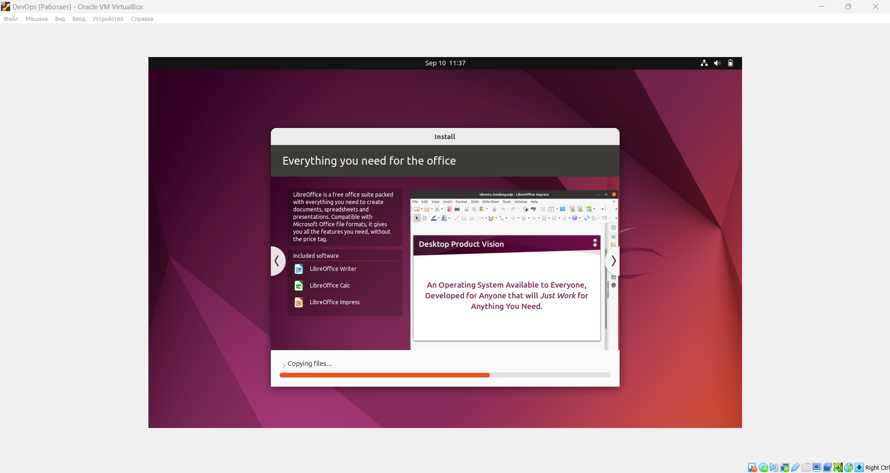

# Task 1: VM Deployment

VirtualBox version number - 7.0.10 r158379 (Qt5.15.2)

I decided to create a new Virtual Machine (VM) and choose Ubuntu 22.04.4

During the deployment I set up 
- name and username of the system and choosed iso as Ubuntu 22.04.4
- RAM volume
- number of CPU cores
- allocated Memory

After that I created VM and deployed it.

I have following VM settings:

- 8 GB for RAM
- 4 CPU cores
- 25 GB of allocated Memory
- Network adapter - Intel PRO/1000 MT Desktop (NAT type of connection)
- Name of VM - DevOps
- Name of user - zaurall




# Task 2: System Information Tools

I didn't install any tool for getting processor, RAM, network, and OS information. Because all needed commands exist in Ubuntu terminal.

To display processor info I will use `lscpu` command

```
$ lscpu
lscpu
Architecture:            x86_64
  CPU op-mode(s):        32-bit, 64-bit
  Address sizes:         48 bits physical, 48 bits virtual
  Byte Order:            Little Endian
CPU(s):                  4
  On-line CPU(s) list:   0-3
Vendor ID:               AuthenticAMD
  Model name:            AMD Ryzen 7 5700U with Radeon Graphics
    CPU family:          23
    Model:               104
    Thread(s) per core:  1
    Core(s) per socket:  4
    Socket(s):           1
    Stepping:            1
    BogoMIPS:            3593.13
    Flags:               fpu vme de pse tsc msr pae mce cx8 apic sep mtrr pge mc
                         a cmov pat pse36 clflush mmx fxsr sse sse2 ht syscall n
                         x mmxext fxsr_opt rdtscp lm constant_tsc rep_good nopl 
                         nonstop_tsc cpuid extd_apicid tsc_known_freq pni pclmul
                         qdq ssse3 cx16 sse4_1 sse4_2 movbe popcnt aes rdrand hy
                         pervisor lahf_lm cmp_legacy cr8_legacy abm sse4a misali
                         gnsse 3dnowprefetch ssbd vmmcall fsgsbase bmi1 bmi2 rds
                         eed clflushopt arat
Virtualization features: 
  Hypervisor vendor:     KVM
  Virtualization type:   full
Caches (sum of all):     
  L1d:                   128 KiB (4 instances)
  L1i:                   128 KiB (4 instances)
  L2:                    2 MiB (4 instances)
  L3:                    32 MiB (4 instances)
NUMA:                    
  NUMA node(s):          1
  NUMA node0 CPU(s):     0-3
Vulnerabilities:         
  Gather data sampling:  Not affected
  Itlb multihit:         Not affected
  L1tf:                  Not affected
  Mds:                   Not affected
  Meltdown:              Not affected
  Mmio stale data:       Not affected
  Retbleed:              Mitigation; untrained return thunk; SMT disabled
  Spec rstack overflow:  Vulnerable: Safe RET, no microcode
  Spec store bypass:     Not affected
  Spectre v1:            Mitigation; usercopy/swapgs barriers and __user pointer
                          sanitization
  Spectre v2:            Mitigation; Retpolines, STIBP disabled, RSB filling, PB
                         RSB-eIBRS Not affected
  Srbds:                 Not affected
  Tsx async abort:       Not affected

```

`free -h` command prints info about RAM

```
$ free -h
               total        used        free      shared  buff/cache   available
Mem:           7.7Gi       1.6Gi       4.1Gi        70Mi       2.0Gi       5.8Gi
Swap:          2.6Gi          0B       2.6Gi
```

`ip a` command gives an information about network

```
$ ip a
1: lo: <LOOPBACK,UP,LOWER_UP> mtu 65536 qdisc noqueue state UNKNOWN group default qlen 1000
    link/loopback 00:00:00:00:00:00 brd 00:00:00:00:00:00
    inet 127.0.0.1/8 scope host lo
       valid_lft forever preferred_lft forever
    inet6 ::1/128 scope host 
       valid_lft forever preferred_lft forever
2: enp0s3: <BROADCAST,MULTICAST,UP,LOWER_UP> mtu 1500 qdisc fq_codel state UP group default qlen 1000
    link/ether 08:00:27:ff:71:ba brd ff:ff:ff:ff:ff:ff
    inet 10.0.2.15/24 brd 10.0.2.255 scope global dynamic noprefixroute enp0s3
       valid_lft 86050sec preferred_lft 86050sec
    inet6 fe80::c185:4ea9:c713:ee6c/64 scope link noprefixroute 
       valid_lft forever preferred_lft forever
```

I used `lsb_release -a` command to display system specification

```
$ lsb_release -a
No LSB modules are available.
Distributor ID: Ubuntu
Description: Ubuntu 22.04.4 LTS
Release: 22.04
Codename: jammy
```