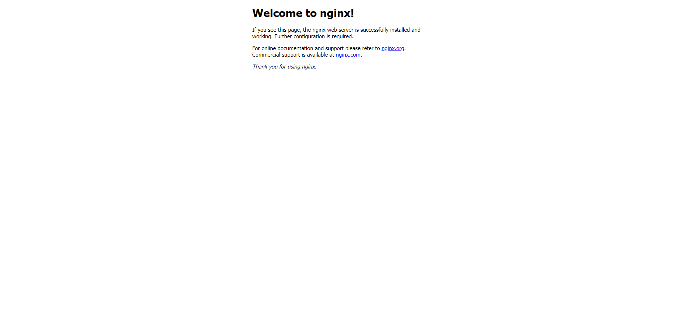

# Task 1: Container Management


```
$ docker ps -a
CONTAINER ID   IMAGE         COMMAND    CREATED        STATUS                    PORTS     NAMES
11b1c4827fa5   hello-world   "/hello"   17 hours ago   Exited (0) 17 hours ago             focused_varahamihira
```

As we can see there is only one container that is not running

```
$ docker pull ubuntu:latest
latest: Pulling from library/ubuntu
31e907dcc94a: Pull complete 
Digest: sha256:8a37d68f4f73ebf3d4efafbcf66379bf3728902a8038616808f04e34a9ab63ee
Status: Downloaded newer image for ubuntu:latest
docker.io/library/ubuntu:latest

$ docker ps -a
CONTAINER ID   IMAGE         COMMAND    CREATED        STATUS                    PORTS     NAMES
11b1c4827fa5   hello-world   "/hello"   17 hours ago   Exited (0) 17 hours ago             focused_varahamihira
```

After pulling, container wasn't running therefore it doesn't appear in `docker ps -a`

```
$ docker run -it --name ubuntu_container ubuntu:latest
root@531575f76c4e:/# ls
bin  boot  dev  etc  home  lib  lib64  media  mnt  opt  proc  root  run  sbin  srv  sys  tmp  usr  var

$ docker ps -a
CONTAINER ID   IMAGE           COMMAND       CREATED              STATUS                    PORTS     NAMES
531575f76c4e   ubuntu:latest   "/bin/bash"   About a minute ago   Up About a minute                   ubuntu_container
11b1c4827fa5   hello-world     "/hello"      17 hours ago         Exited (0) 17 hours ago             focused_varahamihira

$ docker stop ubuntu_container
ubuntu_container
```

After running docker container it appears in `docker ps -a`

```
$ docker rmi ubuntu:latest
Error response from daemon: conflict: unable to remove repository reference "ubuntu:latest" (must force) - container 531575f76c4e is using its referenced image edbfe74c41f8
```

To remoce `ubuntu:latest` we must remove container that depends on it first

```
$ docker rm 531575f76c4e
531575f76c4e

$ docker rmi ubuntu:latest
Untagged: ubuntu:latest
Untagged: ubuntu@sha256:8a37d68f4f73ebf3d4efafbcf66379bf3728902a8038616808f04e34a9ab63ee
Deleted: sha256:edbfe74c41f8a3501ce542e137cf28ea04dd03e6df8c9d66519b6ad761c2598a
Deleted: sha256:f36fd4bb7334b7ae3321e3229d103c4a3e7c10a263379cc6a058b977edfb46de
```

Now the image was deleted


# Task 2: Image and Container Operations


```
$ docker save -o ubuntu_image.tar ubuntu:latest
$
```

The image has been saved

```
$ ls -lh ubuntu_image.tar
-rw------- 1 zaurall zaurall 77M Sep 10 16:32 ubuntu_image.tar

$ docker images
REPOSITORY    TAG       IMAGE ID       CREATED         SIZE
ubuntu        latest    edbfe74c41f8   5 weeks ago     78.1MB
hello-world   latest    d2c94e258dcb   16 months ago   13.3kB
```

As we can see, the difference exists, but it's negligible. I think it's because of the way Docker manages the image layers and potential metadata compression in the image registry.

```
$ docker run -d -p 80:80 --name nginx_container nginx
Unable to find image 'nginx:latest' locally
latest: Pulling from library/nginx
a2318d6c47ec: Pull complete 
095d327c79ae: Pull complete 
bbfaa25db775: Pull complete 
7bb6fb0cfb2b: Pull complete 
0723edc10c17: Pull complete 
24b3fdc4d1e3: Pull complete 
3122471704d5: Pull complete 
Digest: sha256:04ba374043ccd2fc5c593885c0eacddebabd5ca375f9323666f28dfd5a9710e3
Status: Downloaded newer image for nginx:latest
7fcae5f5c68367d5f7f2f97136b56f3b2d1b19c76e0f6bbf5c291a92d964fe2a

$ docker ps
CONTAINER ID   IMAGE     COMMAND                  CREATED          STATUS          PORTS                               NAMES
7fcae5f5c683   nginx     "/docker-entrypoint.…"   39 seconds ago   Up 37 seconds   0.0.0.0:80->80/tcp, :::80->80/tcp   nginx_container
```



After creating html file I ran following command:

```
$ docker cp index.html nginx_container:/usr/share/nginx/html/index.html
Successfully copied 2.05kB to nginx_container:/usr/share/nginx/html/index.html
```

I created new custom image 

```
$ docker commit nginx_container my_website:latest
sha256:97aafe500438baa5884eff32098252daeeebfa4f467cd330e08103c9596f6ab3
```

Removed old container

```
$ docker rm -f nginx_container
nginx_container
```

And created new container and checked if it's running

```
$ docker run -d -p 80:80 --name my_website_container my_website:latest
4ec3410dc331c458922820658bcdabe2add60f0bda14fa6844efd485c41dfdc9
$ curl http://127.0.0.1:80
<html>
<head>
<title>The best</title>
</head>
<body>
<h1>website</h1>
</body>
</html>
```

Now it's time to see the changes:

```
docker diff my_website_container
C /etc
C /etc/nginx
C /etc/nginx/conf.d
C /etc/nginx/conf.d/default.conf
C /run
C /run/nginx.pid
```

As we can see, main differences in configuration files (because of index.html) and process id of nginx (because of recreating container). They have been changed.