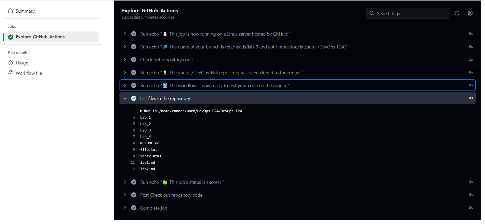

# Task 1: Create Your First GitHub Actions Pipeline


I created `github-actions-demo.yaml` file in the `.github/workflows` directory. Following quickstart guide I paste next workflow in it:

```
name: GitHub Actions Demo
run-name: ${{ github.actor }} is testing out GitHub Actions 🚀
on: [push]
jobs:
  Explore-GitHub-Actions:
    runs-on: ubuntu-latest
    steps:
      - run: echo "🎉 The job was automatically triggered by a ${{ github.event_name }} event."
      - run: echo "🐧 This job is now running on a ${{ runner.os }} server hosted by GitHub!"
      - run: echo "🔎 The name of your branch is ${{ github.ref }} and your repository is ${{ github.repository }}."
      - name: Check out repository code
        uses: actions/checkout@v4
      - run: echo "💡 The ${{ github.repository }} repository has been cloned to the runner."
      - run: echo "🖥️ The workflow is now ready to test your code on the runner."
      - name: List files in the repository
        run: |
          ls ${{ github.workspace }}
      - run: echo "🍏 This job's status is ${{ job.status }}."
```

After commiting and pushing to github, new workflow in github actions started executing



As we can see, it executed successfully

```
Set up job
  Current runner version: '2.319.1'
  Operating System
  Runner Image
  Runner Image Provisioner
  GITHUB_TOKEN Permissions
  Secret source: Actions
  Prepare workflow directory
  Prepare all required actions
  Getting action download info
  Download action repository 'actions/checkout@v4' (SHA:692973e3d937129bcbf40652eb9f2f61becf3332)
  Complete job name: Explore-GitHub-Actions

Run echo "🎉 The job was automatically triggered by a push event."
  Run echo "🎉 The job was automatically triggered by a push event."
  🎉 The job was automatically triggered by a push event.

Run echo "🐧 This job is now running on a Linux server hosted by GitHub!"
  Run echo "🐧 This job is now running on a Linux server hosted by GitHub!"
  🐧 This job is now running on a Linux server hosted by GitHub!

Run echo "🔎 The name of your branch is refs/heads/lab_9 and your repository is Zaurall/DevOps-F24."
  Run echo "🔎 The name of your branch is refs/heads/lab_9 and your repository is Zaurall/DevOps-F24."
  🔎 The name of your branch is refs/heads/lab_9 and your repository is Zaurall/DevOps-F24.

Check out repository code
  Run actions/checkout@v4
  Syncing repository: Zaurall/DevOps-F24
  Getting Git version info
  Temporarily overriding HOME='/home/runner/work/_temp/31c7b429-bb41-493c-88a3-4e7322b4797e' before making global git config changes
  Adding repository directory to the temporary git global config as a safe directory
  /usr/bin/git config --global --add safe.directory /home/runner/work/DevOps-F24/DevOps-F24
  Deleting the contents of '/home/runner/work/DevOps-F24/DevOps-F24'
  Initializing the repository
  Disabling automatic garbage collection
  Setting up auth
  Fetching the repository
  Determining the checkout info
  /usr/bin/git sparse-checkout disable
  /usr/bin/git config --local --unset-all extensions.worktreeConfig
  Checking out the ref
  /usr/bin/git log -1 --format='%H'
  '178659ca5363daf923c2c8d966356c0b0f67f0d3'

Run echo "💡 The Zaurall/DevOps-F24 repository has been cloned to the runner."
  Run echo "💡 The Zaurall/DevOps-F24 repository has been cloned to the runner."
  💡 The Zaurall/DevOps-F24 repository has been cloned to the runner.

Run echo 🖥️ The workflow is now ready to test your code on the runner.
  Run echo "🖥️ The workflow is now ready to test your code on the runner."
  🖥️ The workflow is now ready to test your code on the runner.

List files in the repository
  Run ls /home/runner/work/DevOps-F24/DevOps-F24
  Lab_1
  Lab_2
  Lab_3
  Lab_4
  README.md
  file.txt
  index.html
  lab1.md
  lab2.md

Run echo "🍏 This job's status is success."
  Run echo "🍏 This job's status is success."
  🍏 This job's status is success.

Post Check out repository code
  Post job cleanup.
  /usr/bin/git version
  git version 2.46.0
  Temporarily overriding HOME='/home/runner/work/_temp/c021ad3f-4f7f-4f5c-b4b9-04833f9d4c48' before making global git config changes
  Adding repository directory to the temporary git global config as a safe directory
  /usr/bin/git config --global --add safe.directory /home/runner/work/DevOps-F24/DevOps-F24
  /usr/bin/git config --local --name-only --get-regexp core\.sshCommand
  /usr/bin/git submodule foreach --recursive sh -c "git config --local --name-only --get-regexp 'core\.sshCommand' && git config --local --unset-all 'core.sshCommand' || :"
  /usr/bin/git config --local --name-only --get-regexp http\.https\:\/\/github\.com\/\.extraheader
  http.https://github.com/.extraheader
  /usr/bin/git config --local --unset-all http.https://github.com/.extraheader
  /usr/bin/git submodule foreach --recursive sh -c "git config --local --name-only --get-regexp 'http\.https\:\/\/github\.com\/\.extraheader' && git config --local --unset-all 'http.https://github.com/.extraheader' || :"

Complete job
  Cleaning up orphan processes
```


# Task 2: Gathering System Information and Manual Triggering

Now it's time to set up manual manual triggering and system information gathering

Firstly I added an ability to manually triger workflow and changed push trigger for only two branches (main and lab_9):

```yaml
run-name: ${{ github.actor }} is testing out GitHub Actions 🚀
- on: [push]
+ on: 
+   push:
+     branches:
+       - main
+       - lab_9
+   workflow_dispatch:
jobs:
```

After that I added new run that will gather the information about system:

```yaml
- name: Gather system information
  run: |
    echo "System specification:"
    lsb_release -a
    echo ""
    echo "Operating System Info:"
    uname -a
    echo ""
    echo "Disk Space Info:"
    df -h
    echo ""
    echo "Memory Info:"
    free -m
    echo ""
    echo "CPU Info:"
    lscpu
    echo ""
    echo "I/O Info:"
    iostat 
    echo ""
    echo "Network Info"
    ip a
```

Here is the output of this run:

```
System specification:
No LSB modules are available.
Distributor ID:	Ubuntu
Description:	Ubuntu 22.04.4 LTS
Release:	22.04
Codename:	jammy

Operating System Info:
Linux fv-az773-770 6.5.0-1025-azure #26~22.04.1-Ubuntu SMP Thu Jul 11 22:33:04 UTC 2024 x86_64 x86_64 x86_64 GNU/Linux

Disk Space Info:
Filesystem      Size  Used Avail Use% Mounted on
/dev/root        73G   51G   22G  70% /
tmpfs           7.9G  172K  7.9G   1% /dev/shm
tmpfs           3.2G  1.1M  3.2G   1% /run
tmpfs           5.0M     0  5.0M   0% /run/lock
/dev/sdb15      105M  6.1M   99M   6% /boot/efi
/dev/sda1        74G  4.1G   66G   6% /mnt
tmpfs           1.6G   12K  1.6G   1% /run/user/1001

Memory Info:
               total        used        free      shared  buff/cache   available
Mem:           15981         721       14161          22        1098       14890
Swap:           4095           0        4095

CPU Info:
Architecture:                       x86_64
CPU op-mode(s):                     32-bit, 64-bit
Address sizes:                      48 bits physical, 48 bits virtual
Byte Order:                         Little Endian
CPU(s):                             4
On-line CPU(s) list:                0-3
Vendor ID:                          AuthenticAMD
Model name:                         AMD EPYC 7763 64-Core Processor
CPU family:                         25
Model:                              1
Thread(s) per core:                 2
Core(s) per socket:                 2
Socket(s):                          1
Stepping:                           1
BogoMIPS:                           4890.85
Flags:                              fpu vme de pse tsc msr pae mce cx8 apic sep mtrr pge mca cmov pat pse36 clflush mmx fxsr sse sse2 ht syscall nx mmxext fxsr_opt pdpe1gb rdtscp lm constant_tsc rep_good nopl tsc_reliable nonstop_tsc cpuid extd_apicid aperfmperf pni pclmulqdq ssse3 fma cx16 pcid sse4_1 sse4_2 movbe popcnt aes xsave avx f16c rdrand hypervisor lahf_lm cmp_legacy svm cr8_legacy abm sse4a misalignsse 3dnowprefetch osvw topoext invpcid_single vmmcall fsgsbase bmi1 avx2 smep bmi2 erms invpcid rdseed adx smap clflushopt clwb sha_ni xsaveopt xsavec xgetbv1 xsaves clzero xsaveerptr rdpru arat npt nrip_save tsc_scale vmcb_clean flushbyasid decodeassists pausefilter pfthreshold v_vmsave_vmload umip vaes vpclmulqdq rdpid fsrm
Virtualization:                     AMD-V
Hypervisor vendor:                  Microsoft
Virtualization type:                full
L1d cache:                          64 KiB (2 instances)
L1i cache:                          64 KiB (2 instances)
L2 cache:                           1 MiB (2 instances)
L3 cache:                           32 MiB (1 instance)
NUMA node(s):                       1
NUMA node0 CPU(s):                  0-3
Vulnerability Gather data sampling: Not affected
Vulnerability Itlb multihit:        Not affected
Vulnerability L1tf:                 Not affected
Vulnerability Mds:                  Not affected
Vulnerability Meltdown:             Not affected
Vulnerability Mmio stale data:      Not affected
Vulnerability Retbleed:             Not affected
Vulnerability Spec rstack overflow: Vulnerable: Safe RET, no microcode
Vulnerability Spec store bypass:    Vulnerable
Vulnerability Spectre v1:           Mitigation; usercopy/swapgs barriers and __user pointer sanitization
Vulnerability Spectre v2:           Mitigation; Retpolines; STIBP disabled; RSB filling; PBRSB-eIBRS Not affected; BHI Not affected
Vulnerability Srbds:                Not affected
Vulnerability Tsx async abort:      Not affected

I/O Info:
Linux 6.5.0-1025-azure (fv-az773-770) 	09/15/24 	_x86_64_	(4 CPU)

avg-cpu:  %user   %nice %system %iowait  %steal   %idle
           2.53    0.00    1.99    0.60    0.00   94.88

Device             tps    kB_read/s    kB_wrtn/s    kB_dscd/s    kB_read    kB_wrtn    kB_dscd
loop0             1.44        13.68         0.00         0.00       2364          0          0
loop1             0.40         6.39         0.00         0.00       1104          0          0
loop2             0.31         2.14         0.00         0.00        370          0          0
loop3             0.06         0.08         0.00         0.00         14          0          0
sda              13.02        74.58     10172.36    454915.00      12893    1758496   78641156
sdb             205.87      4381.25       909.96       235.48     757386     157305      40708


Network Info
1: lo: <LOOPBACK,UP,LOWER_UP> mtu 65536 qdisc noqueue state UNKNOWN group default qlen 1000
    link/loopback 00:00:00:00:00:00 brd 00:00:00:00:00:00
    inet 127.0.0.1/8 scope host lo
       valid_lft forever preferred_lft forever
    inet6 ::1/128 scope host 
       valid_lft forever preferred_lft forever
2: eth0: <BROADCAST,MULTICAST,UP,LOWER_UP> mtu 1500 qdisc mq state UP group default qlen 1000
    link/ether 00:0d:3a:5a:a1:8d brd ff:ff:ff:ff:ff:ff
    inet 10.1.0.110/16 metric 100 brd 10.1.255.255 scope global eth0
       valid_lft forever preferred_lft forever
    inet6 fe80::20d:3aff:fe5a:a18d/64 scope link 
       valid_lft forever preferred_lft forever
3: docker0: <NO-CARRIER,BROADCAST,MULTICAST,UP> mtu 1500 qdisc noqueue state DOWN group default 
    link/ether 02:42:ef:b1:0f:bd brd ff:ff:ff:ff:ff:ff
    inet 172.17.0.1/16 brd 172.17.255.255 scope global docker0
       valid_lft forever preferred_lft forever
```
