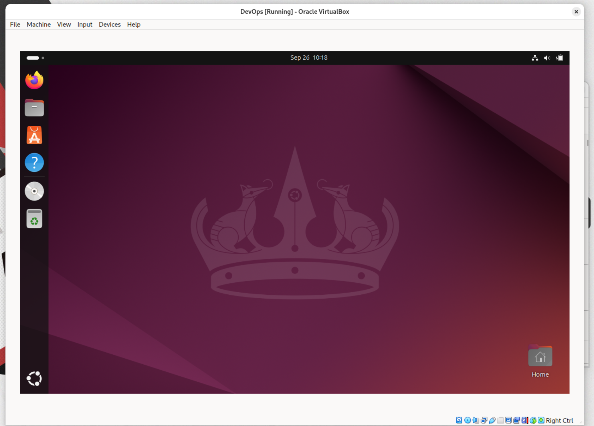
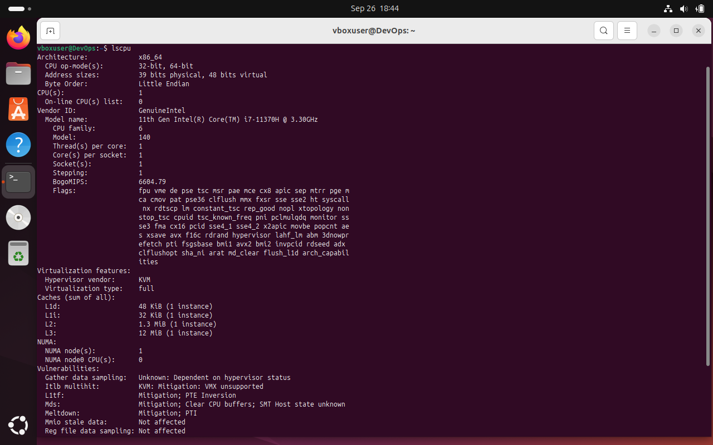
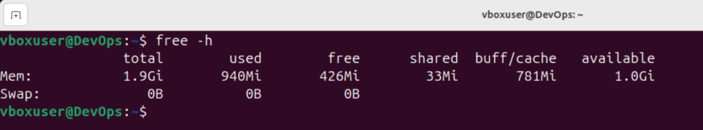
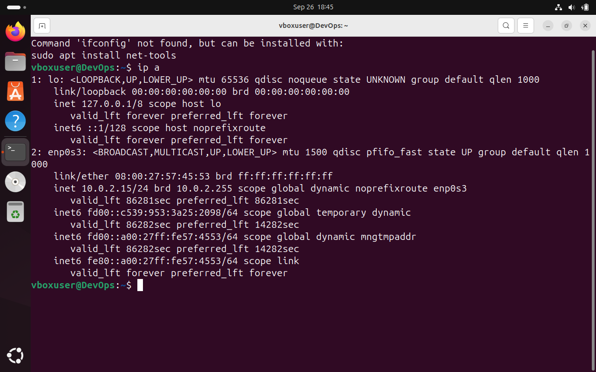

# Task 1

## 1. Installation
- I installed Oracle VirtualBox of version **7.1.0**
```bash
sudo pacman -S virtualbox-host-modules-arch virtualbox
```
## 2. Deploying
- As task 1 asked, I installed Ubuntu version **24.04**, 
and launched the virtual machine with following parameters:
  - **RAM:** 2048 MB
  - **Number of CPU:** 1
  - **Storage Memory:** 20GB





---------------------------------------------------------------------------

# Task 2
## 1.Processor, RAM, and Network Information:
### CPU info
- I used `lscpu` to display detailed information about the CPU:



### RAM info
- I used `free -h` to display  about total, used, 
and available memory in a human-readable format:



### Network info
- I used `ifconfig` to display network interface details:


## 2.Operating System Specifications


