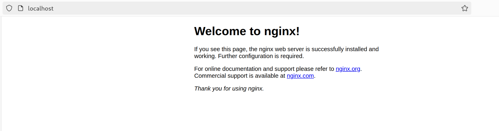

# Task 1

## 1. List containers
```
CONTAINER ID   IMAGE     COMMAND   CREATED   STATUS    PORTS     NAMES
```

## 2. Pulling Ubuntu Image
- Successfully pulled Ubuntu ISO
```
latest: Pulling from library/ubuntu
dafa2b0c44d2: Pull complete 
Digest: sha256:dfc10878be8d8fc9c61cbff33166cb1d1fe44391539243703c72766894fa834a
Status: Downloaded newer image for ubuntu:latest
docker.io/library/ubuntu:latest
```

## 3. Run container
```bash
docker run -it --name ubuntu-devops ubuntu:latest
```

- Ubuntu successfully run in command line 
```
$ uname -a
Linux b5c82daba166 6.10.4-linuxkit #1 SMP PREEMPT_DYNAMIC Mon Aug 12 08:48:58 UTC 2024 x86_64 x86_64 x86_64 GNU/Linux
```


## 4. Attempt to remove image
- Docker container cannot be removed as the container is running.
```
Error response from daemon: conflict: unable to remove repository reference "ubuntu:latest" (must force) - container 6424b773f20c is using its referenced image b1e9cef3f297
```

- To remove the image it's required to stop the container
```bash
docker stop ubuntu-devops
```
- We should use _**force remove**_ to get rif of image:
```bash
docker rmi -f ubuntu:latest 
```


---------------------------------------------------

# Task 2
## 1. Compare archive with image
- To compare them I used the following command:
```bash
du -h ubuntu-24.04.1-desktop-amd64.iso ubuntu_image.tar 
```
```
5.8G	ubuntu-24.04.1-desktop-amd64.iso
77M	ubuntu_image.tar
```

- Size of the archived ubuntu image is much less than the original one.
Firstly, the docker image is designed to be lightweight,
including only necessary packages and excluding graphical services.
Secondly, it uses a compression to reduce the total file size.

## 2. Run nginx container 
- Firstly I pulled nginx image
```bash
docker pull nginx
```
- And run it
```bash 
docker run -d -p 80:80 --name nginx_container nginx
```

- Here is the approval:

- 

## 3.Add HTML file to container
- I took the template of HTML file, that was provided in task description. 
And add to base nginx container.
```bash
docker cp index.html nginx_container:/usr/share/nginx/html/index.html
```
```
Successfully copied 2.05kB to nginx_container:/usr/share/nginx/html/index.html
```
## 4. Replace the nginx original image
- Firstly, I created my own custom image with additional file `index.html`
```bash
docker commit nginx_container devops_nginx:latest
```

- Remove the previous container
```bash
docker rm -f nginx_container
```

- And finally, run custom image
```bash
docker run -d -p 80:80 --name devops_container devops_nginx:latest
```

## 5. Check Web-Server
- To check the webserver, I used `curl`, and got the index.html content:
```
<!DOCTYPE html> 
<!-- You can modify it as you wish -->
<html>
<head>
    <title>My Simple Website</title>
</head>
<body>
    <h1>Welcome to My Simple Website</h1>
    <p>This is the content of the folder.</p>
    <ul>
        <li>File 1</li>
        <li>File 2</li>
        <li>File 3</li>
    </ul>
</body>
</html>
```

## 6. Analyze Image Changes:
The `docker diff` inspect changes to files or directories on a container's filesystem,
as it says in manual.
```bash
docker diff devops_container
```

```
C /etc
C /etc/nginx
C /etc/nginx/conf.d
C /etc/nginx/conf.d/default.conf
C /run
C /run/nginx.pid
```