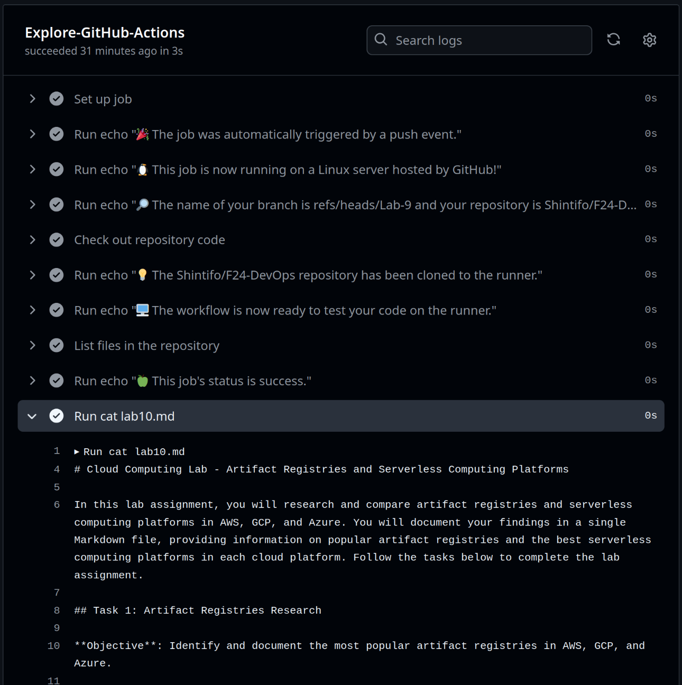

## Task 1

### GitHub Actions Guide

1. Firstly, I created directory `.github/workflows`
and configuration file `github-actions-demo.yml` with following content:
```yaml
name: GitHub Actions Demo
run-name: ${{ github.actor }} is testing out GitHub Actions 🚀
on: [push]
jobs:
  Explore-GitHub-Actions:
    runs-on: ubuntu-latest
    steps:
      - run: echo "🎉 The job was automatically triggered by a ${{ github.event_name }} event."
      - run: echo "🐧 This job is now running on a ${{ runner.os }} server hosted by GitHub!"
      - run: echo "🔎 The name of your branch is ${{ github.ref }} and your repository is ${{ github.repository }}."
      - name: Check out repository code
        uses: actions/checkout@v4
      - run: echo "💡 The ${{ github.repository }} repository has been cloned to the runner."
      - run: echo "🖥️ The workflow is now ready to test your code on the runner."
      - name: List files in the repository
        run: |
          ls ${{ github.workspace }}
      - run: echo "🍏 This job's status is ${{ job.status }}."
      - run: cat lab10.md
```
- This configuration file defines the workflow process
that will complete several task automatically. It can build and test specific pull requests, deploy the application etc.

2. I commited changes into the repository. 
In action tab commit with workflow appeard with logs of each process.



I faced with no problems during this simple guide. 


## Task 2