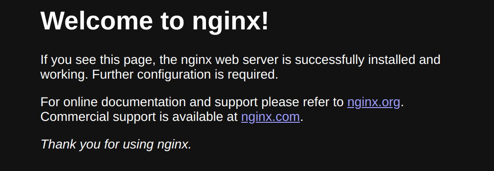

### Task 2: Terraform Installation and Nginx Deployment

#### 1. Research and Installation:
Terraform is an open-source infrastructure as code (IaC) tool. It allows users to define and provision data center infrastructure. This means you can write code to describe the desired state of your infrastructure, and Terraform will automatically manage the creation, modification, and destruction of resources to match that state.

To install terraform on endeavouros I've used:
```sh 
> pacman -Sy terraform
```
Then I have verified the installation with: 
```sh 
> terraform help
Usage: terraform [global options] <subcommand> [args]

The available commands for execution are listed below.
The primary workflow commands are given first, followed by
less common or more advanced commands.

Main commands:
  init          Prepare your working directory for other commands
  validate      Check whether the configuration is valid
  plan          Show changes required by the current configuration
  apply         Create or update infrastructure
  destroy       Destroy previously-created infrastructure

All other commands:
  console       Try Terraform expressions at an interactive command prompt
  fmt           Reformat your configuration in the standard style
  force-unlock  Release a stuck lock on the current workspace
  get           Install or upgrade remote Terraform modules
  graph         Generate a Graphviz graph of the steps in an operation
  import        Associate existing infrastructure with a Terraform resource
  login         Obtain and save credentials for a remote host
  logout        Remove locally-stored credentials for a remote host
  metadata      Metadata related commands
  output        Show output values from your root module
  providers     Show the providers required for this configuration
  refresh       Update the state to match remote systems
  show          Show the current state or a saved plan
  state         Advanced state management
  taint         Mark a resource instance as not fully functional
  test          Execute integration tests for Terraform modules
  untaint       Remove the 'tainted' state from a resource instance
  version       Show the current Terraform version
  workspace     Workspace management

Global options (use these before the subcommand, if any):
  -chdir=DIR    Switch to a different working directory before executing the
                given subcommand.
  -help         Show this help output, or the help for a specified subcommand.
  -version      An alias for the "version" subcommand.
```     

Then I had to set mirror to terraform in _~/.terraformrc_. 
```sh 
> nano ~/.terraformrc
provider_installation {
  network_mirror {
    url = "https://terraform-mirror.yandexcloud.net/"
    include = ["registry.terraform.io/*/*"]
  }
  direct {
    exclude = ["registry.terraform.io/*/*"]
  } 
}
```

Terraform version: 1.9.5
```sh 
> terraform --version
Terraform v1.9.5
on linux_amd64
+ provider registry.terraform.io/kreuzwerker/docker v3.0.2
```

#### 2. Nginx Deployment:
To satisfy lab requirements: 
```sh 
> mkdir lab05
> cd lab05 
```

Making terraform config: 
```sh 
> touch main.tf 
```
and put the config from tutorial: 
```
terraform {
  required_providers {
    docker = {
      source  = "kreuzwerker/docker"
      version = "~> 3.0.1"
    }
  }
}

provider "docker" {
    
}

resource "docker_image" "nginx" {
  name         = "nginx"
  keep_locally = false
}

resource "docker_container" "nginx" {
  image = docker_image.nginx.image_id
  name  = "tutorial"

  ports {
    internal = 80
    external = 8000
  }
}
```

Initialising the project
```sh 
> terraform init 
Initializing the backend...
Initializing provider plugins...
- Finding kreuzwerker/docker versions matching "~> 3.0.1"...
- Installing kreuzwerker/docker v3.0.2...
- Installed kreuzwerker/docker v3.0.2 (unauthenticated)
Terraform has created a lock file .terraform.lock.hcl to record the provider
selections it made above. Include this file in your version control repository
so that Terraform can guarantee to make the same selections by default when
you run "terraform init" in the future.

╷
│ Warning: Incomplete lock file information for providers
│ 
│ Due to your customized provider installation methods, Terraform was forced to calculate lock file
│ checksums locally for the following providers:
│   - kreuzwerker/docker
│ 
│ The current .terraform.lock.hcl file only includes checksums for linux_amd64, so Terraform running on
│ another platform will fail to install these providers.
│ 
│ To calculate additional checksums for another platform, run:
│   terraform providers lock -platform=linux_amd64
│ (where linux_amd64 is the platform to generate)
╵
Terraform has been successfully initialized!

You may now begin working with Terraform. Try running "terraform plan" to see
any changes that are required for your infrastructure. All Terraform commands
should now work.

If you ever set or change modules or backend configuration for Terraform,
rerun this command to reinitialize your w   orking directory. If you forget, other
commands will detect it and remind you to do so if necessary.
```

Running the configuration: 
```sh 
> terraform apply
```

Check:
```localhost:8000```


```sh
> docker ps
CONTAINER ID   IMAGE          COMMAND                  CREATED         STATUS         PORTS                  NAMES
91c41bcd1d98   39286ab8a5e1   "/docker-entrypoint.…"   6 minutes ago   Up 6 minutes   0.0.0.0:8000->80/tcp   tutorial
```     

Close the session and destroy infrastructure
```sh 
> terraform destroy
```

Challanges: 
For me there were 2 problems: 
1) Official page does not have the installation guide for arch based linux distributions. 
2) I had to set up a mirror to be able to initialise the project. 