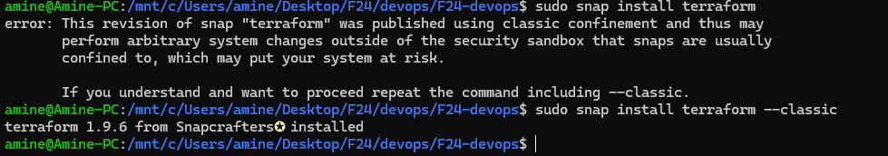
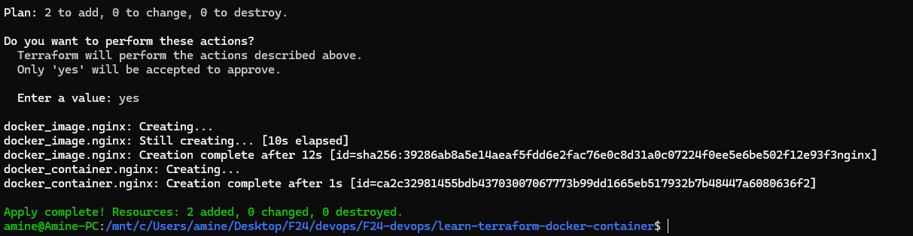
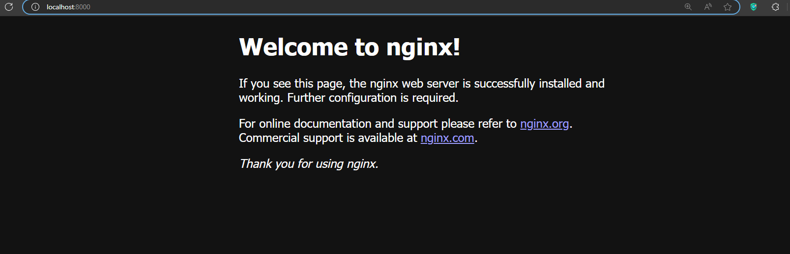
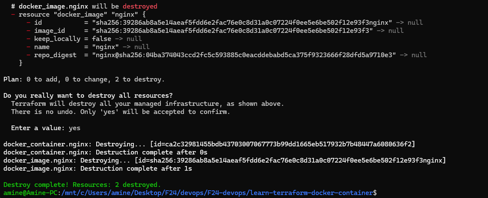
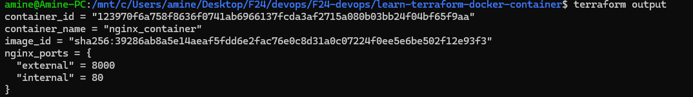

# Task 2
terraform did not work on windows, so I decided to use wsl, after that the problem turned out to be that russia is blocked so I changed the provider link to yandex (thanks to the group chat)

### downloaded terraform using snap

### Terraform is version 1.9.6

### applied changes

### Successfuly opened in the localhost

### Successfuly destroyed the instance

### output example
after adding variables `variables.tf` and outputs `output.tf`, I ran apply command

variables help keep the configuration reusable and flexible

> terraform apply

