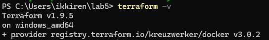
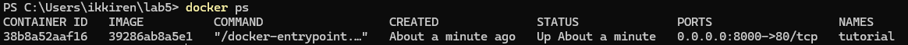
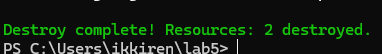

# Task 2

## **Nginx Deployment:**

1. Create project folder

    ```shell
    mkdir <path>
    ```

2. Install `terraform`

    I used `chocolatey` to install the `terraform` because I use Windows

    ```shell
    sudo choco install terraform
    ```

    

3. Deploy Nginx

    * Create `main.tf` file with the following config:

        ```shell
        terraform {
            required_providers {
                docker = {
                source  = "kreuzwerker/docker"
                version = "~> 3.0.1"
                }
            }
        }

        provider "docker" {
            host    = "npipe:////.//pipe//docker_engine"
        }

        resource "docker_image" "nginx" {
            name         = "nginx"
            keep_locally = false
        }

        resource "docker_container" "nginx" {
            image = docker_image.nginx.image_id
            name  = "tutorial"

            ports {
                internal = 80
                external = 8000
            }
        }
        ```

    * Run `init` command

        ```shell
        terraform init
        ```

    * Apply the container

        ```shell
        terraform apply
        ```

    * Check the container in the Docker or by opening `localhost:8000`

        
        

    * Destroy the container

        ```shell
        terraform destroy
        ```

        
