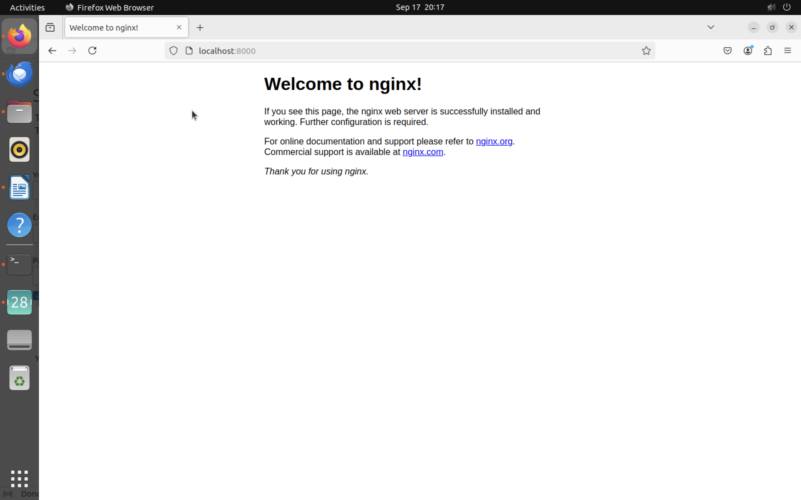

## Task 2

Version number of Terraform installed

```
Terraform v1.9.5
```

### Steps followed to install Terraform

1.  Install gnupg, software-properties-common and curl packages.

```
sudo apt install gnupg
sudo apt install software-properties-common
sudo apt install curl
```

2.  install HashiCorp's Debian package repository

```
sudo apt-get update && sudo apt-get install -y gnupg software-properties-common
```

**Output**

```
Get:1 file:/home/ubuntu/local-apt-repo ./ InRelease
Ign:1 file:/home/ubuntu/local-apt-repo ./ InRelease
Get:2 file:/home/ubuntu/local-apt-repo ./ Release
Ign:2 file:/home/ubuntu/local-apt-repo ./ Release
Get:3 file:/home/ubuntu/local-apt-repo ./ Packages
Ign:3 file:/home/ubuntu/local-apt-repo ./ Packages
Get:4 file:/home/ubuntu/local-apt-repo ./ Translation-en
Ign:4 file:/home/ubuntu/local-apt-repo ./ Translation-en
Get:3 file:/home/ubuntu/local-apt-repo ./ Packages
Ign:3 file:/home/ubuntu/local-apt-repo ./ Packages
Get:4 file:/home/ubuntu/local-apt-repo ./ Translation-en
Ign:4 file:/home/ubuntu/local-apt-repo ./ Translation-en
Get:3 file:/home/ubuntu/local-apt-repo ./ Packages
Ign:3 file:/home/ubuntu/local-apt-repo ./ Packages
Get:4 file:/home/ubuntu/local-apt-repo ./ Translation-en
Ign:4 file:/home/ubuntu/local-apt-repo ./ Translation-en
Get:3 file:/home/ubuntu/local-apt-repo ./ Packages [937 B]
Hit:3 file:/home/ubuntu/local-apt-repo ./ Packages
Get:4 file:/home/ubuntu/local-apt-repo ./ Translation-en
Err:4 file:/home/ubuntu/local-apt-repo ./ Translation-en
 File not found - /home/ubuntu/local-apt-repo/./en.gz (2: No such file or directory)
Get:4 file:/home/ubuntu/local-apt-repo ./ Translation-en
Err:4 file:/home/ubuntu/local-apt-repo ./ Translation-en
 File not found - /home/ubuntu/local-apt-repo/./en.lz4 (2: No such file or directory)
Get:4 file:/home/ubuntu/local-apt-repo ./ Translation-en
Err:4 file:/home/ubuntu/local-apt-repo ./ Translation-en
 File not found - /home/ubuntu/local-apt-repo/./en.zst (2: No such file or directory)
Get:4 file:/home/ubuntu/local-apt-repo ./ Translation-en
Ign:4 file:/home/ubuntu/local-apt-repo ./ Translation-en
Err:3 file:/home/ubuntu/local-apt-repo ./ Packages
 Could not open file /home/ubuntu/local-apt-repo/./Packages - open (13: Permission denied)
Get:3 file:/home/ubuntu/local-apt-repo ./ Packages
Err:3 file:/home/ubuntu/local-apt-repo ./ Packages
 Method gave a blank filename
Get:3 file:/home/ubuntu/local-apt-repo ./ Packages
Err:3 file:/home/ubuntu/local-apt-repo ./ Packages
 Method gave a blank filename
Get:3 file:/home/ubuntu/local-apt-repo ./ Packages [1685 B]
Get:5 https://packages.microsoft.com/repos/code stable InRelease [3590 B]
Hit:6 https://linux.teamviewer.com/deb stable InRelease
Get:7 https://packages.microsoft.com/repos/code stable/main arm64 Packages [18.4 kB]
Get:8 https://packages.microsoft.com/repos/code stable/main amd64 Packages [18.4 kB]
Get:9 https://packages.microsoft.com/repos/code stable/main armhf Packages [18.4 kB]
Hit:10 http://ports.ubuntu.com/ubuntu-ports jammy InRelease
Get:11 http://ports.ubuntu.com/ubuntu-ports jammy-updates InRelease [128 kB]
Hit:12 http://ports.ubuntu.com/ubuntu-ports jammy-backports InRelease
Get:13 http://ports.ubuntu.com/ubuntu-ports jammy-security InRelease [129 kB]
Get:14 http://ports.ubuntu.com/ubuntu-ports jammy-updates/main arm64 Packages [1802 kB]
Get:15 http://ports.ubuntu.com/ubuntu-ports jammy-updates/universe arm64 Packages [1078 kB]
Get:16 http://ports.ubuntu.com/ubuntu-ports jammy-security/main arm64 Packages [1589 kB]
Get:17 http://ports.ubuntu.com/ubuntu-ports jammy-security/main Translation-en [298 kB]
Get:18 http://ports.ubuntu.com/ubuntu-ports jammy-security/restricted arm64 Packages [1908 kB]
Get:19 http://ports.ubuntu.com/ubuntu-ports jammy-security/restricted Translation-en [418 kB]
Get:20 http://ports.ubuntu.com/ubuntu-ports jammy-security/universe arm64 Packages [862 kB]
Get:21 http://ports.ubuntu.com/ubuntu-ports jammy-security/universe Translation-en [177 kB]
Fetched 8447 kB in 3s (3105 kB/s)
Reading package lists... Done
N: Download is performed unsandboxed as root as file '/home/ubuntu/local-apt-repo/./InRelease' couldn't be accessed by user '_apt'. - pkgAcquire::Run (13: Permission denied)
Reading package lists... Done
Building dependency tree... Done
Reading state information... Done
gnupg is already the newest version (2.2.27-3ubuntu2.1).
software-properties-common is already the newest version (0.99.22.9).
0 upgraded, 0 newly installed, 0 to remove and 21 not upgraded.

```

3.  Install the HashiCorp GPG key

```
wget -O- https://apt.releases.hashicorp.com/gpg | \
gpg --dearmor | \
sudo tee /usr/share/keyrings/hashicorp-archive-keyring.gpg > /dev/null

```

**Output**

```
--2024-09-17 19:20:25--  https://apt.releases.hashicorp.com/gpg
Resolving apt.releases.hashicorp.com (apt.releases.hashicorp.com)... 3.164.230.2, 3.164.230.56, 3.164.230.48, ...
Connecting to apt.releases.hashicorp.com (apt.releases.hashicorp.com)|3.164.230.2|:443... connected.
HTTP request sent, awaiting response... 404 Not Found
2024-09-17 19:20:26 ERROR 404: Not Found.

gpg: no valid OpenPGP data found.

```

4. Create Terraform CLI configuration file.

```
cd ~
nano ~/.terraformrc

```

Paste the following content:

```
provider_installation {
 network_mirror {
   url = "https://terraform-mirror.yandexcloud.net/"
   include = ["registry.terraform.io/*/*"]
 }
 direct {
   exclude = ["registry.terraform.io/*/*"]
 }
}
```

5.  Turn on vpn and run.

```
sudo apt-get update && sudo apt-get install -y gnupg software-properties-common
```

**Output**

```
Get:1 file:/home/ubuntu/local-apt-repo ./ InRelease
Ign:1 file:/home/ubuntu/local-apt-repo ./ InRelease
Get:2 file:/home/ubuntu/local-apt-repo ./ Release
Ign:2 file:/home/ubuntu/local-apt-repo ./ Release
Get:3 file:/home/ubuntu/local-apt-repo ./ Packages
Ign:3 file:/home/ubuntu/local-apt-repo ./ Packages
Get:4 file:/home/ubuntu/local-apt-repo ./ Translation-en
Ign:4 file:/home/ubuntu/local-apt-repo ./ Translation-en
Get:3 file:/home/ubuntu/local-apt-repo ./ Packages
Ign:3 file:/home/ubuntu/local-apt-repo ./ Packages
Get:4 file:/home/ubuntu/local-apt-repo ./ Translation-en
Ign:4 file:/home/ubuntu/local-apt-repo ./ Translation-en
Get:3 file:/home/ubuntu/local-apt-repo ./ Packages
Ign:3 file:/home/ubuntu/local-apt-repo ./ Packages
Get:4 file:/home/ubuntu/local-apt-repo ./ Translation-en
Ign:4 file:/home/ubuntu/local-apt-repo ./ Translation-en
Get:3 file:/home/ubuntu/local-apt-repo ./ Packages [937 B]
Hit:3 file:/home/ubuntu/local-apt-repo ./ Packages
Get:4 file:/home/ubuntu/local-apt-repo ./ Translation-en
Err:4 file:/home/ubuntu/local-apt-repo ./ Translation-en
  File not found - /home/ubuntu/local-apt-repo/./en.gz (2: No such file or directory)
Get:4 file:/home/ubuntu/local-apt-repo ./ Translation-en
Err:4 file:/home/ubuntu/local-apt-repo ./ Translation-en
  File not found - /home/ubuntu/local-apt-repo/./en.lz4 (2: No such file or directory)
Get:4 file:/home/ubuntu/local-apt-repo ./ Translation-en
Err:4 file:/home/ubuntu/local-apt-repo ./ Translation-en
  File not found - /home/ubuntu/local-apt-repo/./en.zst (2: No such file or directory)
Get:4 file:/home/ubuntu/local-apt-repo ./ Translation-en
Ign:4 file:/home/ubuntu/local-apt-repo ./ Translation-en
Err:3 file:/home/ubuntu/local-apt-repo ./ Packages
  Could not open file /home/ubuntu/local-apt-repo/./Packages - open (13: Permission denied)
Get:3 file:/home/ubuntu/local-apt-repo ./ Packages
Err:3 file:/home/ubuntu/local-apt-repo ./ Packages
  Method gave a blank filename
Get:3 file:/home/ubuntu/local-apt-repo ./ Packages
Err:3 file:/home/ubuntu/local-apt-repo ./ Packages
  Method gave a blank filename
Get:3 file:/home/ubuntu/local-apt-repo ./ Packages [1685 B]
Hit:5 http://ports.ubuntu.com/ubuntu-ports jammy InRelease
Get:6 http://ports.ubuntu.com/ubuntu-ports jammy-updates InRelease [128 kB]
Hit:7 https://linux.teamviewer.com/deb stable InRelease
Hit:8 https://packages.microsoft.com/repos/code stable InRelease
Hit:9 http://ports.ubuntu.com/ubuntu-ports jammy-backports InRelease
Get:10 http://ports.ubuntu.com/ubuntu-ports jammy-security InRelease [129 kB]
Fetched 257 kB in 1s (237 kB/s)
Reading package lists... Done
N: Download is performed unsandboxed as root as file '/home/ubuntu/local-apt-repo/./InRelease' couldn't be accessed by user '_apt'. - pkgAcquire::Run (13: Permission denied)
Reading package lists... Done
Building dependency tree... Done
Reading state information... Done
gnupg is already the newest version (2.2.27-3ubuntu2.1).
software-properties-common is already the newest version (0.99.22.9).
0 upgraded, 0 newly installed, 0 to remove and 21 not upgraded.
```

6. Install the HashiCorp GPG key.

```
wget -O- https://apt.releases.hashicorp.com/gpg | \
gpg --dearmor | \
sudo tee /usr/share/keyrings/hashicorp-archive-keyring.gpg > /dev/null
```

**Output**

```
--2024-09-17 19:34:27--  https://apt.releases.hashicorp.com/gpg
Resolving apt.releases.hashicorp.com (apt.releases.hashicorp.com)... 18.173.233.74, 18.173.233.113, 18.173.233.10, ...
Connecting to apt.releases.hashicorp.com (apt.releases.hashicorp.com)|18.173.233.74|:443... connected.
HTTP request sent, awaiting response... 200 OK
Length: 3980 (3.9K) [binary/octet-stream]
Saving to: \u2018STDOUT\u2019

-                   100%[===================>]   3.89K  --.-KB/s    in 0s

2024-09-17 19:34:28 (60.6 MB/s) - written to stdout [3980/3980]
```

7.

```
echo "deb [signed-by=/usr/share/keyrings/hashicorp-archive-keyring.gpg] \
https://apt.releases.hashicorp.com $(lsb_release -cs) main" | \
sudo tee /etc/apt/sources.list.d/hashicorp.list
```

**Output**

```
deb [signed-by=/usr/share/keyrings/hashicorp-archive-keyring.gpg] https://apt.releases.hashicorp.com jammy main

```

8.

```
sudo apt update
```

**Output**

```
Get:1 file:/home/ubuntu/local-apt-repo ./ InRelease
Ign:1 file:/home/ubuntu/local-apt-repo ./ InRelease
Get:2 file:/home/ubuntu/local-apt-repo ./ Release
Ign:2 file:/home/ubuntu/local-apt-repo ./ Release
Get:3 file:/home/ubuntu/local-apt-repo ./ Packages
Ign:3 file:/home/ubuntu/local-apt-repo ./ Packages
Get:4 file:/home/ubuntu/local-apt-repo ./ Translation-en
Ign:4 file:/home/ubuntu/local-apt-repo ./ Translation-en
Get:3 file:/home/ubuntu/local-apt-repo ./ Packages
Ign:3 file:/home/ubuntu/local-apt-repo ./ Packages
Get:4 file:/home/ubuntu/local-apt-repo ./ Translation-en
Ign:4 file:/home/ubuntu/local-apt-repo ./ Translation-en
Get:3 file:/home/ubuntu/local-apt-repo ./ Packages
Ign:3 file:/home/ubuntu/local-apt-repo ./ Packages
Get:4 file:/home/ubuntu/local-apt-repo ./ Translation-en
Ign:4 file:/home/ubuntu/local-apt-repo ./ Translation-en
Get:3 file:/home/ubuntu/local-apt-repo ./ Packages [937 B]
Hit:3 file:/home/ubuntu/local-apt-repo ./ Packages
Get:4 file:/home/ubuntu/local-apt-repo ./ Translation-en
Err:4 file:/home/ubuntu/local-apt-repo ./ Translation-en
  File not found - /home/ubuntu/local-apt-repo/./en.gz (2: No such file or directory)
Get:4 file:/home/ubuntu/local-apt-repo ./ Translation-en
Err:4 file:/home/ubuntu/local-apt-repo ./ Translation-en
  File not found - /home/ubuntu/local-apt-repo/./en.lz4 (2: No such file or directory)
Ign:3 file:/home/ubuntu/local-apt-repo ./ Packages
Get:4 file:/home/ubuntu/local-apt-repo ./ Translation-en
Ign:4 file:/home/ubuntu/local-apt-repo ./ Translation-en
Get:3 file:/home/ubuntu/local-apt-repo ./ Packages
Ign:3 file:/home/ubuntu/local-apt-repo ./ Packages
Get:4 file:/home/ubuntu/local-apt-repo ./ Translation-en
Ign:4 file:/home/ubuntu/local-apt-repo ./ Translation-en
Get:3 file:/home/ubuntu/local-apt-repo ./ Packages
Err:3 file:/home/ubuntu/local-apt-repo ./ Packages
  Method gave a blank filename
Get:3 file:/home/ubuntu/local-apt-repo ./ Packages [1685 B]
Hit:5 http://ports.ubuntu.com/ubuntu-ports jammy InRelease
Hit:6 http://ports.ubuntu.com/ubuntu-ports jammy-updates InRelease
Hit:7 https://linux.teamviewer.com/deb stable InRelease
Hit:8 http://ports.ubuntu.com/ubuntu-ports jammy-backports InRelease
Get:9 https://apt.releases.hashicorp.com jammy InRelease [12.9 kB]
Hit:10 https://packages.microsoft.com/repos/code stable InRelease
Hit:11 http://ports.ubuntu.com/ubuntu-ports jammy-security InRelease
Get:12 https://apt.releases.hashicorp.com jammy/main arm64 Packages [83.1 kB]
Fetched 95.9 kB in 1s (115 kB/s)
Reading package lists... Done
Building dependency tree... Done
Reading state information... Done
21 packages can be upgraded. Run 'apt list --upgradable' to see them.
N: Download is performed unsandboxed as root as file '/home/ubuntu/local-apt-repo/./InRelease' couldn't be accessed by user '_apt'. - pkgAcquire::Run (13: Permission denied)
```

9.

```
sudo apt-get install terraform
```

**Output**

```
Reading package lists... Done
Building dependency tree... Done
Reading state information... Done
The following NEW packages will be installed:
  terraform
0 upgraded, 1 newly installed, 0 to remove and 21 not upgraded.
Need to get 25.5 MB of archives.
After this operation, 85.2 MB of additional disk space will be used.
Get:1 https://apt.releases.hashicorp.com jammy/main arm64 terraform arm64 1.9.5-1 [25.5 MB]
Fetched 25.5 MB in 4s (6434 kB/s)
debconf: delaying package configuration, since apt-utils is not installed
Selecting previously unselected package terraform.
(Reading database ... 208573 files and directories currently installed.)
Preparing to unpack .../terraform_1.9.5-1_arm64.deb ...
Unpacking terraform (1.9.5-1) ...
Setting up terraform (1.9.5-1) ...
debconf: unable to initialize frontend: Dialog
debconf: (No usable dialog-like program is installed, so the dialog based frontend cannot be used. at /usr/share/perl5/Debconf/FrontEnd/Dialog.pm line 78.)
debconf: falling back to frontend: Readline
Scanning processes...
Scanning candidates...
Scanning linux images...

Running kernel seems to be up-to-date.

Restarting services...
Daemons using outdated libraries
--------------------------------

  1. networkd-dispatcher.service  4. unattended-upgrades.service
  2. NetworkManager.service       5. user@1000.service
  3. packagekit.service           6. none of the above

(Enter the items or ranges you want to select, separated by spaces.)

Which services should be restarted?

Service restarts being deferred:
 systemctl restart NetworkManager.service
 systemctl restart networkd-dispatcher.service
 systemctl restart packagekit.service
 systemctl restart unattended-upgrades.service
 systemctl restart user@1000.service

No containers need to be restarted.

No user sessions are running outdated binaries.

No VM guests are running outdated hypervisor (qemu) binaries on this host.
```

## Commands executed to initialize and apply the Terraform configuration.

10.

```
terraform init
```

**Output**

```
Terraform initialized in an empty directory!

The directory has no Terraform configuration files. You may begin working
with Terraform immediately by creating Terraform configuration files.
```

11. Verify the installation

```
terraform -help
```

**Outout**

```
Usage: terraform [global options] <subcommand> [args]

The available commands for execution are listed below.
The primary workflow commands are given first, followed by
less common or more advanced commands.

Main commands:
  init          Prepare your working directory for other commands
  validate      Check whether the configuration is valid
  plan          Show changes required by the current configuration
  apply         Create or update infrastructure
  destroy       Destroy previously-created infrastructure

All other commands:
  console       Try Terraform expressions at an interactive command prompt
  fmt           Reformat your configuration in the standard style
  force-unlock  Release a stuck lock on the current workspace
  get           Install or upgrade remote Terraform modules
  graph         Generate a Graphviz graph of the steps in an operation
  import        Associate existing infrastructure with a Terraform resource
  login         Obtain and save credentials for a remote host
  logout        Remove locally-stored credentials for a remote host
  metadata      Metadata related commands
  output        Show output values from your root module
  providers     Show the providers required for this configuration
  refresh       Update the state to match remote systems
  show          Show the current state or a saved plan
  state         Advanced state management
  taint         Mark a resource instance as not fully functional
  test          Execute integration tests for Terraform modules
  untaint       Remove the 'tainted' state from a resource instance
  version       Show the current Terraform version
  workspace     Workspace management

Global options (use these before the subcommand, if any):
  -chdir=DIR    Switch to a different working directory before executing the
                given subcommand.
  -help         Show this help output, or the help for a specified subcommand.
  -version      An alias for the "version" subcommand.
```

Terraform was successfully installed 🥳

Enable autocompletion

```
touch ~/.bashrc
terraform -install-autocomplete
```

**Creating nginx server**

```
mkdir learn-terraform-docker-container
```

```
cd learn-terraform-docker-container
```

Write Terraform configuration into file `main.tf`.

```
nano main.tf
```

The content in main.tf

```
terraform {
  required_providers {
    docker = {
      source  = "kreuzwerker/docker"
      version = "~> 3.0.1"
    }
  }
}

provider "docker" {}

resource "docker_image" "nginx" {
  name         = "nginx"
  keep_locally = false
}

resource "docker_container" "nginx" {
  image = docker_image.nginx.image_id
  name  = "tutorial"

  ports {
    internal = 80
    external = 8000
  }
}

```

Initialize the project, which downloads a plugin called a provider that lets Terraform interact with Docker.

```
terraform init
```

**Output**

```
Initializing the backend...
Initializing provider plugins...
- Finding kreuzwerker/docker versions matching "~> 3.0.1"...
- Installing kreuzwerker/docker v3.0.2...
- Installed kreuzwerker/docker v3.0.2 (unauthenticated)
Terraform has created a lock file .terraform.lock.hcl to record the provider
selections it made above. Include this file in your version control repository
so that Terraform can guarantee to make the same selections by default when
you run "terraform init" in the future.

\u2577
\u2502 Warning: Incomplete lock file information for providers
\u2502
\u2502 Due to your customized provider installation methods, Terraform was forced to
\u2502 calculate lock file checksums locally for the following providers:
\u2502   - kreuzwerker/docker
\u2502
\u2502 The current .terraform.lock.hcl file only includes checksums for linux_arm64,
\u2502 so Terraform running on another platform will fail to install these
\u2502 providers.
\u2502
\u2502 To calculate additional checksums for another platform, run:
\u2502   terraform providers lock -platform=linux_amd64
\u2502 (where linux_amd64 is the platform to generate)
\u2575
Terraform has been successfully initialized!

You may now begin working with Terraform. Try running "terraform plan" to see
any changes that are required for your infrastructure. All Terraform commands
should now work.

If you ever set or change modules or backend configuration for Terraform,
rerun this command to reinitialize your working directory. If you forget, other
commands will detect it and remind you to do so if necessary.
```

5. Create nginx server container.

```
sudo terraform apply
```

Enter `yes`.

```
Terraform used the selected providers to generate the following execution plan.
Resource actions are indicated with the following symbols:
  + create

Terraform will perform the following actions:

  # docker_container.nginx will be created
  + resource "docker_container" "nginx" {
      + attach                                      = false
      + bridge                                      = (known after apply)
      + command                                     = (known after apply)
      + container_logs                              = (known after apply)
      + container_read_refresh_timeout_milliseconds = 15000
      + entrypoint                                  = (known after apply)
      + env                                         = (known after apply)
      + exit_code                                   = (known after apply)
      + hostname                                    = (known after apply)
      + id                                          = (known after apply)
      + image                                       = (known after apply)
      + init                                        = (known after apply)
      + ipc_mode                                    = (known after apply)
      + log_driver                                  = (known after apply)
      + logs                                        = false
      + must_run                                    = true
      + name                                        = "tutorial"
      + network_data                                = (known after apply)
      + read_only                                   = false
      + remove_volumes                              = true
      + restart                                     = "no"
      + rm                                          = false
      + runtime                                     = (known after apply)
      + security_opts                               = (known after apply)
      + shm_size                                    = (known after apply)
      + start                                       = true
      + stdin_open                                  = false
      + stop_signal                                 = (known after apply)
      + stop_timeout                                = (known after apply)
      + tty                                         = false
      + wait                                        = false
      + wait_timeout                                = 60

      + healthcheck (known after apply)

      + labels (known after apply)

      + ports {
          + external = 8000
          + internal = 80
          + ip       = "0.0.0.0"
          + protocol = "tcp"
        }
    }

  # docker_image.nginx will be created
  + resource "docker_image" "nginx" {
      + id           = (known after apply)
      + image_id     = (known after apply)
      + keep_locally = false
      + name         = "nginx"
      + repo_digest  = (known after apply)
    }

Plan: 2 to add, 0 to change, 0 to destroy.

Do you want to perform these actions?
  Terraform will perform the actions described above.
  Only 'yes' will be accepted to approve.

  Enter a value: yes

docker_image.nginx: Creating...
docker_image.nginx: Still creating... [10s elapsed]
docker_image.nginx: Creation complete after 19s [id=sha256:195245f0c79279e8b8e012efa02c91dad4cf7d0e44c0f4382fea68cd93088e6cnginx]
docker_container.nginx: Creating...
docker_container.nginx: Creation complete after 2s [id=0053ed43cfefa286db49494e077462ce17dc69c5b5b01010705026e86aa4edb1]

Apply complete! Resources: 2 added, 0 changed, 0 destroyed.
```

6. Verify the existence of the NGINX container by visiting localhost:8000



7. Check that container is running.

```
sudo docker ps
```

**Output**

```
CONTAINER ID   IMAGE          COMMAND                  CREATED         STATUS         PORTS                  NAMES
0053ed43cfef   195245f0c792   "/docker-entrypoint.\u2026"   8 minutes ago   Up 8 minutes   0.0.0.0:8000->80/tcp   tutorial
```

8. Stop the container.

```
terraform destroy
```

**Output**

```
docker_image.nginx: Refreshing state... [id=sha256:195245f0c79279e8b8e012efa02c91dad4cf7d0e44c0f4382fea68cd93088e6cnginx]
docker_container.nginx: Refreshing state... [id=0053ed43cfefa286db49494e077462ce17dc69c5b5b01010705026e86aa4edb1]

Terraform used the selected providers to generate the following execution plan.
Resource actions are indicated with the following symbols:
  - destroy

Terraform will perform the following actions:

  # docker_container.nginx will be destroyed
  - resource "docker_container" "nginx" {
      - attach                                      = false -> null
      - command                                     = [
          - "nginx",
          - "-g",
          - "daemon off;",
        ] -> null
      - container_read_refresh_timeout_milliseconds = 15000 -> null
      - cpu_shares                                  = 0 -> null
      - dns                                         = [] -> null
      - dns_opts                                    = [] -> null
      - dns_search                                  = [] -> null
      - entrypoint                                  = [
          - "/docker-entrypoint.sh",
        ] -> null
      - env                                         = [] -> null
      - group_add                                   = [] -> null
      - hostname                                    = "0053ed43cfef" -> null
      - id                                          = "0053ed43cfefa286db49494e077462ce17dc69c5b5b01010705026e86aa4edb1" -> null
      - image                                       = "sha256:195245f0c79279e8b8e012efa02c91dad4cf7d0e44c0f4382fea68cd93088e6c" -> null
      - init                                        = false -> null
      - ipc_mode                                    = "private" -> null
      - log_driver                                  = "json-file" -> null
      - log_opts                                    = {} -> null
      - logs                                        = false -> null
      - max_retry_count                             = 0 -> null
      - memory                                      = 0 -> null
      - memory_swap                                 = 0 -> null
      - must_run                                    = true -> null
      - name                                        = "tutorial" -> null
      - network_data                                = [
          - {
              - gateway                   = "172.17.0.1"
              - global_ipv6_prefix_length = 0
              - ip_address                = "172.17.0.2"
              - ip_prefix_length          = 16
              - mac_address               = "02:42:ac:11:00:02"
              - network_name              = "bridge"
                # (2 unchanged attributes hidden)
            },
        ] -> null
      - network_mode                                = "bridge" -> null
      - privileged                                  = false -> null
      - publish_all_ports                           = false -> null
      - read_only                                   = false -> null
      - remove_volumes                              = true -> null
      - restart                                     = "no" -> null
      - rm                                          = false -> null
      - runtime                                     = "runc" -> null
      - security_opts                               = [] -> null
      - shm_size                                    = 64 -> null
      - start                                       = true -> null
      - stdin_open                                  = false -> null
      - stop_signal                                 = "SIGQUIT" -> null
      - stop_timeout                                = 0 -> null
      - storage_opts                                = {} -> null
      - sysctls                                     = {} -> null
      - tmpfs                                       = {} -> null
      - tty                                         = false -> null
      - wait                                        = false -> null
      - wait_timeout                                = 60 -> null
        # (7 unchanged attributes hidden)

      - ports {
          - external = 8000 -> null
          - internal = 80 -> null
          - ip       = "0.0.0.0" -> null
          - protocol = "tcp" -> null
        }
    }

  # docker_image.nginx will be destroyed
  - resource "docker_image" "nginx" {
      - id           = "sha256:195245f0c79279e8b8e012efa02c91dad4cf7d0e44c0f4382fea68cd93088e6cnginx" -> null
      - image_id     = "sha256:195245f0c79279e8b8e012efa02c91dad4cf7d0e44c0f4382fea68cd93088e6c" -> null
      - keep_locally = false -> null
      - name         = "nginx" -> null
      - repo_digest  = "nginx@sha256:04ba374043ccd2fc5c593885c0eacddebabd5ca375f9323666f28dfd5a9710e3" -> null
    }

Plan: 0 to add, 0 to change, 2 to destroy.

Do you really want to destroy all resources?
  Terraform will destroy all your managed infrastructure, as shown above.
  There is no undo. Only 'yes' will be accepted to confirm.

  Enter a value: yes

docker_container.nginx: Destroying... [id=0053ed43cfefa286db49494e077462ce17dc69c5b5b01010705026e86aa4edb1]
docker_container.nginx: Destruction complete after 1s
docker_image.nginx: Destroying... [id=sha256:195245f0c79279e8b8e012efa02c91dad4cf7d0e44c0f4382fea68cd93088e6cnginx]
docker_image.nginx: Destruction complete after 0s

Destroy complete! Resources: 2 destroyed.
```

### Build

Initialize the directory.

```
terraform init
```

**Output**

```
Initializing the backend...
Initializing provider plugins...
- Reusing previous version of kreuzwerker/docker from the dependency lock file
- Using previously-installed kreuzwerker/docker v3.0.2

Terraform has been successfully initialized!

You may now begin working with Terraform. Try running "terraform plan" to see
any changes that are required for your infrastructure. All Terraform commands
should now work.

If you ever set or change modules or backend configuration for Terraform,
rerun this command to reinitialize your working directory. If you forget, other
commands will detect it and remind you to do so if necessary.

```

Format and validate the configuration

```
terraform fmt
```

The command returned nothing, therefore configuration file was already formatted correctly.

Validate the configuration.

```
terraform validate
```

**Output**

```
Success! The configuration is valid.
```

Create infrestructure

```
sudo terraform apply
```

**Output**

```
Terraform used the selected providers to generate the following execution plan.
Resource actions are indicated with the following symbols:
  + create

Terraform will perform the following actions:

  # docker_container.nginx will be created
  + resource "docker_container" "nginx" {
      + attach                                      = false
      + bridge                                      = (known after apply)
      + command                                     = (known after apply)
      + container_logs                              = (known after apply)
      + container_read_refresh_timeout_milliseconds = 15000
      + entrypoint                                  = (known after apply)
      + env                                         = (known after apply)
      + exit_code                                   = (known after apply)
      + hostname                                    = (known after apply)
      + id                                          = (known after apply)
      + image                                       = (known after apply)
      + init                                        = (known after apply)
      + ipc_mode                                    = (known after apply)
      + log_driver                                  = (known after apply)
      + logs                                        = false
      + must_run                                    = true
      + name                                        = "tutorial"
      + network_data                                = (known after apply)
      + read_only                                   = false
      + remove_volumes                              = true
      + restart                                     = "no"
      + rm                                          = false
      + runtime                                     = (known after apply)
      + security_opts                               = (known after apply)
      + shm_size                                    = (known after apply)
      + start                                       = true
      + stdin_open                                  = false
      + stop_signal                                 = (known after apply)
      + stop_timeout                                = (known after apply)
      + tty                                         = false
      + wait                                        = false
      + wait_timeout                                = 60

      + healthcheck (known after apply)

      + labels (known after apply)

      + ports {
          + external = 8000
          + internal = 80
          + ip       = "0.0.0.0"
          + protocol = "tcp"
        }
    }

  # docker_image.nginx will be created
  + resource "docker_image" "nginx" {
      + id           = (known after apply)
      + image_id     = (known after apply)
      + keep_locally = false
      + name         = "nginx"
      + repo_digest  = (known after apply)
    }

Plan: 2 to add, 0 to change, 0 to destroy.

Do you want to perform these actions?
  Terraform will perform the actions described above.
  Only 'yes' will be accepted to approve.

  Enter a value: yes

docker_image.nginx: Creating...
docker_image.nginx: Still creating... [10s elapsed]
docker_image.nginx: Creation complete after 15s [id=sha256:195245f0c79279e8b8e012efa02c91dad4cf7d0e44c0f4382fea68cd93088e6cnginx]
docker_container.nginx: Creating...
docker_container.nginx: Creation complete after 1s [id=bade648219d327330eb13fde681d55a68ccfcd505759a91020fe802e29cebdd6]

Apply complete! Resources: 2 added, 0 changed, 0 destroyed.
```

Inspect state.

```
terraform show
```

**Output**

```
# docker_container.nginx:
resource "docker_container" "nginx" {
    attach                                      = false
    bridge                                      = null
    command                                     = [
        "nginx",
        "-g",
        "daemon off;",
    ]
    container_read_refresh_timeout_milliseconds = 15000
    cpu_set                                     = null
    cpu_shares                                  = 0
    domainname                                  = null
    entrypoint                                  = [
        "/docker-entrypoint.sh",
    ]
    env                                         = []
    hostname                                    = "bade648219d3"
    id                                          = "bade648219d327330eb13fde681d55a68ccfcd505759a91020fe802e29cebdd6"
    image                                       = "sha256:195245f0c79279e8b8e012efa02c91dad4cf7d0e44c0f4382fea68cd93088e6c"
    init                                        = false
    ipc_mode                                    = "private"
    log_driver                                  = "json-file"
    logs                                        = false
    max_retry_count                             = 0
    memory                                      = 0
    memory_swap                                 = 0
    must_run                                    = true
    name                                        = "tutorial"
    network_data                                = [
        {
            gateway                   = "172.17.0.1"
            global_ipv6_address       = null
            global_ipv6_prefix_length = 0
            ip_address                = "172.17.0.2"
            ip_prefix_length          = 16
            ipv6_gateway              = null
            mac_address               = "02:42:ac:11:00:02"
            network_name              = "bridge"
        },
    ]
    network_mode                                = "bridge"
    pid_mode                                    = null
    privileged                                  = false
    publish_all_ports                           = false
    read_only                                   = false
    remove_volumes                              = true
    restart                                     = "no"
    rm                                          = false
    runtime                                     = "runc"
    security_opts                               = []
    shm_size                                    = 64
    start                                       = true
    stdin_open                                  = false
    stop_signal                                 = "SIGQUIT"
    stop_timeout                                = 0
    tty                                         = false
    user                                        = null
    userns_mode                                 = null
    wait                                        = false
    wait_timeout                                = 60
    working_dir                                 = null

    ports {
        external = 8000
        internal = 80
        ip       = "0.0.0.0"
        protocol = "tcp"
    }
}

# docker_image.nginx:
resource "docker_image" "nginx" {
    id           = "sha256:195245f0c79279e8b8e012efa02c91dad4cf7d0e44c0f4382fea68cd93088e6cnginx"
    image_id     = "sha256:195245f0c79279e8b8e012efa02c91dad4cf7d0e44c0f4382fea68cd93088e6c"
    keep_locally = false
    name         = "nginx"
    repo_digest  = "nginx@sha256:04ba374043ccd2fc5c593885c0eacddebabd5ca375f9323666f28dfd5a9710e3"
}

```

Resources in the project's state.

```
terraform state list
```

**Output**

```
docker_container.nginx
docker_image.nginx
```

### Change infrastructure

Update configuration (changed the port number that container uses to serve the nginx server from 8000 to 8080).
The content of `main.tf` became:

```
terraform {
  required_providers {
    docker = {
      source  = "kreuzwerker/docker"
      version = "~> 3.0.1"
    }
  }
}

provider "docker" {}

resource "docker_image" "nginx" {
  name         = "nginx"
  keep_locally = false
}

resource "docker_container" "nginx" {
  image = docker_image.nginx.image_id
  name  = "tutorial"

  ports {
    internal = 80
    external = 8080
  }
}
```

Apply the change.

```
sudo terraform apply
```

**Output**

```
docker_image.nginx: Refreshing state... [id=sha256:195245f0c79279e8b8e012efa02c91dad4cf7d0e44c0f4382fea68cd93088e6cnginx]
docker_container.nginx: Refreshing state... [id=bade648219d327330eb13fde681d55a68ccfcd505759a91020fe802e29cebdd6]

Terraform used the selected providers to generate the following execution plan.
Resource actions are indicated with the following symbols:
-/+ destroy and then create replacement

Terraform will perform the following actions:

  # docker_container.nginx must be replaced
-/+ resource "docker_container" "nginx" {
      + bridge                                      = (known after apply)
      ~ command                                     = [
          - "nginx",
          - "-g",
          - "daemon off;",
        ] -> (known after apply)
      + container_logs                              = (known after apply)
      - cpu_shares                                  = 0 -> null
      - dns                                         = [] -> null
      - dns_opts                                    = [] -> null
      - dns_search                                  = [] -> null
      ~ entrypoint                                  = [
          - "/docker-entrypoint.sh",
        ] -> (known after apply)
      ~ env                                         = [] -> (known after apply)
      + exit_code                                   = (known after apply)
      - group_add                                   = [] -> null
      ~ hostname                                    = "bade648219d3" -> (known after apply)
      ~ id                                          = "bade648219d327330eb13fde681d55a68ccfcd505759a91020fe802e29cebdd6" -> (known after apply)
      ~ init                                        = false -> (known after apply)
      ~ ipc_mode                                    = "private" -> (known after apply)
      ~ log_driver                                  = "json-file" -> (known after apply)
      - log_opts                                    = {} -> null
      - max_retry_count                             = 0 -> null
      - memory                                      = 0 -> null
      - memory_swap                                 = 0 -> null
        name                                        = "tutorial"
      ~ network_data                                = [
          - {
              - gateway                   = "172.17.0.1"
              - global_ipv6_prefix_length = 0
              - ip_address                = "172.17.0.2"
              - ip_prefix_length          = 16
              - mac_address               = "02:42:ac:11:00:02"
              - network_name              = "bridge"
                # (2 unchanged attributes hidden)
            },
        ] -> (known after apply)
      - network_mode                                = "bridge" -> null # forces replacement
      - privileged                                  = false -> null
      - publish_all_ports                           = false -> null
      ~ runtime                                     = "runc" -> (known after apply)
      ~ security_opts                               = [] -> (known after apply)
      ~ shm_size                                    = 64 -> (known after apply)
      ~ stop_signal                                 = "SIGQUIT" -> (known after apply)
      ~ stop_timeout                                = 0 -> (known after apply)
      - storage_opts                                = {} -> null
      - sysctls                                     = {} -> null
      - tmpfs                                       = {} -> null
        # (20 unchanged attributes hidden)

      ~ healthcheck {
          + attach                                      = (known after apply)
          + bridge                                      = (known after apply)
          + cgroupns_mode                               = (known after apply)
          + command                                     = (known after apply)
          + container_logs                              = (known after apply)
          + container_read_refresh_timeout_milliseconds = (known after apply)
          + cpu_set                                     = (known after apply)
          + cpu_shares                                  = (known after apply)
          + destroy_grace_seconds                       = (known after apply)
          + dns                                         = (known after apply)
          + dns_opts                                    = (known after apply)
          + dns_search                                  = (known after apply)
          + domainname                                  = (known after apply)
          + entrypoint                                  = (known after apply)
          + env                                         = (known after apply)
          + exit_code                                   = (known after apply)
          + gpus                                        = (known after apply)
          + group_add                                   = (known after apply)
          + hostname                                    = (known after apply)
          + id                                          = (known after apply)
          + image                                       = (known after apply)
          + init                                        = (known after apply)
          + ipc_mode                                    = (known after apply)
          + log_driver                                  = (known after apply)
          + log_opts                                    = (known after apply)
          + logs                                        = (known after apply)
          + max_retry_count                             = (known after apply)
          + memory                                      = (known after apply)
          + memory_swap                                 = (known after apply)
          + must_run                                    = (known after apply)
          + name                                        = (known after apply)
          + network_data                                = (known after apply)
          + network_mode                                = (known after apply)
          + pid_mode                                    = (known after apply)
          + privileged                                  = (known after apply)
          + publish_all_ports                           = (known after apply)
          + read_only                                   = (known after apply)
          + remove_volumes                              = (known after apply)
          + restart                                     = (known after apply)
          + rm                                          = (known after apply)
          + runtime                                     = (known after apply)
          + security_opts                               = (known after apply)
          + shm_size                                    = (known after apply)
          + start                                       = (known after apply)
          + stdin_open                                  = (known after apply)
          + stop_signal                                 = (known after apply)
          + stop_timeout                                = (known after apply)
          + storage_opts                                = (known after apply)
          + sysctls                                     = (known after apply)
          + tmpfs                                       = (known after apply)
          + tty                                         = (known after apply)
          + user                                        = (known after apply)
          + userns_mode                                 = (known after apply)
          + wait                                        = (known after apply)
          + wait_timeout                                = (known after apply)
          + working_dir                                 = (known after apply)
        } -> (known after apply)

      ~ labels {
          + attach                                      = (known after apply)
          + bridge                                      = (known after apply)
          + cgroupns_mode                               = (known after apply)
          + command                                     = (known after apply)
          + container_logs                              = (known after apply)
          + container_read_refresh_timeout_milliseconds = (known after apply)
          + cpu_set                                     = (known after apply)
          + cpu_shares                                  = (known after apply)
          + destroy_grace_seconds                       = (known after apply)
          + dns                                         = (known after apply)
          + dns_opts                                    = (known after apply)
          + dns_search                                  = (known after apply)
          + domainname                                  = (known after apply)
          + entrypoint                                  = (known after apply)
          + env                                         = (known after apply)
          + exit_code                                   = (known after apply)
          + gpus                                        = (known after apply)
          + group_add                                   = (known after apply)
          + hostname                                    = (known after apply)
          + id                                          = (known after apply)
          + image                                       = (known after apply)
          + init                                        = (known after apply)
          + ipc_mode                                    = (known after apply)
          + log_driver                                  = (known after apply)
          + log_opts                                    = (known after apply)
          + logs                                        = (known after apply)
          + max_retry_count                             = (known after apply)
          + memory                                      = (known after apply)
          + memory_swap                                 = (known after apply)
          + must_run                                    = (known after apply)
          + name                                        = (known after apply)
          + network_data                                = (known after apply)
          + network_mode                                = (known after apply)
          + pid_mode                                    = (known after apply)
          + privileged                                  = (known after apply)
          + publish_all_ports                           = (known after apply)
          + read_only                                   = (known after apply)
          + remove_volumes                              = (known after apply)
          + restart                                     = (known after apply)
          + rm                                          = (known after apply)
          + runtime                                     = (known after apply)
          + security_opts                               = (known after apply)
          + shm_size                                    = (known after apply)
          + start                                       = (known after apply)
          + stdin_open                                  = (known after apply)
          + stop_signal                                 = (known after apply)
          + stop_timeout                                = (known after apply)
          + storage_opts                                = (known after apply)
          + sysctls                                     = (known after apply)
          + tmpfs                                       = (known after apply)
          + tty                                         = (known after apply)
          + user                                        = (known after apply)
          + userns_mode                                 = (known after apply)
          + wait                                        = (known after apply)
          + wait_timeout                                = (known after apply)
          + working_dir                                 = (known after apply)
        } -> (known after apply)

      ~ ports {
          ~ external = 8000 -> 8080 # forces replacement
            # (3 unchanged attributes hidden)
        }
    }

Plan: 1 to add, 0 to change, 1 to destroy.

Do you want to perform these actions?
  Terraform will perform the actions described above.
  Only 'yes' will be accepted to approve.

  Enter a value: yes

docker_container.nginx: Destroying... [id=bade648219d327330eb13fde681d55a68ccfcd505759a91020fe802e29cebdd6]
docker_container.nginx: Destruction complete after 0s
docker_container.nginx: Creating...
docker_container.nginx: Creation complete after 1s [id=c2d0223b0c37a56da8ab9e2b8a3be6950b2cbe9560576c5918a53b5bfa8d92a2]

Apply complete! Resources: 1 added, 0 changed, 1 destroyed.
```

### Destroy

```
sudo terraform destroy
```

**Output**

```
docker_image.nginx: Refreshing state... [id=sha256:195245f0c79279e8b8e012efa02c91dad4cf7d0e44c0f4382fea68cd93088e6cnginx]
docker_container.nginx: Refreshing state... [id=c2d0223b0c37a56da8ab9e2b8a3be6950b2cbe9560576c5918a53b5bfa8d92a2]

Terraform used the selected providers to generate the following execution plan.
Resource actions are indicated with the following symbols:
  - destroy

Terraform will perform the following actions:

  # docker_container.nginx will be destroyed
  - resource "docker_container" "nginx" {
      - attach                                      = false -> null
      - command                                     = [
          - "nginx",
          - "-g",
          - "daemon off;",
        ] -> null
      - container_read_refresh_timeout_milliseconds = 15000 -> null
      - cpu_shares                                  = 0 -> null
      - dns                                         = [] -> null
      - dns_opts                                    = [] -> null
      - dns_search                                  = [] -> null
      - entrypoint                                  = [
          - "/docker-entrypoint.sh",
        ] -> null
      - env                                         = [] -> null
      - group_add                                   = [] -> null
      - hostname                                    = "c2d0223b0c37" -> null
      - id                                          = "c2d0223b0c37a56da8ab9e2b8a3be6950b2cbe9560576c5918a53b5bfa8d92a2" -> null
      - image                                       = "sha256:195245f0c79279e8b8e012efa02c91dad4cf7d0e44c0f4382fea68cd93088e6c" -> null
      - init                                        = false -> null
      - ipc_mode                                    = "private" -> null
      - log_driver                                  = "json-file" -> null
      - log_opts                                    = {} -> null
      - logs                                        = false -> null
      - max_retry_count                             = 0 -> null
      - memory                                      = 0 -> null
      - memory_swap                                 = 0 -> null
      - must_run                                    = true -> null
      - name                                        = "tutorial" -> null
      - network_data                                = [
          - {
              - gateway                   = "172.17.0.1"
              - global_ipv6_prefix_length = 0
              - ip_address                = "172.17.0.2"
              - ip_prefix_length          = 16
              - mac_address               = "02:42:ac:11:00:02"
              - network_name              = "bridge"
                # (2 unchanged attributes hidden)
            },
        ] -> null
      - network_mode                                = "bridge" -> null
      - privileged                                  = false -> null
      - publish_all_ports                           = false -> null
      - read_only                                   = false -> null
      - remove_volumes                              = true -> null
      - restart                                     = "no" -> null
      - rm                                          = false -> null
      - runtime                                     = "runc" -> null
      - security_opts                               = [] -> null
      - shm_size                                    = 64 -> null
      - start                                       = true -> null
      - stdin_open                                  = false -> null
      - stop_signal                                 = "SIGQUIT" -> null
      - stop_timeout                                = 0 -> null
      - storage_opts                                = {} -> null
      - sysctls                                     = {} -> null
      - tmpfs                                       = {} -> null
      - tty                                         = false -> null
      - wait                                        = false -> null
      - wait_timeout                                = 60 -> null
        # (7 unchanged attributes hidden)

      - ports {
          - external = 8080 -> null
          - internal = 80 -> null
          - ip       = "0.0.0.0" -> null
          - protocol = "tcp" -> null
        }
    }

  # docker_image.nginx will be destroyed
  - resource "docker_image" "nginx" {
      - id           = "sha256:195245f0c79279e8b8e012efa02c91dad4cf7d0e44c0f4382fea68cd93088e6cnginx" -> null
      - image_id     = "sha256:195245f0c79279e8b8e012efa02c91dad4cf7d0e44c0f4382fea68cd93088e6c" -> null
      - keep_locally = false -> null
      - name         = "nginx" -> null
      - repo_digest  = "nginx@sha256:04ba374043ccd2fc5c593885c0eacddebabd5ca375f9323666f28dfd5a9710e3" -> null
    }

Plan: 0 to add, 0 to change, 2 to destroy.

Do you really want to destroy all resources?
  Terraform will destroy all your managed infrastructure, as shown above.
  There is no undo. Only 'yes' will be accepted to confirm.

  Enter a value: yes

docker_container.nginx: Destroying... [id=c2d0223b0c37a56da8ab9e2b8a3be6950b2cbe9560576c5918a53b5bfa8d92a2]
docker_container.nginx: Destruction complete after 1s
docker_image.nginx: Destroying... [id=sha256:195245f0c79279e8b8e012efa02c91dad4cf7d0e44c0f4382fea68cd93088e6cnginx]
docker_image.nginx: Destruction complete after 0s

Destroy complete! Resources: 2 destroyed.
```

### Variables

Run terraform init in the learn-terraform-docker-container directory.

```
terraform init
```

**Output**

```
Initializing the backend...
Initializing provider plugins...
- Reusing previous version of kreuzwerker/docker from the dependency lock file
- Using previously-installed kreuzwerker/docker v3.0.2

Terraform has been successfully initialized!

You may now begin working with Terraform. Try running "terraform plan" to see
any changes that are required for your infrastructure. All Terraform commands
should now work.

If you ever set or change modules or backend configuration for Terraform,
rerun this command to reinitialize your working directory. If you forget, other
commands will detect it and remind you to do so if necessary.
```

I created file `variables.tf` with the following content:

```
variable "container_name" {
  description = "Value of the name for the Docker container"
  type        = string
  default     = "ExampleNginxContainer"
}
```

In `main.tf` I updated the line `name  = "tutorial"` to `name  = var.container_name`.

Apply the configuration.

```
sudo terraform apply
```

**Output**

```
Terraform used the selected providers to generate the following execution plan.
Resource actions are indicated with the following symbols:
  + create

Terraform will perform the following actions:

  # docker_container.nginx will be created
  + resource "docker_container" "nginx" {
      + attach                                      = false
      + bridge                                      = (known after apply)
      + command                                     = (known after apply)
      + container_logs                              = (known after apply)
      + container_read_refresh_timeout_milliseconds = 15000
      + entrypoint                                  = (known after apply)
      + env                                         = (known after apply)
      + exit_code                                   = (known after apply)
      + hostname                                    = (known after apply)
      + id                                          = (known after apply)
      + image                                       = (known after apply)
      + init                                        = (known after apply)
      + ipc_mode                                    = (known after apply)
      + log_driver                                  = (known after apply)
      + logs                                        = false
      + must_run                                    = true
      + name                                        = "ExampleNginxContainer"
      + network_data                                = (known after apply)
      + read_only                                   = false
      + remove_volumes                              = true
      + restart                                     = "no"
      + rm                                          = false
      + runtime                                     = (known after apply)
      + security_opts                               = (known after apply)
      + shm_size                                    = (known after apply)
      + start                                       = true
      + stdin_open                                  = false
      + stop_signal                                 = (known after apply)
      + stop_timeout                                = (known after apply)
      + tty                                         = false
      + wait                                        = false
      + wait_timeout                                = 60

      + healthcheck (known after apply)

      + labels (known after apply)

      + ports {
          + external = 8080
          + internal = 80
          + ip       = "0.0.0.0"
          + protocol = "tcp"
        }
    }

  # docker_image.nginx will be created
  + resource "docker_image" "nginx" {
      + id           = (known after apply)
      + image_id     = (known after apply)
      + keep_locally = false
      + name         = "nginx"
      + repo_digest  = (known after apply)
    }

Plan: 2 to add, 0 to change, 0 to destroy.

Do you want to perform these actions?
  Terraform will perform the actions described above.
  Only 'yes' will be accepted to approve.

  Enter a value: yes

docker_image.nginx: Creating...
docker_image.nginx: Still creating... [10s elapsed]
docker_image.nginx: Creation complete after 12s [id=sha256:195245f0c79279e8b8e012efa02c91dad4cf7d0e44c0f4382fea68cd93088e6cnginx]
docker_container.nginx: Creating...
docker_container.nginx: Creation complete after 1s [id=b638238df6c4a1ad211ffcfd491730454756f5e875ec062c1285f726030d0478]

Apply complete! Resources: 2 added, 0 changed, 0 destroyed.
```

Apply new name for container.

```
sudo terraform apply -var "container_name=MyNewContainerName"
```

**Output**

```
docker_image.nginx: Refreshing state... [id=sha256:195245f0c79279e8b8e012efa02c91dad4cf7d0e44c0f4382fea68cd93088e6cnginx]
docker_container.nginx: Refreshing state... [id=b638238df6c4a1ad211ffcfd491730454756f5e875ec062c1285f726030d0478]

Terraform used the selected providers to generate the following execution plan.
Resource actions are indicated with the following symbols:
-/+ destroy and then create replacement

Terraform will perform the following actions:

  # docker_container.nginx must be replaced
-/+ resource "docker_container" "nginx" {
      + bridge                                      = (known after apply)
      ~ command                                     = [
          - "nginx",
          - "-g",
          - "daemon off;",
        ] -> (known after apply)
      + container_logs                              = (known after apply)
      - cpu_shares                                  = 0 -> null
      - dns                                         = [] -> null
      - dns_opts                                    = [] -> null
      - dns_search                                  = [] -> null
      ~ entrypoint                                  = [
          - "/docker-entrypoint.sh",
        ] -> (known after apply)
      ~ env                                         = [] -> (known after apply)
      + exit_code                                   = (known after apply)
      - group_add                                   = [] -> null
      ~ hostname                                    = "b638238df6c4" -> (known after apply)
      ~ id                                          = "b638238df6c4a1ad211ffcfd491730454756f5e875ec062c1285f726030d0478" -> (known after apply)
      ~ init                                        = false -> (known after apply)
      ~ ipc_mode                                    = "private" -> (known after apply)
      ~ log_driver                                  = "json-file" -> (known after apply)
      - log_opts                                    = {} -> null
      - max_retry_count                             = 0 -> null
      - memory                                      = 0 -> null
      - memory_swap                                 = 0 -> null
      ~ name                                        = "ExampleNginxContainer" -> "MyNewContainerName" # forces replacement
      ~ network_data                                = [
          - {
              - gateway                   = "172.17.0.1"
              - global_ipv6_prefix_length = 0
              - ip_address                = "172.17.0.2"
              - ip_prefix_length          = 16
              - mac_address               = "02:42:ac:11:00:02"
              - network_name              = "bridge"
                # (2 unchanged attributes hidden)
            },
        ] -> (known after apply)
      - network_mode                                = "bridge" -> null # forces replacement
      - privileged                                  = false -> null
      - publish_all_ports                           = false -> null
      ~ runtime                                     = "runc" -> (known after apply)
      ~ security_opts                               = [] -> (known after apply)
      ~ shm_size                                    = 64 -> (known after apply)
      ~ stop_signal                                 = "SIGQUIT" -> (known after apply)
      ~ stop_timeout                                = 0 -> (known after apply)
      - storage_opts                                = {} -> null
      - sysctls                                     = {} -> null
      - tmpfs                                       = {} -> null
        # (20 unchanged attributes hidden)

      ~ healthcheck {
          + attach                                      = (known after apply)
          + bridge                                      = (known after apply)
          + cgroupns_mode                               = (known after apply)
          + command                                     = (known after apply)
          + container_logs                              = (known after apply)
          + container_read_refresh_timeout_milliseconds = (known after apply)
          + cpu_set                                     = (known after apply)
          + cpu_shares                                  = (known after apply)
          + destroy_grace_seconds                       = (known after apply)
          + dns                                         = (known after apply)
          + dns_opts                                    = (known after apply)
          + dns_search                                  = (known after apply)
          + domainname                                  = (known after apply)
          + entrypoint                                  = (known after apply)
          + env                                         = (known after apply)
          + exit_code                                   = (known after apply)
          + gpus                                        = (known after apply)
          + group_add                                   = (known after apply)
          + hostname                                    = (known after apply)
          + id                                          = (known after apply)
          + image                                       = (known after apply)
          + init                                        = (known after apply)
          + ipc_mode                                    = (known after apply)
          + log_driver                                  = (known after apply)
          + log_opts                                    = (known after apply)
          + logs                                        = (known after apply)
          + max_retry_count                             = (known after apply)
          + memory                                      = (known after apply)
          + memory_swap                                 = (known after apply)
          + must_run                                    = (known after apply)
          + name                                        = (known after apply)
          + network_data                                = (known after apply)
          + network_mode                                = (known after apply)
          + pid_mode                                    = (known after apply)
          + privileged                                  = (known after apply)
          + publish_all_ports                           = (known after apply)
          + read_only                                   = (known after apply)
          + remove_volumes                              = (known after apply)
          + restart                                     = (known after apply)
          + rm                                          = (known after apply)
          + runtime                                     = (known after apply)
          + security_opts                               = (known after apply)
          + shm_size                                    = (known after apply)
          + start                                       = (known after apply)
          + stdin_open                                  = (known after apply)
          + stop_signal                                 = (known after apply)
          + stop_timeout                                = (known after apply)
          + storage_opts                                = (known after apply)
          + sysctls                                     = (known after apply)
          + tmpfs                                       = (known after apply)
          + tty                                         = (known after apply)
          + user                                        = (known after apply)
          + userns_mode                                 = (known after apply)
          + wait                                        = (known after apply)
          + wait_timeout                                = (known after apply)
          + working_dir                                 = (known after apply)
        } -> (known after apply)

      ~ labels {
          + attach                                      = (known after apply)
          + bridge                                      = (known after apply)
          + cgroupns_mode                               = (known after apply)
          + command                                     = (known after apply)
          + container_logs                              = (known after apply)
          + container_read_refresh_timeout_milliseconds = (known after apply)
          + cpu_set                                     = (known after apply)
          + cpu_shares                                  = (known after apply)
          + destroy_grace_seconds                       = (known after apply)
          + dns                                         = (known after apply)
          + dns_opts                                    = (known after apply)
          + dns_search                                  = (known after apply)
          + domainname                                  = (known after apply)
          + entrypoint                                  = (known after apply)
          + env                                         = (known after apply)
          + exit_code                                   = (known after apply)
          + gpus                                        = (known after apply)
          + group_add                                   = (known after apply)
          + hostname                                    = (known after apply)
          + id                                          = (known after apply)
          + image                                       = (known after apply)
          + init                                        = (known after apply)
          + ipc_mode                                    = (known after apply)
          + log_driver                                  = (known after apply)
          + log_opts                                    = (known after apply)
          + logs                                        = (known after apply)
          + max_retry_count                             = (known after apply)
          + memory                                      = (known after apply)
          + memory_swap                                 = (known after apply)
          + must_run                                    = (known after apply)
          + name                                        = (known after apply)
          + network_data                                = (known after apply)
          + network_mode                                = (known after apply)
          + pid_mode                                    = (known after apply)
          + privileged                                  = (known after apply)
          + publish_all_ports                           = (known after apply)
          + read_only                                   = (known after apply)
          + remove_volumes                              = (known after apply)
          + restart                                     = (known after apply)
          + rm                                          = (known after apply)
          + runtime                                     = (known after apply)
          + security_opts                               = (known after apply)
          + shm_size                                    = (known after apply)
          + start                                       = (known after apply)
          + stdin_open                                  = (known after apply)
          + stop_signal                                 = (known after apply)
          + stop_timeout                                = (known after apply)
          + storage_opts                                = (known after apply)
          + sysctls                                     = (known after apply)
          + tmpfs                                       = (known after apply)
          + tty                                         = (known after apply)
          + user                                        = (known after apply)
          + userns_mode                                 = (known after apply)
          + wait                                        = (known after apply)
          + wait_timeout                                = (known after apply)
          + working_dir                                 = (known after apply)
        } -> (known after apply)

        # (1 unchanged block hidden)
    }

Plan: 1 to add, 0 to change, 1 to destroy.

Do you want to perform these actions?
  Terraform will perform the actions described above.
  Only 'yes' will be accepted to approve.

  Enter a value: yes

docker_container.nginx: Destroying... [id=b638238df6c4a1ad211ffcfd491730454756f5e875ec062c1285f726030d0478]
docker_container.nginx: Destruction complete after 1s
docker_container.nginx: Creating...
docker_container.nginx: Creation complete after 0s [id=5a20620c8ee59277238640405b99cf6851531187a757696b7ac94a2e9b7cae30]

Apply complete! Resources: 1 added, 0 changed, 1 destroyed.
```

Check that the name was changed.

```
sudo docker ps
```

**Output**

```
CONTAINER ID   IMAGE          COMMAND                  CREATED         STATUS         PORTS                  NAMES
5a20620c8ee5   195245f0c792   "/docker-entrypoint.\u2026"   3 minutes ago   Up 2 minutes   0.0.0.0:8080->80/tcp   MyNewContainerName
```

### Outputs

Initialize terraform.

```
terraform init
```

**Output**

```
Initializing the backend...
Initializing provider plugins...
- Reusing previous version of kreuzwerker/docker from the dependency lock file
- Using previously-installed kreuzwerker/docker v3.0.2

Terraform has been successfully initialized!

You may now begin working with Terraform. Try running "terraform plan" to see
any changes that are required for your infrastructure. All Terraform commands
should now work.

If you ever set or change modules or backend configuration for Terraform,
rerun this command to reinitialize your working directory. If you forget, other
commands will detect it and remind you to do so if necessary.
```

Apply the configuration.

```
sudo terraform apply
```

**Output**

```
docker_image.nginx: Refreshing state... [id=sha256:195245f0c79279e8b8e012efa02c91dad4cf7d0e44c0f4382fea68cd93088e6cnginx]
docker_container.nginx: Refreshing state... [id=5a20620c8ee59277238640405b99cf6851531187a757696b7ac94a2e9b7cae30]

Terraform used the selected providers to generate the following execution plan. Resource actions are indicated with the
following symbols:
-/+ destroy and then create replacement

Terraform will perform the following actions:

  # docker_container.nginx must be replaced
-/+ resource "docker_container" "nginx" {
      + bridge                                      = (known after apply)
      ~ command                                     = [
          - "nginx",
          - "-g",
          - "daemon off;",
        ] -> (known after apply)
      + container_logs                              = (known after apply)
      - cpu_shares                                  = 0 -> null
      - dns                                         = [] -> null
      - dns_opts                                    = [] -> null
      - dns_search                                  = [] -> null
      ~ entrypoint                                  = [
          - "/docker-entrypoint.sh",
        ] -> (known after apply)
      ~ env                                         = [] -> (known after apply)
      + exit_code                                   = (known after apply)
      - group_add                                   = [] -> null
      ~ hostname                                    = "5a20620c8ee5" -> (known after apply)
      ~ id                                          = "5a20620c8ee59277238640405b99cf6851531187a757696b7ac94a2e9b7cae30" -> (known after apply)
      ~ init                                        = false -> (known after apply)
      ~ ipc_mode                                    = "private" -> (known after apply)
      ~ log_driver                                  = "json-file" -> (known after apply)
      - log_opts                                    = {} -> null
      - max_retry_count                             = 0 -> null
      - memory                                      = 0 -> null
      - memory_swap                                 = 0 -> null
      ~ name                                        = "MyNewContainerName" -> "ExampleNginxContainer" # forces replacement
      ~ network_data                                = [
          - {
              - gateway                   = "172.17.0.1"
              - global_ipv6_prefix_length = 0
              - ip_address                = "172.17.0.2"
              - ip_prefix_length          = 16
              - mac_address               = "02:42:ac:11:00:02"
              - network_name              = "bridge"
                # (2 unchanged attributes hidden)
            },
        ] -> (known after apply)
      - network_mode                                = "bridge" -> null # forces replacement
      - privileged                                  = false -> null
      - publish_all_ports                           = false -> null
      ~ runtime                                     = "runc" -> (known after apply)
      ~ security_opts                               = [] -> (known after apply)
      ~ shm_size                                    = 64 -> (known after apply)
      ~ stop_signal                                 = "SIGQUIT" -> (known after apply)
      ~ stop_timeout                                = 0 -> (known after apply)
      - storage_opts                                = {} -> null
      - sysctls                                     = {} -> null
      - tmpfs                                       = {} -> null
        # (20 unchanged attributes hidden)

      ~ healthcheck {
          + attach                                      = (known after apply)
          + bridge                                      = (known after apply)
          + cgroupns_mode                               = (known after apply)
          + command                                     = (known after apply)
          + container_logs                              = (known after apply)
          + container_read_refresh_timeout_milliseconds = (known after apply)
          + cpu_set                                     = (known after apply)
          + cpu_shares                                  = (known after apply)
          + destroy_grace_seconds                       = (known after apply)
          + dns                                         = (known after apply)
          + dns_opts                                    = (known after apply)
          + dns_search                                  = (known after apply)
          + domainname                                  = (known after apply)
          + entrypoint                                  = (known after apply)
          + env                                         = (known after apply)
          + exit_code                                   = (known after apply)
          + gpus                                        = (known after apply)
          + group_add                                   = (known after apply)
          + hostname                                    = (known after apply)
          + id                                          = (known after apply)
          + image                                       = (known after apply)
          + init                                        = (known after apply)
          + ipc_mode                                    = (known after apply)
          + log_driver                                  = (known after apply)
          + log_opts                                    = (known after apply)
          + logs                                        = (known after apply)
          + max_retry_count                             = (known after apply)
          + memory                                      = (known after apply)
          + memory_swap                                 = (known after apply)
          + must_run                                    = (known after apply)
          + name                                        = (known after apply)
          + network_data                                = (known after apply)
          + network_mode                                = (known after apply)
          + pid_mode                                    = (known after apply)
          + privileged                                  = (known after apply)
          + publish_all_ports                           = (known after apply)
          + read_only                                   = (known after apply)
          + remove_volumes                              = (known after apply)
          + restart                                     = (known after apply)
          + rm                                          = (known after apply)
          + runtime                                     = (known after apply)
          + security_opts                               = (known after apply)
          + shm_size                                    = (known after apply)
          + start                                       = (known after apply)
          + stdin_open                                  = (known after apply)
          + stop_signal                                 = (known after apply)
          + stop_timeout                                = (known after apply)
          + storage_opts                                = (known after apply)
          + sysctls                                     = (known after apply)
          + tmpfs                                       = (known after apply)
          + tty                                         = (known after apply)
          + user                                        = (known after apply)
          + userns_mode                                 = (known after apply)
          + wait                                        = (known after apply)
          + wait_timeout                                = (known after apply)
          + working_dir                                 = (known after apply)
        } -> (known after apply)

      ~ labels {
          + attach                                      = (known after apply)
          + bridge                                      = (known after apply)
          + cgroupns_mode                               = (known after apply)
          + command                                     = (known after apply)
          + container_logs                              = (known after apply)
          + container_read_refresh_timeout_milliseconds = (known after apply)
          + cpu_set                                     = (known after apply)
          + cpu_shares                                  = (known after apply)
          + destroy_grace_seconds                       = (known after apply)
          + dns                                         = (known after apply)
          + dns_opts                                    = (known after apply)
          + dns_search                                  = (known after apply)
          + domainname                                  = (known after apply)
          + entrypoint                                  = (known after apply)
          + env                                         = (known after apply)
          + exit_code                                   = (known after apply)
          + gpus                                        = (known after apply)
          + group_add                                   = (known after apply)
          + hostname                                    = (known after apply)
          + id                                          = (known after apply)
          + image                                       = (known after apply)
          + init                                        = (known after apply)
          + ipc_mode                                    = (known after apply)
          + log_driver                                  = (known after apply)
          + log_opts                                    = (known after apply)
          + logs                                        = (known after apply)
          + max_retry_count                             = (known after apply)
          + memory                                      = (known after apply)
          + memory_swap                                 = (known after apply)
          + must_run                                    = (known after apply)
          + name                                        = (known after apply)
          + network_data                                = (known after apply)
          + network_mode                                = (known after apply)
          + pid_mode                                    = (known after apply)
          + privileged                                  = (known after apply)
          + publish_all_ports                           = (known after apply)
          + read_only                                   = (known after apply)
          + remove_volumes                              = (known after apply)
          + restart                                     = (known after apply)
          + rm                                          = (known after apply)
          + runtime                                     = (known after apply)
          + security_opts                               = (known after apply)
          + shm_size                                    = (known after apply)
          + start                                       = (known after apply)
          + stdin_open                                  = (known after apply)
          + stop_signal                                 = (known after apply)
          + stop_timeout                                = (known after apply)
          + storage_opts                                = (known after apply)
          + sysctls                                     = (known after apply)
          + tmpfs                                       = (known after apply)
          + tty                                         = (known after apply)
          + user                                        = (known after apply)
          + userns_mode                                 = (known after apply)
          + wait                                        = (known after apply)
          + wait_timeout                                = (known after apply)
          + working_dir                                 = (known after apply)
        } -> (known after apply)

        # (1 unchanged block hidden)
    }

Plan: 1 to add, 0 to change, 1 to destroy.

Do you want to perform these actions?
  Terraform will perform the actions described above.
  Only 'yes' will be accepted to approve.

  Enter a value: yes

docker_container.nginx: Destroying... [id=5a20620c8ee59277238640405b99cf6851531187a757696b7ac94a2e9b7cae30]
docker_container.nginx: Destruction complete after 1s
docker_container.nginx: Creating...
docker_container.nginx: Creation complete after 1s [id=28c470ed49d7cfac587e35048ec583e462059d33031d98557b1bb5401e4c8a3c]

Apply complete! Resources: 1 added, 0 changed, 1 destroyed.
```

Then I created a file `outputs.tf` in `learn-terraform-docker-container` directory

```
nano outputs.tf
```

with the following content.

```
output "container_id" {
  description = "ID of the Docker container"
  value       = docker_container.nginx.id
}

output "image_id" {
  description = "ID of the Docker image"
  value       = docker_image.nginx.id
}
```

Apply the configuration.

```
sudo terraform apply
```

**Output**

```
docker_image.nginx: Refreshing state... [id=sha256:195245f0c79279e8b8e012efa02c91dad4cf7d0e44c0f4382fea68cd93088e6cnginx]
docker_container.nginx: Refreshing state... [id=28c470ed49d7cfac587e35048ec583e462059d33031d98557b1bb5401e4c8a3c]

Terraform used the selected providers to generate the following execution plan. Resource actions are indicated with the
following symbols:
-/+ destroy and then create replacement

Terraform will perform the following actions:

  # docker_container.nginx must be replaced
-/+ resource "docker_container" "nginx" {
      + bridge                                      = (known after apply)
      ~ command                                     = [
          - "nginx",
          - "-g",
          - "daemon off;",
        ] -> (known after apply)
      + container_logs                              = (known after apply)
      - cpu_shares                                  = 0 -> null
      - dns                                         = [] -> null
      - dns_opts                                    = [] -> null
      - dns_search                                  = [] -> null
      ~ entrypoint                                  = [
          - "/docker-entrypoint.sh",
        ] -> (known after apply)
      ~ env                                         = [] -> (known after apply)
      + exit_code                                   = (known after apply)
      - group_add                                   = [] -> null
      ~ hostname                                    = "28c470ed49d7" -> (known after apply)
      ~ id                                          = "28c470ed49d7cfac587e35048ec583e462059d33031d98557b1bb5401e4c8a3c" -> (known after apply)
      ~ init                                        = false -> (known after apply)
      ~ ipc_mode                                    = "private" -> (known after apply)
      ~ log_driver                                  = "json-file" -> (known after apply)
      - log_opts                                    = {} -> null
      - max_retry_count                             = 0 -> null
      - memory                                      = 0 -> null
      - memory_swap                                 = 0 -> null
        name                                        = "ExampleNginxContainer"
      ~ network_data                                = [
          - {
              - gateway                   = "172.17.0.1"
              - global_ipv6_prefix_length = 0
              - ip_address                = "172.17.0.2"
              - ip_prefix_length          = 16
              - mac_address               = "02:42:ac:11:00:02"
              - network_name              = "bridge"
                # (2 unchanged attributes hidden)
            },
        ] -> (known after apply)
      - network_mode                                = "bridge" -> null # forces replacement
      - privileged                                  = false -> null
      - publish_all_ports                           = false -> null
      ~ runtime                                     = "runc" -> (known after apply)
      ~ security_opts                               = [] -> (known after apply)
      ~ shm_size                                    = 64 -> (known after apply)
      ~ stop_signal                                 = "SIGQUIT" -> (known after apply)
      ~ stop_timeout                                = 0 -> (known after apply)
      - storage_opts                                = {} -> null
      - sysctls                                     = {} -> null
      - tmpfs                                       = {} -> null
        # (20 unchanged attributes hidden)

      ~ healthcheck {
          + attach                                      = (known after apply)
          + bridge                                      = (known after apply)
          + cgroupns_mode                               = (known after apply)
          + command                                     = (known after apply)
          + container_logs                              = (known after apply)
          + container_read_refresh_timeout_milliseconds = (known after apply)
          + cpu_set                                     = (known after apply)
          + cpu_shares                                  = (known after apply)
          + destroy_grace_seconds                       = (known after apply)
          + dns                                         = (known after apply)
          + dns_opts                                    = (known after apply)
          + dns_search                                  = (known after apply)
          + domainname                                  = (known after apply)
          + entrypoint                                  = (known after apply)
          + env                                         = (known after apply)
          + exit_code                                   = (known after apply)
          + gpus                                        = (known after apply)
          + group_add                                   = (known after apply)
          + hostname                                    = (known after apply)
          + id                                          = (known after apply)
          + image                                       = (known after apply)
          + init                                        = (known after apply)
          + ipc_mode                                    = (known after apply)
          + log_driver                                  = (known after apply)
          + log_opts                                    = (known after apply)
          + logs                                        = (known after apply)
          + max_retry_count                             = (known after apply)
          + memory                                      = (known after apply)
          + memory_swap                                 = (known after apply)
          + must_run                                    = (known after apply)
          + name                                        = (known after apply)
          + network_data                                = (known after apply)
          + network_mode                                = (known after apply)
          + pid_mode                                    = (known after apply)
          + privileged                                  = (known after apply)
          + publish_all_ports                           = (known after apply)
          + read_only                                   = (known after apply)
          + remove_volumes                              = (known after apply)
          + restart                                     = (known after apply)
          + rm                                          = (known after apply)
          + runtime                                     = (known after apply)
          + security_opts                               = (known after apply)
          + shm_size                                    = (known after apply)
          + start                                       = (known after apply)
          + stdin_open                                  = (known after apply)
          + stop_signal                                 = (known after apply)
          + stop_timeout                                = (known after apply)
          + storage_opts                                = (known after apply)
          + sysctls                                     = (known after apply)
          + tmpfs                                       = (known after apply)
          + tty                                         = (known after apply)
          + user                                        = (known after apply)
          + userns_mode                                 = (known after apply)
          + wait                                        = (known after apply)
          + wait_timeout                                = (known after apply)
          + working_dir                                 = (known after apply)
        } -> (known after apply)

      ~ labels {
          + attach                                      = (known after apply)
          + bridge                                      = (known after apply)
          + cgroupns_mode                               = (known after apply)
          + command                                     = (known after apply)
          + container_logs                              = (known after apply)
          + container_read_refresh_timeout_milliseconds = (known after apply)
          + cpu_set                                     = (known after apply)
          + cpu_shares                                  = (known after apply)
          + destroy_grace_seconds                       = (known after apply)
          + dns                                         = (known after apply)
          + dns_opts                                    = (known after apply)
          + dns_search                                  = (known after apply)
          + domainname                                  = (known after apply)
          + entrypoint                                  = (known after apply)
          + env                                         = (known after apply)
          + exit_code                                   = (known after apply)
          + gpus                                        = (known after apply)
          + group_add                                   = (known after apply)
          + hostname                                    = (known after apply)
          + id                                          = (known after apply)
          + image                                       = (known after apply)
          + init                                        = (known after apply)
          + ipc_mode                                    = (known after apply)
          + log_driver                                  = (known after apply)
          + log_opts                                    = (known after apply)
          + logs                                        = (known after apply)
          + max_retry_count                             = (known after apply)
          + memory                                      = (known after apply)
          + memory_swap                                 = (known after apply)
          + must_run                                    = (known after apply)
          + name                                        = (known after apply)
          + network_data                                = (known after apply)
          + network_mode                                = (known after apply)
          + pid_mode                                    = (known after apply)
          + privileged                                  = (known after apply)
          + publish_all_ports                           = (known after apply)
          + read_only                                   = (known after apply)
          + remove_volumes                              = (known after apply)
          + restart                                     = (known after apply)
          + rm                                          = (known after apply)
          + runtime                                     = (known after apply)
          + security_opts                               = (known after apply)
          + shm_size                                    = (known after apply)
          + start                                       = (known after apply)
          + stdin_open                                  = (known after apply)
          + stop_signal                                 = (known after apply)
          + stop_timeout                                = (known after apply)
          + storage_opts                                = (known after apply)
          + sysctls                                     = (known after apply)
          + tmpfs                                       = (known after apply)
          + tty                                         = (known after apply)
          + user                                        = (known after apply)
          + userns_mode                                 = (known after apply)
          + wait                                        = (known after apply)
          + wait_timeout                                = (known after apply)
          + working_dir                                 = (known after apply)
        } -> (known after apply)

        # (1 unchanged block hidden)
    }

Plan: 1 to add, 0 to change, 1 to destroy.

Changes to Outputs:
  + container_id = (known after apply)
  + image_id     = "sha256:195245f0c79279e8b8e012efa02c91dad4cf7d0e44c0f4382fea68cd93088e6cnginx"

Do you want to perform these actions?
  Terraform will perform the actions described above.
  Only 'yes' will be accepted to approve.

  Enter a value: yes

docker_container.nginx: Destroying... [id=28c470ed49d7cfac587e35048ec583e462059d33031d98557b1bb5401e4c8a3c]
docker_container.nginx: Destruction complete after 0s
docker_container.nginx: Creating...
docker_container.nginx: Creation complete after 1s [id=2274640dce1a60f2c87d502a776492f306a4ff08c136af58b3a1593d8e19460d]

Apply complete! Resources: 1 added, 0 changed, 1 destroyed.

Outputs:

container_id = "2274640dce1a60f2c87d502a776492f306a4ff08c136af58b3a1593d8e19460d"
image_id = "sha256:195245f0c79279e8b8e012efa02c91dad4cf7d0e44c0f4382fea68cd93088e6cnginx"
```

Query the outputs.

```
terraform output
```

**Output**

```
container_id = "2274640dce1a60f2c87d502a776492f306a4ff08c136af58b3a1593d8e19460d"
image_id = "sha256:195245f0c79279e8b8e012efa02c91dad4cf7d0e44c0f4382fea68cd93088e6cnginx"
```

Destroy infrastructure.

```
sudo terraform destroy
```

**Output**

```
docker_image.nginx: Refreshing state... [id=sha256:195245f0c79279e8b8e012efa02c91dad4cf7d0e44c0f4382fea68cd93088e6cnginx]
docker_container.nginx: Refreshing state... [id=2274640dce1a60f2c87d502a776492f306a4ff08c136af58b3a1593d8e19460d]

Terraform used the selected providers to generate the following execution plan. Resource actions are indicated with the
following symbols:
  - destroy

Terraform will perform the following actions:

  # docker_container.nginx will be destroyed
  - resource "docker_container" "nginx" {
      - attach                                      = false -> null
      - command                                     = [
          - "nginx",
          - "-g",
          - "daemon off;",
        ] -> null
      - container_read_refresh_timeout_milliseconds = 15000 -> null
      - cpu_shares                                  = 0 -> null
      - dns                                         = [] -> null
      - dns_opts                                    = [] -> null
      - dns_search                                  = [] -> null
      - entrypoint                                  = [
          - "/docker-entrypoint.sh",
        ] -> null
      - env                                         = [] -> null
      - group_add                                   = [] -> null
      - hostname                                    = "2274640dce1a" -> null
      - id                                          = "2274640dce1a60f2c87d502a776492f306a4ff08c136af58b3a1593d8e19460d" -> null
      - image                                       = "sha256:195245f0c79279e8b8e012efa02c91dad4cf7d0e44c0f4382fea68cd93088e6c" -> null
      - init                                        = false -> null
      - ipc_mode                                    = "private" -> null
      - log_driver                                  = "json-file" -> null
      - log_opts                                    = {} -> null
      - logs                                        = false -> null
      - max_retry_count                             = 0 -> null
      - memory                                      = 0 -> null
      - memory_swap                                 = 0 -> null
      - must_run                                    = true -> null
      - name                                        = "ExampleNginxContainer" -> null
      - network_data                                = [
          - {
              - gateway                   = "172.17.0.1"
              - global_ipv6_prefix_length = 0
              - ip_address                = "172.17.0.2"
              - ip_prefix_length          = 16
              - mac_address               = "02:42:ac:11:00:02"
              - network_name              = "bridge"
                # (2 unchanged attributes hidden)
            },
        ] -> null
      - network_mode                                = "bridge" -> null
      - privileged                                  = false -> null
      - publish_all_ports                           = false -> null
      - read_only                                   = false -> null
      - remove_volumes                              = true -> null
      - restart                                     = "no" -> null
      - rm                                          = false -> null
      - runtime                                     = "runc" -> null
      - security_opts                               = [] -> null
      - shm_size                                    = 64 -> null
      - start                                       = true -> null
      - stdin_open                                  = false -> null
      - stop_signal                                 = "SIGQUIT" -> null
      - stop_timeout                                = 0 -> null
      - storage_opts                                = {} -> null
      - sysctls                                     = {} -> null
      - tmpfs                                       = {} -> null
      - tty                                         = false -> null
      - wait                                        = false -> null
      - wait_timeout                                = 60 -> null
        # (7 unchanged attributes hidden)

      - ports {
          - external = 8080 -> null
          - internal = 80 -> null
          - ip       = "0.0.0.0" -> null
          - protocol = "tcp" -> null
        }
    }

  # docker_image.nginx will be destroyed
  - resource "docker_image" "nginx" {
      - id           = "sha256:195245f0c79279e8b8e012efa02c91dad4cf7d0e44c0f4382fea68cd93088e6cnginx" -> null
      - image_id     = "sha256:195245f0c79279e8b8e012efa02c91dad4cf7d0e44c0f4382fea68cd93088e6c" -> null
      - keep_locally = false -> null
      - name         = "nginx" -> null
      - repo_digest  = "nginx@sha256:04ba374043ccd2fc5c593885c0eacddebabd5ca375f9323666f28dfd5a9710e3" -> null
    }

Plan: 0 to add, 0 to change, 2 to destroy.

Changes to Outputs:
  - container_id = "2274640dce1a60f2c87d502a776492f306a4ff08c136af58b3a1593d8e19460d" -> null
  - image_id     = "sha256:195245f0c79279e8b8e012efa02c91dad4cf7d0e44c0f4382fea68cd93088e6cnginx" -> null

Do you really want to destroy all resources?
  Terraform will destroy all your managed infrastructure, as shown above.
  There is no undo. Only 'yes' will be accepted to confirm.

  Enter a value: yes

docker_container.nginx: Destroying... [id=2274640dce1a60f2c87d502a776492f306a4ff08c136af58b3a1593d8e19460d]
docker_container.nginx: Destruction complete after 1s
docker_image.nginx: Destroying... [id=sha256:195245f0c79279e8b8e012efa02c91dad4cf7d0e44c0f4382fea68cd93088e6cnginx]
docker_image.nginx: Destruction complete after 0s

Destroy complete! Resources: 2 destroyed.
```

## Observations or challenges encountered during the installation and deployment process.

I had difficulties with terraform installation but link with the description of how to set the provider from one of my classmates published in the course chat helped me a lot: https://yandex.cloud/ru/docs/tutorials/infrastructure-management/terraform-quickstart#configure-provider.

Also, I used vpn while doing these tasks. It helped me with installation of HashiCorp GPG key.
