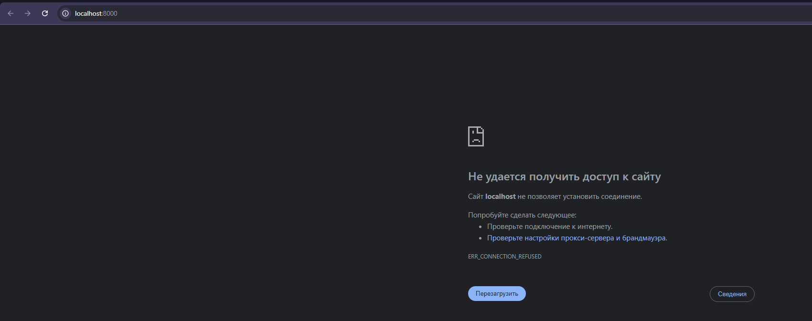
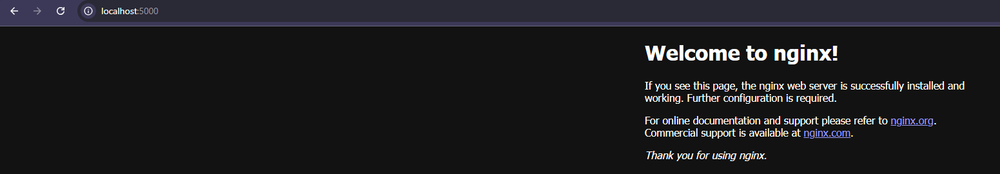
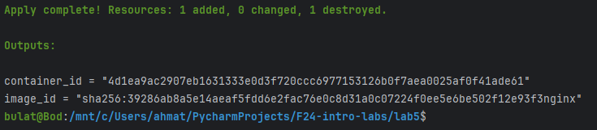

## Task 2: Terraform Installation and Nginx Deployment

### 1. Research and Installation:
Terraform is an open-source tool for "infrastructure as code". It enables users to define and provision data center infrastructure by writing code to describe the desired state. Terraform then manages the creation, modification, and deletion of resources to align with that state automatically.

```shell
sudo snap install terraform --classic
```

Verify:
```shell
terraform -help
```

<details>
<summary>Output</summary>

```
Usage: terraform [global options] <subcommand> [args]

The available commands for execution are listed below.
The primary workflow commands are given first, followed by
less common or more advanced commands.

Main commands:
  init          Prepare your working directory for other commands
  validate      Check whether the configuration is valid
  plan          Show changes required by the current configuration
  apply         Create or update infrastructure
  destroy       Destroy previously-created infrastructure

All other commands:
  console       Try Terraform expressions at an interactive command prompt
  fmt           Reformat your configuration in the standard style
  force-unlock  Release a stuck lock on the current workspace
  get           Install or upgrade remote Terraform modules
  graph         Generate a Graphviz graph of the steps in an operation
  import        Associate existing infrastructure with a Terraform resource
  login         Obtain and save credentials for a remote host
  logout        Remove locally-stored credentials for a remote host
  metadata      Metadata related commands
  output        Show output values from your root module
  providers     Show the providers required for this configuration
  refresh       Update the state to match remote systems
  show          Show the current state or a saved plan
  state         Advanced state management
  taint         Mark a resource instance as not fully functional
  test          Execute integration tests for Terraform modules
  untaint       Remove the 'tainted' state from a resource instance
  version       Show the current Terraform version
  workspace     Workspace management

Global options (use these before the subcommand, if any):
  -chdir=DIR    Switch to a different working directory before executing the
                given subcommand.
  -help         Show this help output, or the help for a specified subcommand.
  -version      An alias for the "version" subcommand.

```

</details>

Enable auto-completion:
```
touch ~/.bashrc
terraform -install-autocomplete
```

### 2. Nginx Deployment:

```shell
cd lab5
nano main.tf
```

And write:
<details>
<summary>Content</summary>

```
terraform {
  required_providers {
    docker = {
      source  = "kreuzwerker/docker"
      version = "~> 3.0.1"
    }
  }
}

provider "docker" {}

resource "docker_image" "nginx" {
  name         = "nginx"
  keep_locally = false
}

resource "docker_container" "nginx" {
  image = docker_image.nginx.image_id
  name  = "tutorial"

  ports {
    internal = 80
    external = 8000
  }
}
```

</details>

Initialize the project
```shell
terraform init
terraform apply
```

Opening http://localhost:8000/, we see:


We can change configuration using the same nano command:
```shell
nano main.tf
```

Let's change "external = 8000" to "external = 5000"

Then apply changes:
```shell
terraform apply
```

Then, if we try to open http://localhost:8000/, we see:

But with 5000 port we see welcome page:


### Let's try to destroy:
```shell
terraform destroy
```

<details>
<summary>Output</summary>

```
docker_image.nginx: Refreshing state... [id=sha256:39286ab8a5e14aeaf5fdd6e2fac76e0c8d31a0c07224f0ee5e6be502f12e93f3nginx]
docker_container.nginx: Refreshing state... [id=4f1da1b182e5cd8faf92ec006c98dfc87e66aefaf0d33d8dfb6f94acc5890b85]

Terraform used the selected providers to generate the following execution plan. Resource actions are indicated with the following symbols:
  - destroy

Terraform will perform the following actions:

  # docker_container.nginx will be destroyed
  - resource "docker_container" "nginx" {
      - attach                                      = false -> null
      - command                                     = [
          - "nginx",
          - "-g",
          - "daemon off;",
        ] -> null
      - container_read_refresh_timeout_milliseconds = 15000 -> null
      - cpu_shares                                  = 0 -> null
      - dns                                         = [] -> null
      - dns_opts                                    = [] -> null
      - dns_search                                  = [] -> null
      - entrypoint                                  = [
          - "/docker-entrypoint.sh",
        ] -> null
      - env                                         = [] -> null
      - group_add                                   = [] -> null
      - hostname                                    = "4f1da1b182e5" -> null
      - id                                          = "4f1da1b182e5cd8faf92ec006c98dfc87e66aefaf0d33d8dfb6f94acc5890b85" -> null
      - image                                       = "sha256:39286ab8a5e14aeaf5fdd6e2fac76e0c8d31a0c07224f0ee5e6be502f12e93f3" -> null
      - init                                        = false -> null
      - ipc_mode                                    = "private" -> null
      - log_driver                                  = "json-file" -> null
      - log_opts                                    = {} -> null
      - logs                                        = false -> null
      - max_retry_count                             = 0 -> null
      - memory                                      = 0 -> null
      - memory_swap                                 = 0 -> null
      - must_run                                    = true -> null
      - name                                        = "tutorial" -> null
      - network_data                                = [
          - {
              - gateway                   = "172.17.0.1"
              - global_ipv6_prefix_length = 0
              - ip_address                = "172.17.0.2"
              - ip_prefix_length          = 16
              - mac_address               = "02:42:ac:11:00:02"
              - network_name              = "bridge"
                # (2 unchanged attributes hidden)
            },
        ] -> null
      - network_mode                                = "bridge" -> null
      - privileged                                  = false -> null
      - publish_all_ports                           = false -> null
      - read_only                                   = false -> null
      - remove_volumes                              = true -> null
      - restart                                     = "no" -> null
      - rm                                          = false -> null
      - runtime                                     = "runc" -> null
      - security_opts                               = [] -> null
      - shm_size                                    = 64 -> null
      - start                                       = true -> null
      - stdin_open                                  = false -> null
      - stop_signal                                 = "SIGQUIT" -> null
      - stop_timeout                                = 0 -> null
      - storage_opts                                = {} -> null
      - sysctls                                     = {} -> null
      - tmpfs                                       = {} -> null
      - tty                                         = false -> null
      - wait                                        = false -> null
      - wait_timeout                                = 60 -> null
        # (7 unchanged attributes hidden)

      - ports {
          - external = 5000 -> null
          - internal = 80 -> null
          - ip       = "0.0.0.0" -> null
          - protocol = "tcp" -> null
        }
    }

  # docker_image.nginx will be destroyed
  - resource "docker_image" "nginx" {
      - id           = "sha256:39286ab8a5e14aeaf5fdd6e2fac76e0c8d31a0c07224f0ee5e6be502f12e93f3nginx" -> null
      - image_id     = "sha256:39286ab8a5e14aeaf5fdd6e2fac76e0c8d31a0c07224f0ee5e6be502f12e93f3" -> null
      - keep_locally = false -> null
      - name         = "nginx" -> null
      - repo_digest  = "nginx@sha256:04ba374043ccd2fc5c593885c0eacddebabd5ca375f9323666f28dfd5a9710e3" -> null
    }

Plan: 0 to add, 0 to change, 2 to destroy.

Do you really want to destroy all resources?
  Terraform will destroy all your managed infrastructure, as shown above.
  There is no undo. Only 'yes' will be accepted to confirm.

  Enter a value: yes

docker_container.nginx: Destroying... [id=4f1da1b182e5cd8faf92ec006c98dfc87e66aefaf0d33d8dfb6f94acc5890b85]
docker_container.nginx: Destruction complete after 1s
docker_image.nginx: Destroying... [id=sha256:39286ab8a5e14aeaf5fdd6e2fac76e0c8d31a0c07224f0ee5e6be502f12e93f3nginx]
docker_image.nginx: Destruction complete after 0s

Destroy complete! Resources: 2 destroyed.
```

</details>

We can check that docker container is removed:
```shell
bulat@Bod:/mnt/c/Users/ahmat/PycharmProjects/F24-intro-labs/lab5$ docker ps
CONTAINER ID   IMAGE     COMMAND   CREATED   STATUS    PORTS     NAMES
```

### Define input variables:
```shell
nano variables.tf
```

and write there:
```
variable "container_name" {
  description = "Value of the name for the Docker container"
  type        = string
  default     = "ExampleNginxContainer"
}
```

```shell
nano main.tf
```

```
resource "docker_container" "nginx" {
  image = docker_image.nginx.image_id
- name  = "tutorial"
+ name  = var.container_name
  ports {
    internal = 80
    external = 8080
  }
}
```

Apply conf:
```shell
terraform apply
```

Check container name:
```shell
bulat@Bod:/mnt/c/Users/ahmat/PycharmProjects/F24-intro-labs/lab5$ docker ps
CONTAINER ID   IMAGE          COMMAND                  CREATED          STATUS         PORTS                  NAMES
f18410842143   39286ab8a5e1   "/docker-entrypoint.…"   10 seconds ago   Up 9 seconds   0.0.0.0:5000->80/tcp   ExampleNginxContainer
```

Check if variable passes correctly:
```shell
terraform apply -var 'container_name=AmazingName'
docker ps
```

```
CONTAINER ID   IMAGE          COMMAND                  CREATED          STATUS          PORTS                  NAMES
91360c4f8ffb   39286ab8a5e1   "/docker-entrypoint.…"   21 seconds ago   Up 21 seconds   0.0.0.0:5000->80/tcp   AmazingName
```

### Query data with outputs

```shell
nano outputs.tf
```

```
output "container_id" {
  description = "ID of the Docker container"
  value       = docker_container.nginx.id
}

output "image_id" {
  description = "ID of the Docker image"
  value       = docker_image.nginx.id
}
```

Let's try to apply this configuration and check outputs:
```shell
terraform apply
```


### Challenges
I encountered the problem with installation, because of my location. I tried to install terraform using VPN, but it didn't help. For me the solution was to install using snap (my friend suggested me this solution)

### Terraform version
```shell
terraform --version
```
Terraform v1.9.6-dev
on linux_amd64
