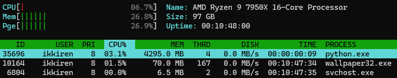
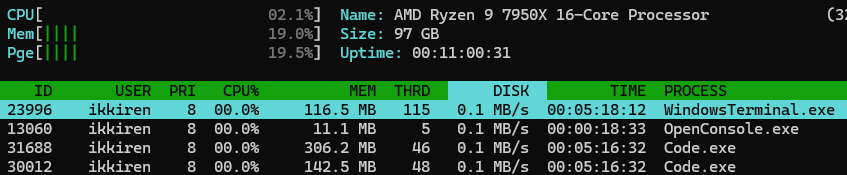
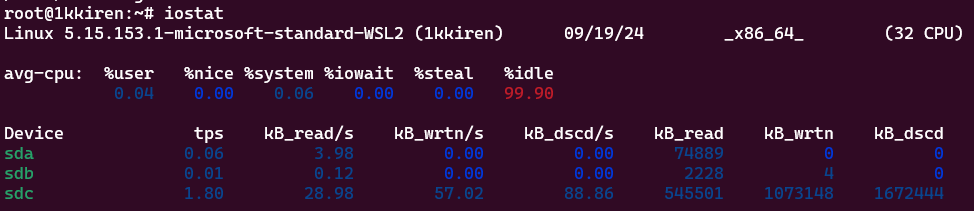

# Lab 5: GitOps & SRE Lab

## Task 1

1. **Monitor System Resources:**

    Top of CPU usage programs:
    1. python.exe
    2. wallpaper32.exe
    3. svchost.exe

    

    IOStat:

    
    

    **P.S.** as my main system is Windows I always use WSL in case I need some Linux staff, but in this task I did not use it because the data from WSL can not fully show the state of the system. I used [NTop](https://gsass1.github.io/NTop/) utility which does exactly the same thing on Windows as `htop` on Linux. Same situation with `iostat` command.

2. **Disk Space Management:**

    3 largest files:
    * 700M /var/cuda-repo-wsl-ubuntu-12-3-local/nsight-compute-2023.3.1_2023.3.1.1-1_amd64.deb
    * 688M /var/cuda-repo-wsl-ubuntu-12-2-local/nsight-compute-2023.2.2_2023.2.2.3-1_amd64.deb
    * 327M /var/cache/apt/archives/libcufft-dev-12-4_11.2.1.3-1_amd64.deb
