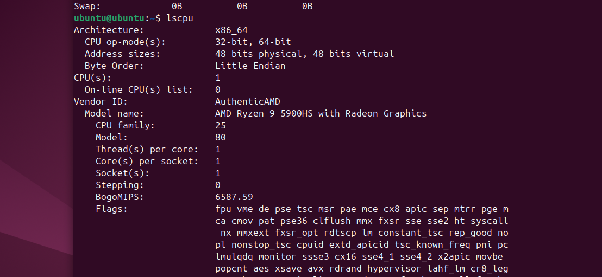

# Lab 7: Virtualization Lab

## Task 1

1. **Install VirtualBox**:

    Oracle VirtualBox 7.1.0 r164728

    

2. **Deploy a Virtual Machine**:

    * **Download Ubuntu ISO image**
    * **Use "New" button in VirtualBox to create VM**
    * **Specify name and OS (choose the downloaded one)**
        
    * **Specify user info**
        
    * **Allocate hardware**
        
    * **Allocate memory**
    

**Running VM:**

## Task 2

1. **Processor, RAM, and Network Information**:

    * **Processor**
    
    * **RAM**
    
    * **Network**
    

2. **Operating System Specifications**:

