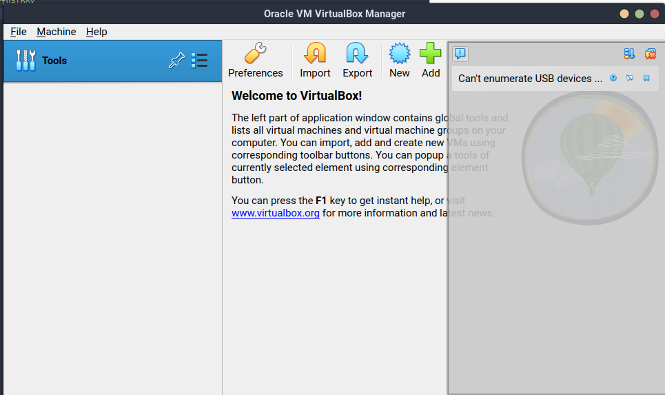
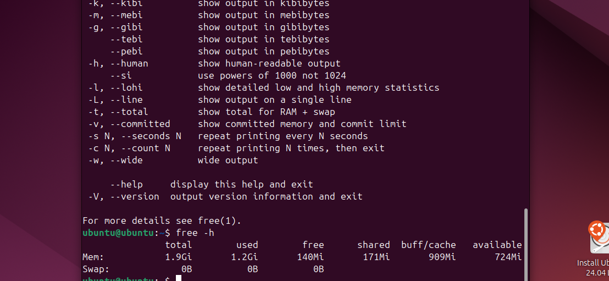

# VM Deployment

### 1. Installing VirtualBox

```sh
> sudo apt update
> sudo apt install virtualbox
```
```sh
> virtualbox --help
```

```sh
Oracle VM VirtualBox VM Selector v7.0.16_Ubuntu
Copyright (C) 2005-2024 Oracle and/or its affiliates

No special options.

If you are looking for --startvm and related options, you need to use VirtualBoxVM.
```

Here's the installed virtualbox


### 2. Deploying virtual machine

Let's choose system configuration


Running ubuntu:


# System Information Tools

Memory: 


Network:


RAM:



CPU:


OS:

