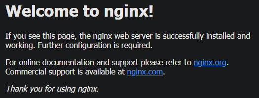

# Lab 8: Containers Lab - Docker

## Task 1

1. **List Containers**:

    ```shell
    > docker ps -a
    CONTAINER ID   IMAGE     COMMAND   CREATED   STATUS    PORTS     NAMES
    ```

2. **Pull Latest Ubuntu Image**:

    ```shell
    > docker pull ubuntu:latest
    latest: Pulling from library/ubuntu
    dafa2b0c44d2: Pull complete
    Digest: sha256:dfc10878be8d8fc9c61cbff33166cb1d1fe44391539243703c72766894fa834a
    Status: Downloaded newer image for ubuntu:latest
    docker.io/library/ubuntu:latest

    What's next:
        View a summary of image vulnerabilities and recommendations → docker scout quickview ubuntu:latest
    ```

3. **Run Container**:

    ```shell
    > docker run -it --name ubuntu_container ubuntu:latest
    root@b763a8f57be0:/#
    ```

4. **Remove Image**:

    ```shell
    > docker rmi ubuntu:latest
    Error response from daemon: conflict: unable to remove repository reference "ubuntu:latest" (must force) - container b763a8f57be0 is using its referenced image b1e9cef3f297
    ```

    Obviously, we won't be able to delete the image because we have its container. Delete it first.

    ```shell
    > docker stop ubuntu_container
    ubuntu_container
    > docker rm ubuntu_container
    ubuntu_container
    > docker rmi ubuntu:latest
    Untagged: ubuntu:latest
    Untagged: ubuntu@sha256:dfc10878be8d8fc9c61cbff33166cb1d1fe44391539243703c72766894fa834a
    Deleted: sha256:b1e9cef3f2977f8bdd19eb9ae04f83b315f80fe4f5c5651fedf41482c12432f7
    Deleted: sha256:b15b682e901dd27efdf436ce837a94c729c0b78c44431d5b5ca3ccca1bed40da
    ```

## Task 2

1. **Create Image Archive**:

    ```shell
    > docker pull ubuntu:latest
    latest: Pulling from library/ubuntu
    dafa2b0c44d2: Pull complete
    Digest: sha256:dfc10878be8d8fc9c61cbff33166cb1d1fe44391539243703c72766894fa834a
    Status: Downloaded newer image for ubuntu:latest
    docker.io/library/ubuntu:latest

    What's next:
        View a summary of image vulnerabilities and recommendations → docker scout quickview ubuntu:latest

    > docker save -o ubuntu_image.tar ubuntu:latest
    >
    ```

    Image size: 78.1 MB

    Archive size: 76.8 MB

    Diff: 1.3 MB

    The size of the archive expected to be larger due to additional metadata for the `.tar` archive extension.

2. **Run Nginx Container**:

    ```shell
    > docker run -d -p 80:80 --name nginx_container nginx
    Unable to find image 'nginx:latest' locally
    latest: Pulling from library/nginx
    a2318d6c47ec: Pull complete
    095d327c79ae: Pull complete
    bbfaa25db775: Pull complete
    7bb6fb0cfb2b: Pull complete
    0723edc10c17: Pull complete
    24b3fdc4d1e3: Pull complete
    3122471704d5: Pull complete
    Digest: sha256:04ba374043ccd2fc5c593885c0eacddebabd5ca375f9323666f28dfd5a9710e3
    Status: Downloaded newer image for nginx:latest
    ae6a5b316c15ed71b17fba80e87470f85c65b9bdb5658cf5651ee538f6f71e0a
    ```

    

3. **Create HTML File**:

    ```shell
    > docker cp index.html nginx_container:/usr/share/nginx/html/index.html
    Successfully copied 2.05kB to nginx_container:/usr/share/nginx/html/index.html
    ```

4. **Create Custom Image**:

    ```shell
    > docker commit nginx_container my_website:latest
    sha256:6d73ea2c187ff1d417d5f40977add011d24cd20dfa93ef8994609fea13bcad26
    ```

5. **Remove Original Container**:

    ```shell
    > docker rm -f nginx_container
    nginx_container
    ```

6. **Create New Container**:

    ```shell
    > docker run -d -p 80:80 --name my_website_container my_website:latest
    43ae43e4b64cbb2396297183d9d3dfb0a1ec9a90035ba46f314d193619fc6183
    ```

7. **Test Web Server**:

    ```shell
    > curl http://127.0.0.1:80
    <html>
        <head>
            <title>The best</title>
        </head>
        <body>
            <h1>website</h1>
        </body>
    </html>
    ```

8. **Analyze Image Changes**:

    ```shell
    > docker diff my_website_container
    C /etc
    C /etc/nginx
    C /etc/nginx/conf.d
    C /etc/nginx/conf.d/default.conf
    C /run
    C /run/nginx.pid
    ```

    The `docker diff` command shows the changes made to the file system of the container.

    The changes appear due to the fact that we copied a new HTML file to the nginx container and then created a new custom image from the existing nginx container.
