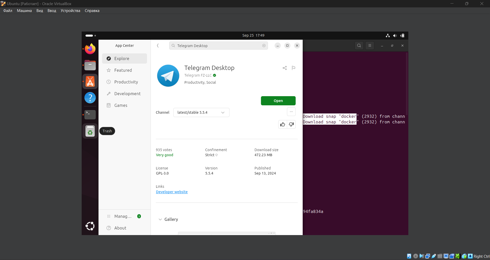

# Lab 1: Introduction to DevOps with Git

## Task 1: SSH Commit Signature Verification

1. **Explore the Importance of Signed Commits**:
   
   **Research**: Learn why commit signing is crucial for verifying the integrity and authenticity of commits.

    - Integrity verification is crucial for keeping version under control. If someone tries to modify the commit, the signature will no longer match, indicating that the commit has been tampered with. So, it ensures that contents of commit are not modified from when commit was created.

    - Authenticity verification is crusial for tracking commiters' identity. By signing a commit, the author can prove that they are indeed the person who created the commit. The author signs the commit with their private key, and others can verify the signature using the author's public key. This ensures that the commit is from the particular author.

2. **Set Up SSH Commit Signing**:

    I do not have a pair of SSH key-value, so I am choosing second option
   - **Option 2: Generate a New SSH Key (Recommended: ed25519 Format)**:
     - Generate a new SSH key pair using the ed25519 format.

       ```sh
       ssh-keygen -t ed25519 -C "m.brednikov@innopolis.university"
       ```

     - Add the public key to your GitHub account.
       Done

   - Configure Git to use your new SSH key for signing commits.

     ```sh
     git config --global user.signingkey <MY_SSH_KEY>
     git config --global commit.gpgSign true
     git config --global gpg.format ssh
     ```

3. **Make a Signed Commit**:
   - Create and sign a commit.

     ```sh
     git commit -S -m "Your signed commit message"
     ```

   - Thats what I get:
     ```sh
     $ git commit -S -m "My first signed commit message"
     [Lab1 7d95076] My first signed commit message
     2 files changed, 0 insertions(+), 0 deletions(-)
     create mode 100644 image.png
     create mode 100644 submission1.md
     ```

   So I guess everything is done.

   - Push the commit with your submission1.md file.

   There is still a problem:

   ```sh
   $ git commit -S -m "My third signed (and I guess verified) commit message"
   [Lab1 0f2195a] My third signed (and I guess verified) commit message
   1 file changed, 1 insertion(+), 1 deletion(-)

   $git verify-commit 0f2195a
   Good "git" signature for m.brednikov@innopolis.university with ED25519 key <MY_KEY>
   ```

   So, everything should be fine? Nope, in GitHub, my commit is marked as 'unverified' and I can not understand why. (I added my key 2 times - as authentification and verification keys, but still run into this).

## Task 2: Merge Strategies in Git

1. **Research Merge Strategies**:
   - **Standard Merge**: Combines two branches by creating a merge commit. This method keeps all commits as a complete history.
     - It is easy to track past changes because all the commits are in history;
     - There are no commit conflicts because they are maintained
     - For long-term, it could make the repository grow to enormous size
     - For long-term, the commit history could become a tree with large number of branches - hard to orient

     Often preferred in collaborative environments because it maintains a clear and complete record of all contributions and changes, which is crucial for understanding the project's history.
   - **Squash and Merge**: Combines all commits from a feature branch into a single commit before merging.
     - Makes the commit history easier by combining all commits from some (non-master) branch into one commit
     - May lead to conflicts due to different versions of the same file in different squashed commits
     - May lead to lack of understanding changes because of lack of detailed history
   - **Rebase and Merge**: Reapplies commits from a feature branch onto the base branch.
    - Makes the history of commits linear - feature branches commits are on top of the main branch commits
    - There are no merge commits, so it may be hard to keep track on merges
    -  It rewrites the commit history, which might lead to conflicts or loss of information

2. **Modify Repository Settings**:
   - **Disable Squash and Rebase Merge**:
     - Go to the Settings page of your forked repository on GitHub.
     - Navigate to the "Options" section.

     
     Done ;)