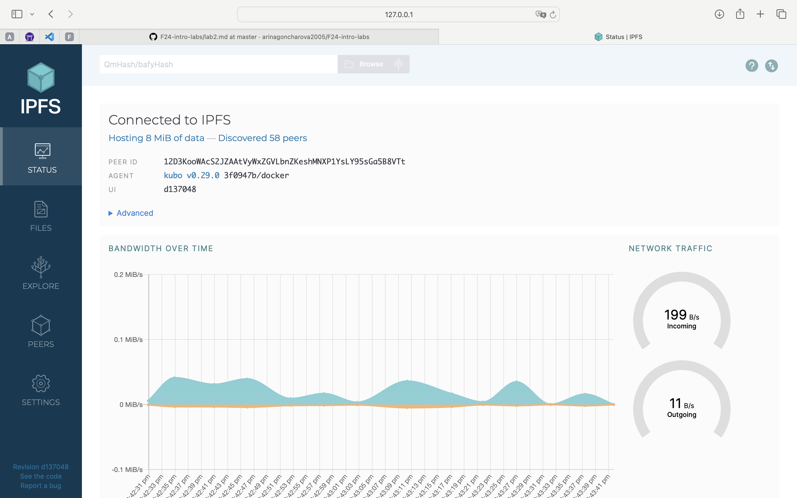
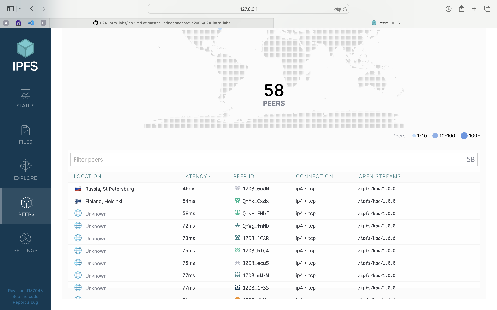

### Task 1

Connected peers: 58

Some information about connected peers.

Bandwidth:

- incoming 199 B/s
- outgoing 11 B/s

Hash: QmYoR9uhqYsZGpDDGHEi9PVSvvuk1wRncmuoayuSpZGHgP

URL: https://ipfs.io/ipfs/QmYoR9uhqYsZGpDDGHEi9PVSvvuk1wRncmuoayuSpZGHgP?filename=cat_devops.jpeg

### Task 2

IPFS link: https://ipfs.io/ipfs/bafybeihgz4t3tqerdkk5pceqbgvg2t7dudi6qjbbxtaexpyotu4uqsr43e/

Domain of the deployed project: https://raspy-rocket-young.on-fleek.app
