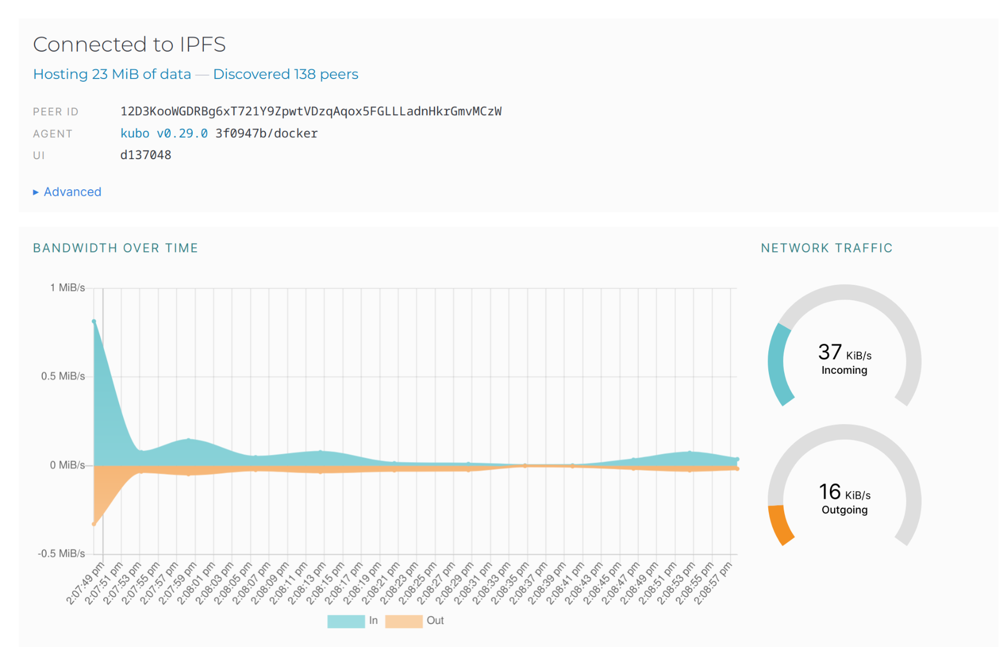
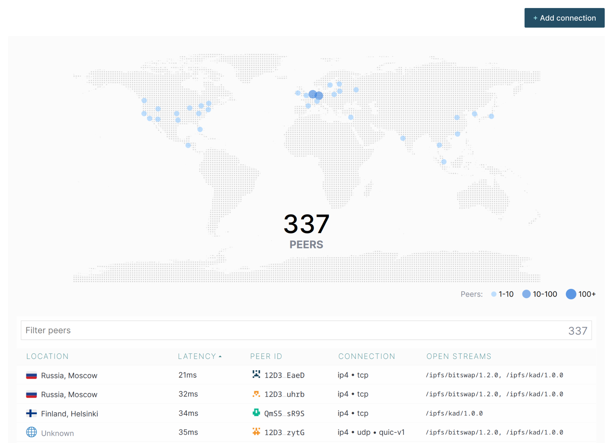
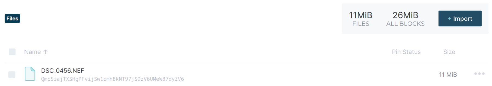

# Task 1

### Information of the available peers and the bandwidth are presented below in pictures:

### I've managed to upload the [file to the IPFS](https://ipfs.io/ipfs/QmcSiajTXSHgPFvijSw1cmh8KNT97jS9zV6UMeW87dyZV6) and get it locally. However, I didn't manage to reach it through the public gateway.

>Hash:
QmcSiajTXSHgPFvijSw1cmh8KNT97jS9zV6UMeW87dyZV6

# Task 2

### [Deployment Link](https://ipfs.io/ipfs/bafybeidnf5oqceh4fm4vyzwefb7bvchyxp3hrea3s47zgvwwzjxgpdpi5e/)