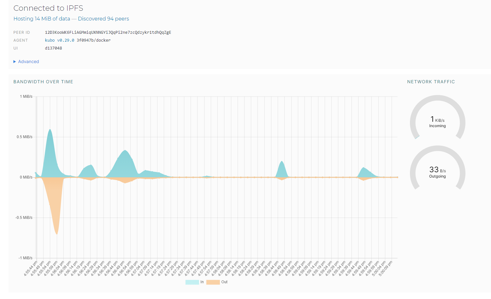
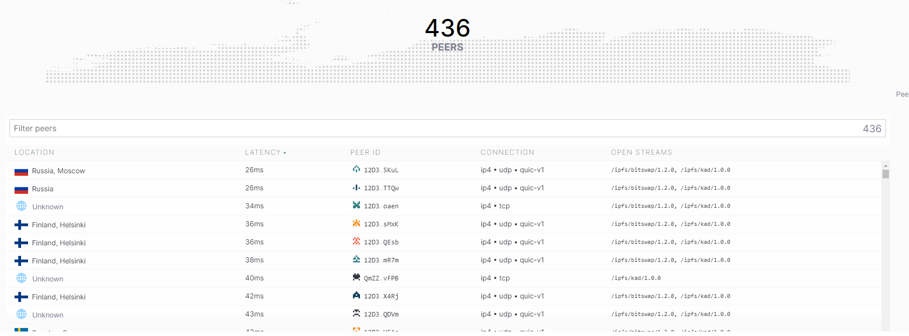

## Task 1: Set Up an IPFS Gateway Using Docker

**As you can see, bandwidth is up to about 0.6 MiB/s for download and up to about 0.7 MiB/s for upload.
436 peers, from different locations.**

**CID (hash) of my file is:** QmNdJe93YXNS7nwcxkYwjPvzAuyGixCqM1uJfn5yGCwuRP

**URL:** https://ipfs.io/ipfs/QmNdJe93YXNS7nwcxkYwjPvzAuyGixCqM1uJfn5yGCwuRP?filename=manifest.json

For some reason, I can't reach it.

## Task 2: Set Up Project on Fleek.co

**IPFS Link:** https://ipfs.io/ipfs/bafybeibnwhprt7opc5ltxvj7yog33hjsszcnzorc32c6y5tfnsq47ggzza/

**Domain:** https://sparse-book-hissing.on-fleek.app/