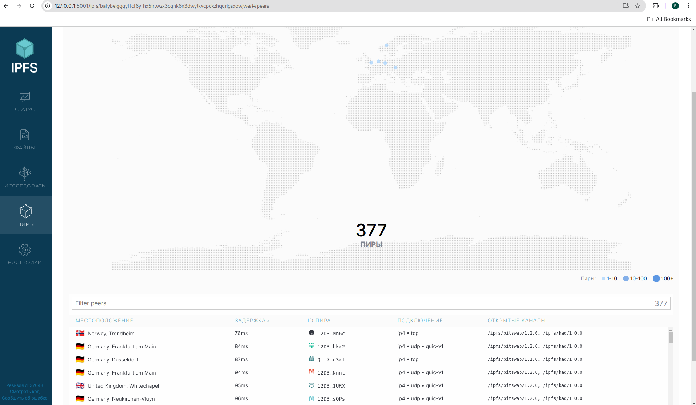
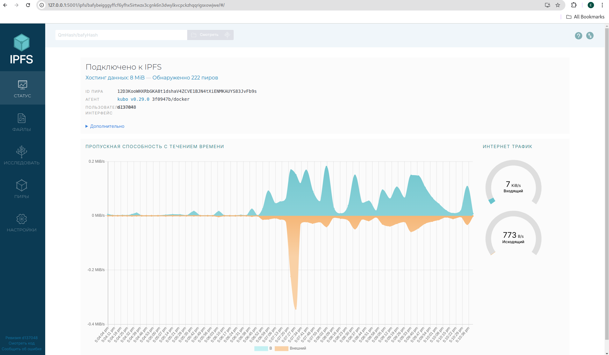

# Task 1: Set Up an IPFS Gateway Using Docker

## Connected Peers and Bandwidth

**Connected Peers:** 

**Bandwidth:** 

## File Hash and Verification URLs

- **File Hash:** 

QmarCyCa387tskCpkJCMEVnEnDsyCsuX9c2np3d1XGWdyk
  
- **Verification URLs:**
- IPFS.io Gateway
`https://ipfs.io/ipfs/QmarCyCa387tskCpkJCMEVnEnDsyCsuX9c2np3d1XGWdyk`

- Cloudflare IPFS Gateway
`https://cloudflare-ipfs.com/ipfs/QmarCyCa387tskCpkJCMEVnEnDsyCsuX9c2np3d1XGWdyk`

- Infura IPFS Gateway
`https://infura-ipfs.io/ipfs/QmarCyCa387tskCpkJCMEVnEnDsyCsuX9c2np3d1XGWdyk`

Or, I can access the file via Local IPFS Node:
`http://127.0.0.1:8080/ipfs/QmarCyCa387tskCpkJCMEVnEnDsyCsuX9c2np3d1XGWdyk`

# Task 2: Set Up Project on Fleek.co

IPFS hash:
bafybeibihvtzf44cxm2dndgmake5jj4drwkki46gtuekbgr7wme2ws5yui

**IPFS link and domain**

https://ipfs.io/ipfs/bafybeibihvtzf44cxm2dndgmake5jj4drwkki46gtuekbgr7wme2ws5yui/

https://swift-rose-wide.on-fleek.app/

# Notes about IPFS and Fleek

**IPFS (InterPlanetary File System)** is a decentralized network protocol that allows users to store and share files in a distributed manner. Instead of relying on a single central server, files on IPFS are stored across multiple nodes (computers) within the network. This distribution makes files more resilient and resistant to censorship, as they can be retrieved from any node that has a copy of the data.

**Fleek** is a platform that simplifies the deployment of websites and applications on the decentralized web. It seamlessly integrates with IPFS, providing tools to easily host, manage, and deploy projects. Key features include continuous deployment (CD) from Git repositories, IPFS hosting, domain management, and more. Fleek automates the process of deploying updates, making it easier for developers to maintain and distribute their projects.