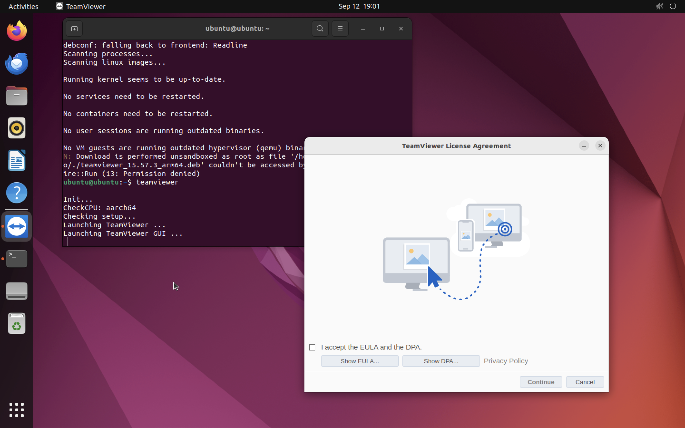

## Task 1

1. Create a directory for my repository.

```
mkdir -p ~/local-apt-repo
```

2. Copy file teamviewer_15.57.3_arm64.deb to this folder.

```
cp /home/ubuntu/Downloads/teamviewer_15.57.3_arm64.deb ~/local-apt-repo/
```

3. Find packages from local repository that can be installed using `dpkg-scanpackages` and compress obtained `Packages` file into `Packages.dz`using `gzip -9c`.

```
dpkg-scanpackages ~/local-apt-repo /dev/null | gzip -9c > ~/local-apt-repo/Packages.gz
```

**Output**

```
dpkg-scanpackages: warning: Packages in archive but missing from override file:
dpkg-scanpackages: warning:   teamviewer
dpkg-scanpackages: info: Wrote 1 entries to output Packages file.
```

4. Add the repository to sources.list.

```
echo "deb [trusted=yes] file:/home/ubuntu/local-apt-repo ./" | sudo tee /etc/apt/sources.list.d/local-apt-repo.list
sudo apt update
```

**Output**

```
deb [trusted=yes] file:/home/ubuntu/local-apt-repo ./
```

5. Check the content of Packages.gz file.

```
zcat /home/ubuntu/local-apt-repo/Packages.gz
```

**Output**

```
Package: teamviewer
Version: 15.57.3
Architecture: arm64
Maintainer: TeamViewer Germany GmbH <service@teamviewer.com>
Installed-Size: 332020
Depends: libc6 (>= 2.17), libdbus-1-3, libexpat1, libfontconfig1, libfreetype6, libglib2.0-0, libgl1, libice6, libminizip1, libnspr4, libnss3, libsm6, libx11-6, libx11-xcb1, libxcb1, libxcb-glx0, libxcb-icccm4, libxcb-image0, libxcb-keysyms1, libxcb-randr0, libxcb-render0, libxcb-render-util0, libxcb-shape0, libxcb-shm0, libxcb-sync1, libxcb-xfixes0, libxcb-xinerama0, libxcb-xkb1, libxcomposite1, libxcursor1, libxdamage1, libxext6, libxfixes3, libxi6, libxkbcommon0, libxkbcommon-x11-0, libxrandr2, libxrender1, libxss1, libxtst6, zlib1g, libpolkit-agent-1-0, policykit-1
Recommends: ttf-liberation | fonts-liberation, xdg-utils
Conflicts: teamviewer-host
Filename: /home/ubuntu/local-apt-repo/teamviewer_15.57.3_arm64.deb
Size: 93218320
MD5sum: 7545690cc2fb058cab93ac040e7df48f
SHA1: a4ee0050aad644e32f83b66e75c7de2e3d766d27
SHA256: 031ce64d39f65979d6fb86eee200201682b28013e46665cf603e6c731294624a
Section: non-free/net
Priority: optional
Homepage: http://www.teamviewer.com
Description: Remote control and meeting solution.
 TeamViewer provides easy, fast and secure remote access and meeting solutions
 to Linux, Windows PCs, Apple PCs and various other platforms,
 including Android and iPhone.
 .
 TeamViewer is free for personal use.
 You can use TeamViewer completely free of charge to access your private
 computers or to help your friends with their computer problems.
 .
 To buy a license for commercial use, please visit http://www.teamviewer.com
 .
 This package contains Free Software components.
 For details, see /opt/teamviewer/doc/license_foss.txt

```

6. Check the info about status of package and the its available versions.

```
apt policy teamviewer
```

**Output**

```
teamviewer:
  Installed: (none)
  Candidate: 15.57.3
  Version table:
     15.57.3 500
        500 file:/home/ubuntu/local-apt-repo ./ Packages
```

7. Install teamviewer package from my local repository.

```
sudo apt install teamviewer
```

**Output**

```
Reading package lists... Done
Building dependency tree... Done
Reading state information... Done
The following additional packages will be installed:
  libminizip1 libxcb-xinerama0 libxss1
The following NEW packages will be installed:
  libminizip1 libxcb-xinerama0 libxss1 teamviewer
0 upgraded, 4 newly installed, 0 to remove and 14 not upgraded.
Need to get 0 B/93.2 MB of archives.
After this operation, 340 MB of additional disk space will be used.
Do you want to continue? [Y/n] y
Get:1 file:/home/ubuntu/local-apt-repo ./ teamviewer 15.57.3 [93.2 MB]
debconf: delaying package configuration, since apt-utils is not installed
Selecting previously unselected package libminizip1:arm64.
(Reading database ... 207526 files and directories currently installed.)
Preparing to unpack .../libminizip1_1.1-8build1_arm64.deb ...
Unpacking libminizip1:arm64 (1.1-8build1) ...
Selecting previously unselected package libxcb-xinerama0:arm64.
Preparing to unpack .../libxcb-xinerama0_1.14-3ubuntu3_arm64.deb ...
Unpacking libxcb-xinerama0:arm64 (1.14-3ubuntu3) ...
Selecting previously unselected package libxss1:arm64.
Preparing to unpack .../libxss1_1%3a1.2.3-1build2_arm64.deb ...
Unpacking libxss1:arm64 (1:1.2.3-1build2) ...
Selecting previously unselected package teamviewer.
Preparing to unpack ..././teamviewer_15.57.3_arm64.deb ...
Unpacking teamviewer (15.57.3) ...
Setting up libminizip1:arm64 (1.1-8build1) ...
Setting up libxcb-xinerama0:arm64 (1.14-3ubuntu3) ...
Setting up libxss1:arm64 (1:1.2.3-1build2) ...
Setting up teamviewer (15.57.3) ...
Processing triggers for mailcap (3.70+nmu1ubuntu1) ...
Processing triggers for desktop-file-utils (0.26-1ubuntu3) ...
Processing triggers for hicolor-icon-theme (0.17-2) ...
Processing triggers for gnome-menus (3.36.0-1ubuntu3) ...
Processing triggers for libc-bin (2.35-0ubuntu3.8) ...
Processing triggers for dbus (1.12.20-2ubuntu4.1) ...
debconf: unable to initialize frontend: Dialog
debconf: (No usable dialog-like program is installed, so the dialog based frontend cannot be used. at /usr/share/perl5/Debconf/FrontEnd/Dialog.pm line 78.)
debconf: falling back to frontend: Readline
Scanning processes...
Scanning linux images...

Running kernel seems to be up-to-date.

No services need to be restarted.

No containers need to be restarted.

No user sessions are running outdated binaries.

No VM guests are running outdated hypervisor (qemu) binaries on this host.
N: Download is performed unsandboxed as root as file '/home/ubuntu/local-apt-repo/./teamviewer_15.57.3_arm64.deb' couldn't be accessed by user '_apt'. - pkgAcquire::Run (13: Permission denied)

```

#### The result of the installation



## Task 2

1. I decided to simulate the installation of the same teamviewer package, therefore I firstly performed simulation and after that installation at step 7 in the first task.

2. Show the details of the package.

```
apt-cache showpkg teamviewer
```

**Output**

```
Package: teamviewer
Versions:
15.57.3 (/var/lib/apt/lists/_home_ubuntu_local-apt-repo_._Packages)
 Description Language:
                 File: /var/lib/apt/lists/_home_ubuntu_local-apt-repo_._Packages
                  MD5: a0aa4ae13eb88cfd7b406505af08544b


Reverse Depends:
Dependencies:
15.57.3 - libc6 (2 2.17) libdbus-1-3 (0 (null)) libexpat1 (0 (null)) libfontconfig1 (0 (null)) libfreetype6 (0 (null)) libglib2.0-0 (0 (null)) libgl1 (0 (null)) libice6 (0 (null)) libminizip1 (0 (null)) libnspr4 (0 (null)) libnss3 (0 (null)) libsm6 (0 (null)) libx11-6 (0 (null)) libx11-xcb1 (0 (null)) libxcb1 (0 (null)) libxcb-glx0 (0 (null)) libxcb-icccm4 (0 (null)) libxcb-image0 (0 (null)) libxcb-keysyms1 (0 (null)) libxcb-randr0 (0 (null)) libxcb-render0 (0 (null)) libxcb-render-util0 (0 (null)) libxcb-shape0 (0 (null)) libxcb-shm0 (0 (null)) libxcb-sync1 (0 (null)) libxcb-xfixes0 (0 (null)) libxcb-xinerama0 (0 (null)) libxcb-xkb1 (0 (null)) libxcomposite1 (0 (null)) libxcursor1 (0 (null)) libxdamage1 (0 (null)) libxext6 (0 (null)) libxfixes3 (0 (null)) libxi6 (0 (null)) libxkbcommon0 (0 (null)) libxkbcommon-x11-0 (0 (null)) libxrandr2 (0 (null)) libxrender1 (0 (null)) libxss1 (0 (null)) libxtst6 (0 (null)) zlib1g (0 (null)) libpolkit-agent-1-0 (0 (null)) policykit-1 (0 (null)) teamviewer-host (0 (null)) ttf-liberation (16 (null)) fonts-liberation (0 (null)) xdg-utils (0 (null))
Provides:
15.57.3 -
Reverse Provides:
```

3. Simulate installation

```
sudo apt-get install -s teamviewer
```

**Output**

```
Reading package lists... Done
Building dependency tree... Done
Reading state information... Done
The following additional packages will be installed:
  libminizip1 libxcb-xinerama0 libxss1
The following NEW packages will be installed:
  libminizip1 libxcb-xinerama0 libxss1 teamviewer
0 upgraded, 4 newly installed, 0 to remove and 14 not upgraded.
Inst libminizip1 (1.1-8build1 Ubuntu:22.04/jammy [arm64])
Inst libxcb-xinerama0 (1.14-3ubuntu3 Ubuntu:22.04/jammy [arm64])
Inst libxss1 (1:1.2.3-1build2 Ubuntu:22.04/jammy [arm64])
Inst teamviewer (15.57.3 localhost [arm64])
Conf libminizip1 (1.1-8build1 Ubuntu:22.04/jammy [arm64])
Conf libxcb-xinerama0 (1.14-3ubuntu3 Ubuntu:22.04/jammy [arm64])
Conf libxss1 (1:1.2.3-1build2 Ubuntu:22.04/jammy [arm64])
Conf teamviewer (15.57.3 localhost [arm64])

```

### Dependencies that would be installed

libminizip1 version 1.1-8build1

libxcb-xinerama0 version 1.14-3ubuntu3

libxss1 version 1:1.2.3-1build2

### Packages that would be installed

teamviewer with version 15.57.3

## Task 3

1. Teamviewer package was installed in the first task. I decided to experiment with it.

2. Hold the package.

```
sudo apt-mark hold teamviewer
```

**Output**

```
teamviewer set on hold.
```

3. Verify the hold status.

```
apt-mark showhold
```

**Output**

```
teamviewer
```

`teamviewer` is not allowed to be upgraded now.

4. Unhold the package.

```
sudo apt-mark unhold teamviewer
```

**Output**

```
Canceled hold on teamviewer.
```

5. Check the status.

```
apt-mark showhold
```

The command printed nothing, therefore `teamviewer` is allowed to be upgraded now.
