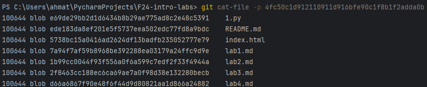
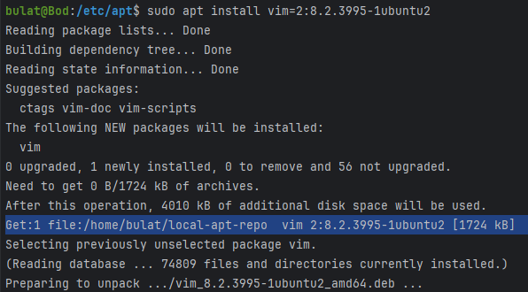

## Task 1: Configure and Use a Local Package Repository

### 1. WSL:
```shell
wsl
```

### 2. Create a local repository and place VIM .deb package in it:
```shell
mkdir -p ~/local-apt-repo/
cd ~/local-apt-repo/
sudo wget http://archive.ubuntu.com/ubuntu/pool/main/v/vim/vim_8.2.3995-1ubuntu2_amd64.deb
```


### 3. Generate the Package Index:
```shell
dpkg-scanpackages -m . > Packages
```

### 4. Add the Local Repository to Your Sources List:
```shell
echo "deb [trusted=yes] file:/home/bulat/local-apt-repo /" | sudo tee /etc/apt/sources.list.d/local-apt-repo.list
sudo apt update
```

### 5. Change the priority of apt:
```shell
sudo nano /etc/apt/sources.list
```
**And add "deb [trusted=yes] file:/home/bulat/local-apt-repo /" on top of this file**

### 6. Verify the Contents of the Packages.gz File:
```shell
cat Packages
apt policy vim
```


### 7. Remove and Install a Package from the Local Repository:
```shell
sudo apt remove vim
sudo apt install vim=2:8.2.3995-1ubuntu2
```


### 8. Install needed dependencies from Ubuntu Archive (as it's not our .deb file and we don't care)
```shell
sudo apt install vim-common=2:8.2.3995-1ubuntu2
sudo apt install vim-runtime=2:8.2.3995-1ubuntu2
```

### 9. Install vim from our local repository:
```shell
sudo apt install vim=2:8.2.3995-1ubuntu2
```


**...**

## Task 2: Simulate Package Installation and Identify Dependencies

```shell
apt-cache showpkg vim
```

<details>
<summary>Output</summary>

```
Package: vim
Versions:
2:8.2.3995-1ubuntu2.18 (/var/lib/apt/lists/archive.ubuntu.com_ubuntu_dists_jammy-updates_main_binary-amd64_Packages) (/var/lib/apt/lists/security.ubuntu.com_ubuntu_dists_jammy-security_main_binary-amd64_Packages)
 Description Language:
                 File: /var/lib/apt/lists/_home_bulat_local-apt-repo_Packages
                  MD5: 59e8b8f7757db8b53566d5d119872de8
 Description Language: en
                 File: /var/lib/apt/lists/archive.ubuntu.com_ubuntu_dists_jammy_main_i18n_Translation-en
                  MD5: 59e8b8f7757db8b53566d5d119872de8
 Description Language:
                 File: /var/lib/apt/lists/archive.ubuntu.com_ubuntu_dists_jammy-updates_main_binary-amd64_Packages
                  MD5: 59e8b8f7757db8b53566d5d119872de8

2:8.2.3995-1ubuntu2 (/var/lib/apt/lists/_home_bulat_local-apt-repo_Packages) (/var/lib/apt/lists/archive.ubuntu.com_ubuntu_dists_jammy_main_binary-amd64_Packages) (/var/lib/dpkg/status)
 Description Language:
                 File: /var/lib/apt/lists/_home_bulat_local-apt-repo_Packages
                  MD5: 59e8b8f7757db8b53566d5d119872de8
 Description Language: en
                 File: /var/lib/apt/lists/archive.ubuntu.com_ubuntu_dists_jammy_main_i18n_Translation-en
                  MD5: 59e8b8f7757db8b53566d5d119872de8
 Description Language:
                 File: /var/lib/apt/lists/archive.ubuntu.com_ubuntu_dists_jammy-updates_main_binary-amd64_Packages
                  MD5: 59e8b8f7757db8b53566d5d119872de8


Reverse Depends:
  vim-ale,vim 2:8.1.0693-2~
  vim-syntax-docker,vim
  vim-syntax-docker,vim
  vim-runtime,vim
  vim-common,vim
  ubuntu-wsl,vim
  ubuntu-server,vim
  exuberant-ctags,vim
  x2gothinclient-chroot,vim
  vim-voom,vim 2:8.1.0693-2~
  vim-vader,vim 2:8.1.0693-2~
  vim-tlib,vim
  vim-textobj-user,vim
  vim-tabular,vim
  vim-syntax-docker,vim
  vim-syntastic,vim
  vim-subtitles,vim 2:8.1.0693-2~
  vim-solarized,vim 2:8.1.0693-2~
  vim-snippets,vim
  vim-snipmate,vim
  vim-scripts,vim 2:8.1.0693-2~
  vim-redact-pass,vim 2:8.1.0693-2~
  vim-rails,vim
  vim-python-jedi,vim 2:8.1.0693-2~
  vim-puppet,vim 2:8.1.0693-2~
  vim-poke,vim 2:8.1.0693-2~
  vim-migemo,vim
  vim-ledger,vim 2:8.1.0693-2~
  vim-latexsuite,vim
  vim-latexsuite,vim
  vim-lastplace,vim
  vim-khuno,vim
  vim-julia,vim
  vim-icinga2,vim 2:8.1.0693-2~
  vim-gitgutter,vim 2:8.1.0693-2~
  vim-git-hub,vim 2:8.1.0693-2~
  vim-fugitive,vim
  vim-ctrlp,vim 2:8.1.0693-2~
  vim-bitbake,vim
  vim-autopep8,vim
  byobu,vim
  vim-airline-themes,vim
  vim-airline,vim
  vim-addon-mw-utils,vim
  vim-addon-manager,vim
  universal-ctags,vim
  tpp,vim
  supercollider-vim,vim
  ocaml-tools,vim
  lubuntu-desktop,vim
  libvi-quickfix-perl,vim
  imediff,vim
  halibut,vim
  gworkspace-apps-wrappers,vim
  games-python3-dev,vim
  games-c++-dev,vim
  dnsvi,vim
  debian-reference-common,vim
  cif-tools,vim
  biosyntax-vim,vim
  bikeshed,vim
  vim-runtime,vim
  vim-common,vim
  ubuntu-wsl,vim
  ubuntu-server,vim
  exuberant-ctags,vim
Dependencies:
2:8.2.3995-1ubuntu2.18 - vim-common (5 2:8.2.3995-1ubuntu2.18) vim-runtime (5 2:8.2.3995-1ubuntu2.18) libacl1 (2 2.2.23) libc6 (2 2.34) libgpm2 (2 1.20.7) libpython3.10 (2 3.10.0) libselinux1 (2 3.1~) libsodium23 (2 1.0.14) libtinfo6 (2 6) ctags (0 (null)) vim-doc (0 (null)) vim-scripts (0 (null))
2:8.2.3995-1ubuntu2 - vim-common (5 2:8.2.3995-1ubuntu2) vim-runtime (5 2:8.2.3995-1ubuntu2) libacl1 (2 2.2.23) libc6 (2 2.34) libgpm2 (2 1.20.7) libpython3.10 (2 3.10.0) libselinux1 (2 3.1~) libsodium23 (2 1.0.14) libtinfo6 (2 6) ctags (0 (null)) vim-doc (0 (null)) vim-scripts (0 (null))
Provides:
2:8.2.3995-1ubuntu2.18 - editor (= )
2:8.2.3995-1ubuntu2 - editor (= )
Reverse Provides:
vim-nox 2:8.2.3995-1ubuntu2.18 (= 2:8.2.3995-1ubuntu2.18)
vim-gtk3 2:8.2.3995-1ubuntu2.18 (= 2:8.2.3995-1ubuntu2.18)
vim-athena 2:8.2.3995-1ubuntu2.18 (= 2:8.2.3995-1ubuntu2.18)
vim-nox 2:8.2.3995-1ubuntu2 (= 2:8.2.3995-1ubuntu2)
vim-gtk3 2:8.2.3995-1ubuntu2 (= 2:8.2.3995-1ubuntu2)
vim-athena 2:8.2.3995-1ubuntu2 (= 2:8.2.3995-1ubuntu2)
```

</details>

```shell
sudo apt-get install -s vim
```

<details>
<summary>Output</summary>

```shell
Reading package lists... Done
Building dependency tree... Done
Reading state information... Done
The following additional packages will be installed:
  vim-common vim-runtime
Suggested packages:
  ctags vim-doc vim-scripts
The following packages will be upgraded:
  vim vim-common vim-runtime
3 upgraded, 0 newly installed, 0 to remove and 54 not upgraded.
Inst vim [2:8.2.3995-1ubuntu2] (2:8.2.3995-1ubuntu2.18 Ubuntu:22.04/jammy-updates, Ubuntu:22.04/jammy-security [amd64]) []
Inst vim-runtime [2:8.2.3995-1ubuntu2] (2:8.2.3995-1ubuntu2.18 Ubuntu:22.04/jammy-updates, Ubuntu:22.04/jammy-security [all]) []
Inst vim-common [2:8.2.3995-1ubuntu2] (2:8.2.3995-1ubuntu2.18 Ubuntu:22.04/jammy-updates, Ubuntu:22.04/jammy-security [all])
Conf vim (2:8.2.3995-1ubuntu2.18 Ubuntu:22.04/jammy-updates, Ubuntu:22.04/jammy-security [amd64])
Conf vim-runtime (2:8.2.3995-1ubuntu2.18 Ubuntu:22.04/jammy-updates, Ubuntu:22.04/jammy-security [all])
Conf vim-common (2:8.2.3995-1ubuntu2.18 Ubuntu:22.04/jammy-updates, Ubuntu:22.04/jammy-security [all])

```

</details>

As we saw in the previous step, requirements are vim-common and vim-runtime, of the same version, as vim. And also there are a lot of reverse depends.

## Task 3: Hold and Unhold Package Versions

### 1. Install a package
```shell
sudo apt install vim=2:8.2.3995-1ubuntu2
```

### 2. Hold a package
```shell
sudo apt-mark hold vim=2:8.2.3995-1ubuntu2
```

### 3. Verify the hold status
```shell
apt-mark showhold
```

### 4. Unhold the package
```shell
sudo apt-mark unhold vim=2:8.2.3995-1ubuntu2
```
### All command and outputs:

