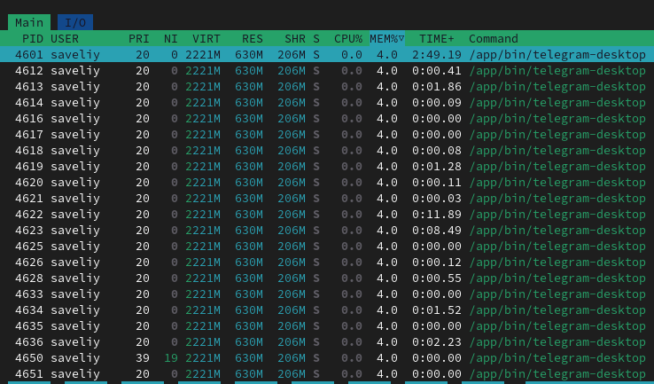

# Lab 4: Software Distribution
for the purpose of this lab I will be using wsl on windows.

## Task 1: Configure and Use a Local Package Repository

First I created the repository
> amine@Amine-PC:~$ mkdir -p ~/local-apt-repo

I then copied the .deb file
> amine@Amine-PC:~$ cp /mnt/c/Users/amine/apt_2.9.8_amd64.deb ~/local-apt-repo/

and generated the package index

after that, I added it to the sources list

then I verified the package by checking that that paths are correct

> zcat Packages.gz

Here is the output of the policy command:

### Example of installation using the package

for my solution the installation is not working because the package I have created is apt.

## Task 2: Simulate Package Installation and Identify Dependencies
Simulating the installation of a package: ffmpeg

> sudo apt-get install -s ffmpeg

(output of the command is in file [output_simulation.txt](output_simulation.txt))

Dependencies are the following:

## Task 3: Hold and Unhold Package Versions

