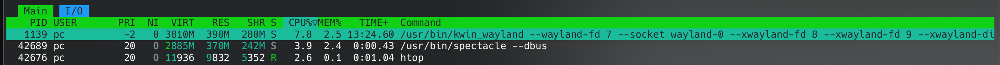
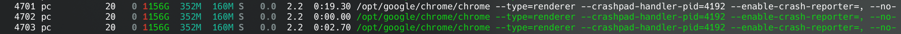
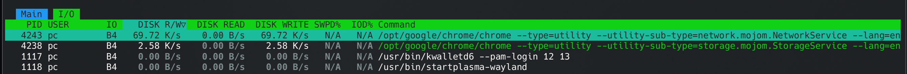

# Introduction to DevOps Lab 6
## Ruslan Izmailov B22-DS-01

### Task 1: Key Metrics for SRE and SLAs

#### 1. Monitor System Resources:
##### Top 3 most consuming applications for CPU:
```sh 
> htop
```

We can see that top 3 cpu consuming processies are:
1. htop 
2. socket using application (possibly chrome uses it)
3. konsole 

(seems logic as all other applications were closed during the test)

##### Top 3 most consuming applications for memory:
```sh 
> htop
```




In my case chrome occupies 3 top places, so I placed the next applicatons from the list: plasmashell and chrome services. 

##### Top 3 most consuming applications for I/O usage:
```sh 
> htop
```


We can observe that among all applications only chrome was using disk I/O. 

#### 2. Disk Space Management:

```sh 
> df
Filesystem     1K-blocks     Used Available Use% Mounted on
/dev/nvme0n1p5 146008036 39681968  98836432  29% /
devtmpfs            4096        0      4096   0% /dev
tmpfs            8037976   553188   7484788   7% /dev/shm
efivarfs             268      251        13  96% /sys/firmware/efi/efivars
tmpfs            3215192     2280   3212912   1% /run
tmpfs               1024        0      1024   0% /run/credentials/systemd-journald.service
tmpfs               1024        0      1024   0% /run/credentials/systemd-udev-load-credentials.service
tmpfs               1024        0      1024   0% /run/credentials/systemd-sysctl.service
tmpfs               1024        0      1024   0% /run/credentials/systemd-tmpfiles-setup-dev-early.service
tmpfs               1024        0      1024   0% /run/credentials/systemd-tmpfiles-setup-dev.service
tmpfs               1024        0      1024   0% /run/credentials/systemd-vconsole-setup.service
tmpfs            8037976    49888   7988088   1% /tmp
/dev/nvme0n1p1    262144    33340    228804  13% /boot/efi
tmpfs               1024        0      1024   0% /run/credentials/systemd-tmpfiles-setup.service
tmpfs            1607592       88   1607504   1% /run/user/1000
```

As I have many OS on my pc, partitions have slide unordered indexes (aka 1 and 5). 


```sh
> du
68      ./.git/hooks
40      ./.git/logs/refs/heads
36      ./.git/logs/refs/remotes/origin
40      ./.git/logs/refs/remotes
84      ./.git/logs/refs
104     ./.git/logs
8       ./.git/objects/f7
8       ./.git/objects/75
8       ./.git/objects/7e
8       ./.git/objects/58
8       ./.git/objects/1a
8       ./.git/objects/61
8       ./.git/objects/d2
8       ./.git/objects/cb
12      ./.git/objects/2f
8       ./.git/objects/4e
8       ./.git/objects/27
8       ./.git/objects/69
8       ./.git/objects/7a
8       ./.git/objects/e8
12      ./.git/objects/6f
12      ./.git/objects/1d
8       ./.git/objects/ed
8       ./.git/objects/6e
12      ./.git/objects/57
12      ./.git/objects/e1
8       ./.git/objects/32
8       ./.git/objects/23
12      ./.git/objects/0e
8       ./.git/objects/bd
8       ./.git/objects/22
8       ./.git/objects/d6
8       ./.git/objects/0c
8       ./.git/objects/f9
8       ./.git/objects/3a
12      ./.git/objects/bf
8       ./.git/objects/8e
8       ./.git/objects/c2
8       ./.git/objects/4a
8       ./.git/objects/43
8       ./.git/objects/7d
8       ./.git/objects/21
8       ./.git/objects/5b
8       ./.git/objects/2a
8       ./.git/objects/d9
8       ./.git/objects/1e
16      ./.git/objects/7b
8       ./.git/objects/93
8       ./.git/objects/e7
8       ./.git/objects/d5
24      ./.git/objects/66
8       ./.git/objects/24
8       ./.git/objects/12
8       ./.git/objects/fc
16      ./.git/objects/50
8       ./.git/objects/8b
8       ./.git/objects/a1
12      ./.git/objects/ad
8       ./.git/objects/7f
8       ./.git/objects/81
8       ./.git/objects/08
4       ./.git/objects/pack
8       ./.git/objects/7c
8       ./.git/objects/1b
108     ./.git/objects/37
8       ./.git/objects/0a
16      ./.git/objects/01
8       ./.git/objects/62
8       ./.git/objects/a5
8       ./.git/objects/86
8       ./.git/objects/16
12      ./.git/objects/91
12      ./.git/objects/9b
12      ./.git/objects/5c
8       ./.git/objects/b0
12      ./.git/objects/6a
8       ./.git/objects/f0
16      ./.git/objects/f5
8       ./.git/objects/52
8       ./.git/objects/82
8       ./.git/objects/6b
4       ./.git/objects/info
8       ./.git/objects/f3
12      ./.git/objects/9e
8       ./.git/objects/3c
8       ./.git/objects/a2
8       ./.git/objects/c0
8       ./.git/objects/79
852     ./.git/objects
4       ./.git/branches
40      ./.git/refs/heads
4       ./.git/refs/tags
36      ./.git/refs/remotes/origin
40      ./.git/refs/remotes
88      ./.git/refs
8       ./.git/info
1156    ./.git
2404    .
```
As _du_ command produces so many lines of output, I have put  only only the content of the folder with DevOps-course materials (for the lab05)  

##### Top 3 largest files in /var

To find largest files, I have used the following shell command:     
```sh 
> sudo find /var -type f -not -path '*/\.*' -exec du -h {} + | 
sort -hr | 
head -n 3

238M    /var/cache/pacman/pkg/linux-firmware-20240909.552ed9b8-1-any.pkg.tar.zst
234M    /var/cache/pacman/pkg/nvidia-utils-560.35.03-2-x86_64.pkg.tar.zst
189M    /var/cache/pacman/pkg/noto-fonts-cjk-20230817-2-any.pkg.tar.zst
```
This command:    
1. finds all files in the /var directory, excluding hidden files and directories
2. calculates their sizes using the du -h command
3. sorts the output in reverse order and makes sizes human readable
4. shows only top 3 files