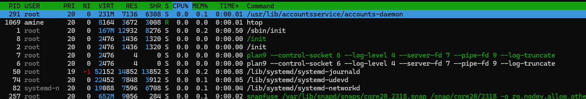
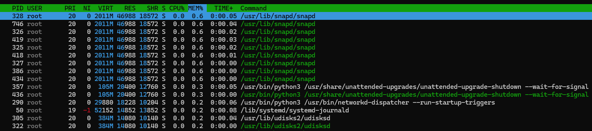
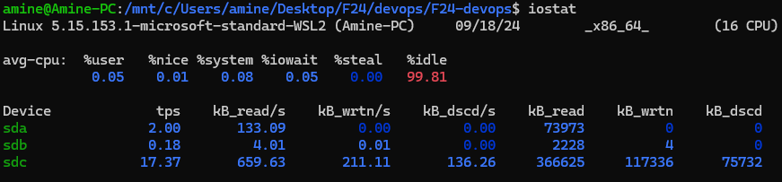
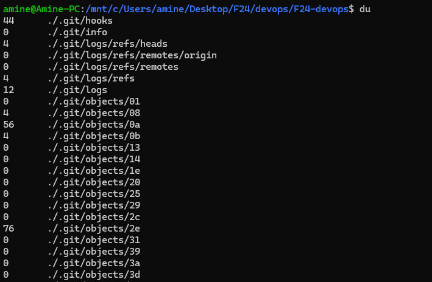
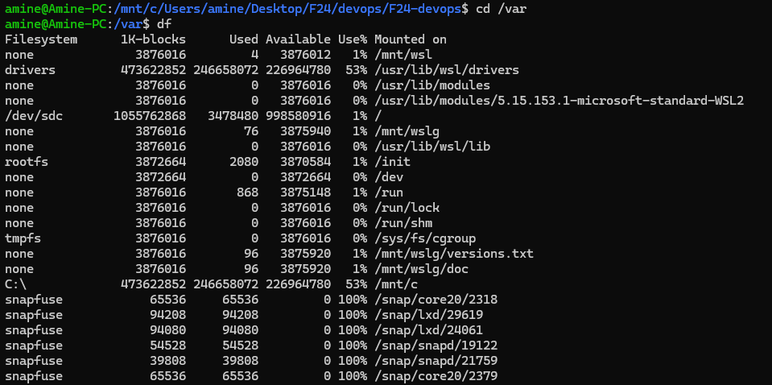

# Task 1
### CPU and Memory usage using htop

since I am using windows subsystem for linux, the top running processes are internal system processes.

### I/O information

### du df commands examples

