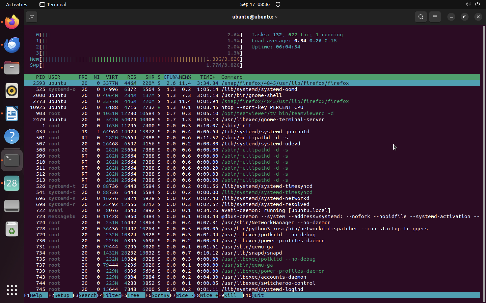
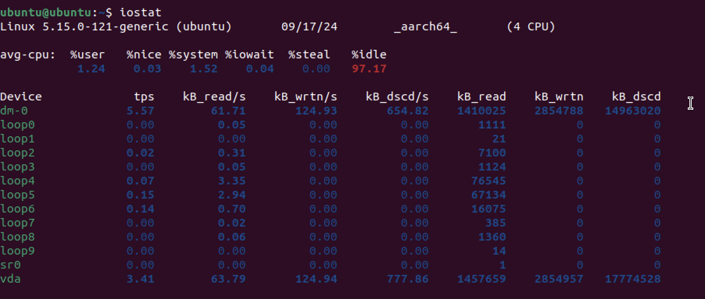

## Task 1

1. Top 3 most consuming applications for CPU:



```
firefox
systemd-oomd
gnome-shell
```

2. Top 3 most consuming applications for memory


```
libreoffice
gnome-shell
stress
```

3. I/O usage

```
iostat
```



From the above picture I made the following conclusions:

- The CPU was idle for 97.17%.
- Processes from the kernel level use 1.52% of CPU.
- User processes took 1.24% of CPU.

**Output**

## Task 2

```
sudo du -a /var | sort -n -r | head -n 3
```

**Output**

```
2880416	/var
1673104	/var/lib
1350216	/var/lib/snapd

```
