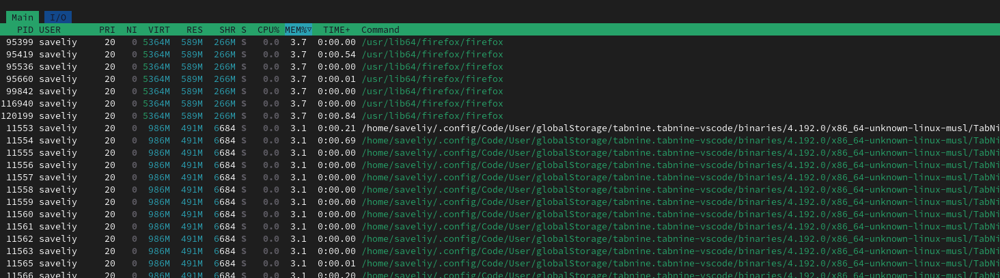

# Task 1

## Top 3 most consuming app
    
- **CPU**

    

- **Memory**

    

- **I/O usage**

    

## The largest files in the /var directory

```sh
sudo find /var -type f -exec du -ah {} + | sort -rh | head -n 3   
```                              
         
    151M    /var/cache/pacman/pkg/libreoffice-still-7.5.5-3-x86_64.pkg.tar.zst
    105M    /var/lib/docker/overlay2/f6ef9412ad57fce8aadcd0b98d2b744695991e2c8edc1a5b22cac81b0b82768f/merged/usr/lib/x86_64-linux-gnu/libLLVM-14.so.1
    105M    /var/lib/docker/overlay2/5de112e375cb86a779db0fd8c6b05c1c3809b77fa8a2fcc7ac8d214ac40733a2/diff/usr/lib/x86_64-linux-gnu/libLLVM-14.so.1

## Analysis

- **CPU and Mem**

    

    - There is a consistently low CPU usage
    - The system has a huge amount of RAM

- **Disk space**

    
    
    The system has a lot of free disk space

# Task 2

## Terraform

    It is IaC tool which allow users to describe and manage cloud and onpremises infrastructure

## Installing

```sh
sudo pacman -S terraform   
```

## Build

```sh
mkdir learn-terraform-docker-container
cd learn-terraform-docker-container
touch main.tf
```

Copy code from the guide

```sh
terraform {
  required_providers {
    docker = {
      source = "kreuzwerker/docker"
      version = "~> 3.0.1"
    }
  }
}

provider "docker" {}

resource "docker_image" "nginx" {
  name         = "nginx:latest"
  keep_locally = false
}

resource "docker_container" "nginx" {
  image = docker_image.nginx.image_id
  name  = "tutorial"
  ports {
    internal = 80
    external = 8000
  }
}
```

But I can't to build

```sh
terraform init
```

```sh
Initializing the backend...
Initializing provider plugins...
- Finding kreuzwerker/docker versions matching "~> 3.0.1"...
╷
│ Error: Invalid provider registry host
│ 
│ The host "registry.terraform.io" given in provider source address
│ "registry.terraform.io/kreuzwerker/docker" does not offer a Terraform provider
│ registry.
╵
```

I tried to repeate it using windos system, but I get the same result. 


Also the same result was getted trying to use vpn(registry.terraform.io cannot be available in my region)

Docker also was enabled

I checked connection, but it was good

```sh
Test-NetConnection registry.terraform.io -Port 443                                                                                                                                                                                                                                                      ComputerName     : registry.terraform.io                                                     RemoteAddress    : 18.245.60.36                                                              RemotePort       : 443                                                                       
InterfaceAlias   : Беспроводная сеть
SourceAddress    : 10.91.52.246
TcpTestSucceeded : True
```