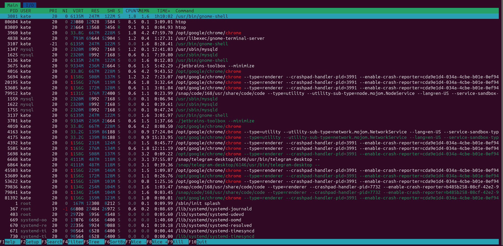
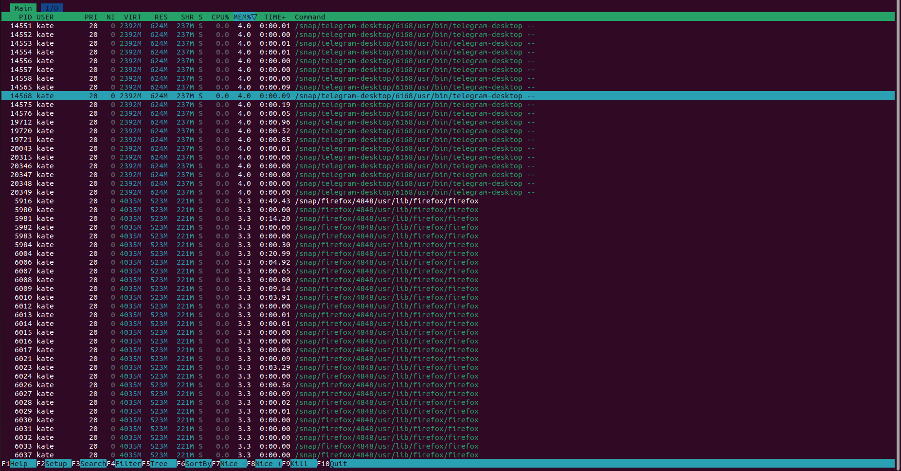

# GitOps & SRE Lab

## Task 1: Key Metrics for SRE and SLAs

1. **Monitor System Resources**:

`htop`

### Top 3 Applications for CPU Usage
1. Htop: 9.1 % CPU
2. Gnome terminal server: 1.2 % CPU
3. Google Chrome: 4.2 % CPU



### Top 3 Applications for Memory Usage
1. Telegram Desktop: 4 % Memory
2. Firefox: 3.4 % Memory
3. Google Chrome: 3.0 % Memory




### Top 3 Applications for I/O Usage

Output:

`$ iostat`

```
Linux 6.8.0-40-generic (linna) 	14.09.2024 	_x86_64_	(16 CPU)

avg-cpu:  %user   %nice %system %iowait  %steal   %idle
           1,72    0,02    0,82    0,48    0,00   96,96

Device             tps    kB_read/s    kB_wrtn/s    kB_dscd/s    kB_read    kB_wrtn    kB_dscd
loop0             0,00         0,00         0,00         0,00         17          0          0
loop1             0,03         0,47         0,00         0,00       7658          0          0
loop10            0,03         0,55         0,00         0,00       8913          0          0
loop11            0,24         8,35         0,00         0,00     135765          0          0
loop2             0,09         4,94         0,00         0,00      80360          0          0
loop3             0,26         4,80         0,00         0,00      78039          0          0
loop4             0,23         0,91         0,00         0,00      14831          0          0
loop5             0,02         0,36         0,00         0,00       5778          0          0
loop6             0,01         0,10         0,00         0,00       1675          0          0
loop7             0,00         0,02         0,00         0,00        314          0          0
loop8             0,01         0,38         0,00         0,00       6248          0          0
loop9             0,19         7,11         0,00         0,00     115678          0          0
nvme0n1          14,83       134,86       617,55         0,00    2193865   10046141          0
```


**Top 3 I/O Consuming Devices:**

1. nvme0n1 (Main storage drive) – Highest I/O activity, particularly writes.
2. loop11 (Virtual disk or image) – Moderate read activity.
3. loop9 (Virtual disk or image) – Moderate read activity.

1. **Disk Space Management**:

### `du`: 

`sudo du -ah /var | grep -v '/$' | sort -rh | head -n 3`

- 20G	/var
- 15G	/var/lib
- 14G	/var/lib/snapd

### `df`:

`df -h`

| Filesystem      | Size | Used | Avail | Use% | Mounted on                |
|-----------------|------|------|-------|------|---------------------------|
| tmpfs           | 1.6G | 2.7M | 1.6G  | 1%   | /run                      |
| /dev/nvme0n1p2  | 187G | 11G  | 167G  | 6%   | /                         |
| tmpfs           | 7.7G | 82M  | 7.6G  | 2%   | /dev/shm                  |
| tmpfs           | 5.0M | 4.0K | 5.0M  | 1%   | /run/lock                 |
| efivarfs        | 268K | 141K | 123K  | 54%  | /sys/firmware/efi/efivars |
| /dev/nvme0n1p6  | 266G | 58G  | 195G  | 23%  | /home                     |
| /dev/nvme0n1p1  | 96M  | 44M  | 53M   | 46%  | /boot/efi                 |
| tmpfs           | 1.6G | 124K | 1.6G  | 1%   | /run/user/1000            |

Takeaways:

- **home**. I have plenty of free space available on both the root (/) and home (/home) partitions.
- **tmpfs:** Temporary filesystems (tmpfs) are mounted for runtime tasks and shared memory, using very little space.
- **EFI Partition:** The /boot/efi partition is nearly half used, but since it is small by design, the remaining space should be sufficient for boot-related tasks.


## Task 2: Terraform Installation and Nginx Deployment

Please, check the TerraformAndNginx.md file inside lab5 for the documentation.