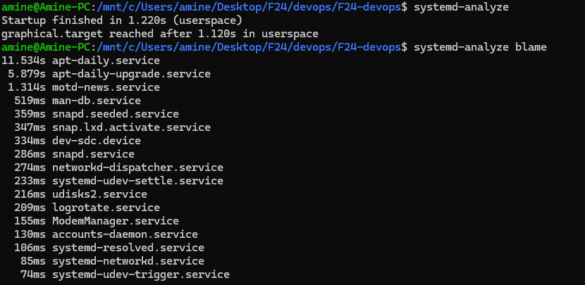
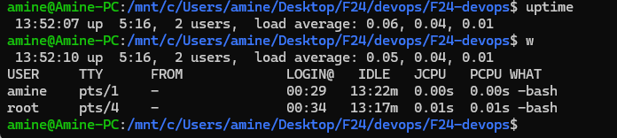

## OS
### Analysis of boot time and slowest services

### Checking uptime of system

## Networks
### tracing network routes

#### Observations
- lines 5 6 and 7 in traceroute are not visible but written as *** 
- some addresses are represented by the domain names and some others by only ip addresses 