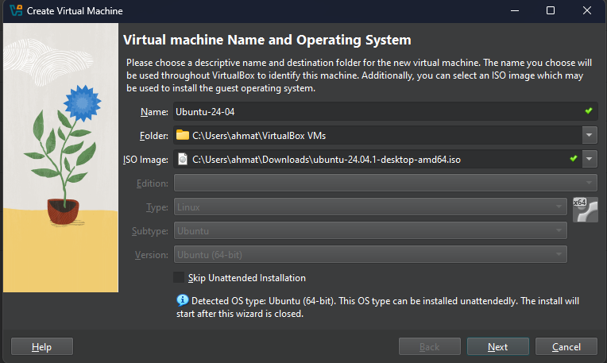
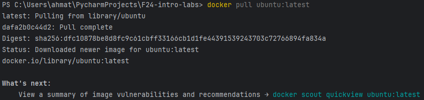
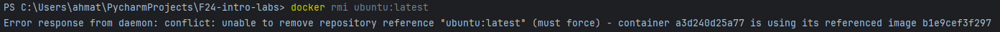
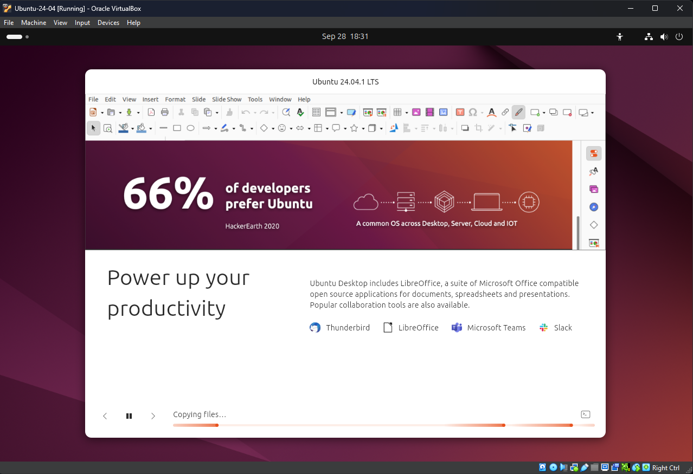
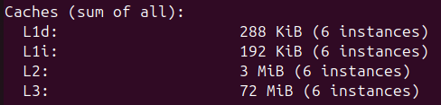
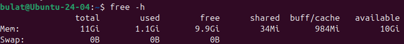
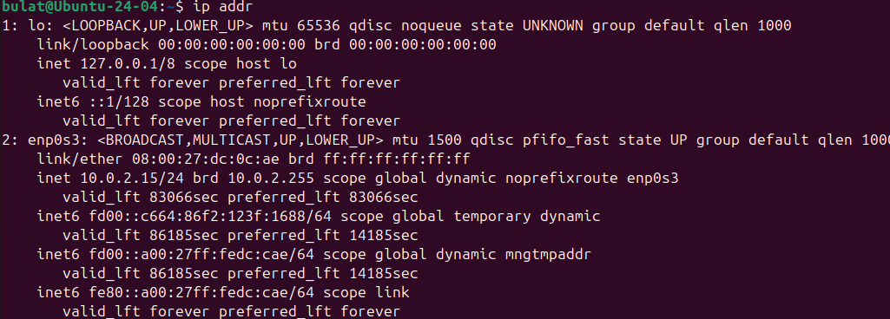
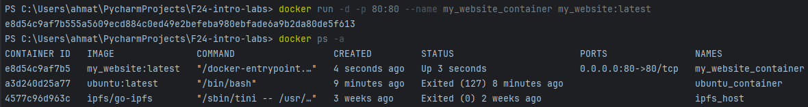

## Task 1: VM Deployment

### 1. Install VirtualBox:
I have installed VirtualBox for Windows by this link: 
https://download.virtualbox.org/virtualbox/7.1.2/VirtualBox-7.1.2-164945-Win.exe

Version is 7.1.2

### 2. Deploy a Virtual Machine:
I have installed Ubuntu 24.04 LTS ISO file by this link:
https://releases.ubuntu.com/24.04.1/ubuntu-24.04.1-desktop-amd64.iso?_gl=1*158loc5*_gcl_au*MjA3MjM3NzMyNy4xNzI3NTQ3NjUx&_ga=2.7654450.1666114970.1727547649-991540447.1727547649

And chose this ISO image for VM:



I decided to allocate 12 GB of memory and 6 virtual CPU's:



And also 25 GB of SSD:



And there is a running VM:



## Task 2: System Information Tools

### 1. Processor, RAM, and Network Information:

**CPU:**

Tool name - lscpu

Command:
```shell
lscpu
```

Output:



**RAM:**

Tool name - free

Command:
```shell
free -h
```

Output:


**Network:**

Tool name - ip

Command:
```shell
ip addr
```

Output:


### 2. Operating System Specifications:
Tool name - LSB Release

Command:
```shell
lsb_release -a
```

Output:
