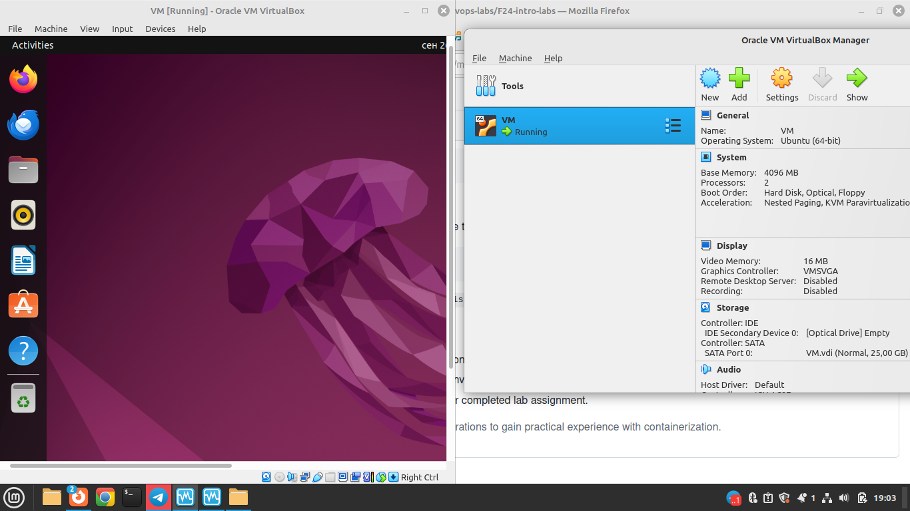

# VM Deployment

## VirtualBox Version
- Version: 7.0.20

## Steps for VM Deployment
1. Installed VirtualBox verYou said:sion 7.0.20 on Linux Mint 21.3.
2. Downloaded Ubuntu 22.04 ISO file from the official Ubuntu website.
3. Created a new virtual machine in VirtualBox with the following settings:
   - Name: Ubuntu VM
   - Type: Linux
   - Version: Ubuntu (64-bit)
   - Memory: 4096 MB
   - Hard Disk: 25 GB dynamically allocated
4. Configured VM settings:
   - Processor: 2 cores
   - Network: NAT
   - Storage: Ubuntu ISO attached as a virtual CD/DVD drive
5. Installed Ubuntu 22.04 on the VM.
6. Screenshot of the VM running Ubuntu:
   
   
# System Information Tools
## Tool/Command For Processor Information :
```bash
lscpu
```
## Output:
```bash
Architecture:             x86_64
  CPU op-mode(s):         32-bit, 64-bit
  Address sizes:          39 bits physical, 48 bits virtual
  Byte Order:             Little Endian
CPU(s):                   2
  On-line CPU(s) list:    0,1
Vendor ID:                GenuineIntel
  Model name:             Intel(R) Core(TM) i5-6300U CPU @ 2.40GHz
    CPU family:           6
    Model:                78
    Thread(s) per core:   1
    Core(s) per socket:   2
    Socket(s):            1
    Stepping:             3
    BogoMIPS:             4991.99
    Flags:                fpu vme de pse tsc msr pae mce cx8 apic sep mtrr pge m
                          ca cmov pat pse36 clflush mmx fxsr sse sse2 ht syscall
                           nx rdtscp lm constant_tsc rep_good nopl xtopology non
                          stop_tsc cpuid tsc_known_freq pni pclmulqdq ssse3 cx16
                           pcid sse4_1 sse4_2 x2apic movbe popcnt aes xsave avx 
                          rdrand hypervisor lahf_lm abm 3dnowprefetch pti fsgsba
                          se bmi1 avx2 bmi2 invpcid rdseed clflushopt arat md_cl
                          ear flush_l1d arch_capabilities
Virtualization features:  
  Hypervisor vendor:      KVM
  Virtualization type:    full
Caches (sum of all):      
  L1d:                    64 KiB (2 instances)
  L1i:                    64 KiB (2 instances)
  L2:                     512 KiB (2 instances)
  L3:                     6 MiB (2 instances)
NUMA:                     
  NUMA node(s):           1
  NUMA node0 CPU(s):      0,1
Vulnerabilities:          
  Gather data sampling:   Unknown: Dependent on hypervisor status
  Itlb multihit:          KVM: Mitigation: VMX unsupported
  L1tf:                   Mitigation; PTE Inversion
```
## Tool/Command For RAM information: 
```bash
free -h
```# System Information Tools
## Tool/Command :
```baship a
1: lo: <LOOPBACK,UP,LOWER_UP> mtu 65536 qdisc noqueue state UNKNOWN group default qlen 1000
    link/loopback 00:00:00:00:00:00 brd 00:00:00:00:00:00
    inet 127.0.0.1/8 scope host lo
       valid_lft forever preferred_lft forever
    inet6 ::1/128 scope host 
       valid_lft forever preferred_lft forever
2: enp0s3: <BROADCAST,MULTICAST,UP,LOWER_UP> mtu 1500 qdisc fq_codel state UP group default qlen 1000
    link/ether 08:00:27:11:de:5d brd ff:ff:ff:ff:ff:ff
    inet 10.0.2.15/24 brd 10.0.2.255 scope global dynamic noprefixroute enp0s3
       valid_lft 84654sec preferred_lft 84654sec
    inet6 fe80::50d4:8177:e8d2:da31/64 scope link noprefixroute 
       valid_lft forever preferred_lft forever
  Meltdown:               Mitigation; PTI
  Mmio stale data:        Mitigation; Clear CPU buffers; SMT Host state unknown
  Reg file data sampling: Not affected
  Retbleed:               Vulnerable
  Spec rstack overflow:   Not affected
  Spec store bypass:      Vulnerable
  Spectre v1:             Mitigation; usercopy/swapgs barriers and __user pointe
                          r sanitization
  Spectre v2:             Mitigation; Retpolines; STIBP disabled; RSB filling; P
                          BRSB-eIBRS Not affected; BHI Retpoline
  Srbds:                  Unknown: Dependent on hypervisor status
  Tsx async abort:        Not affected

lscpu
```
## Output:
```bash
Architecture:             x86_64
  CPU op-mode(s):         32-bit, 64-bit
  Address sizes:          39 bits physical, 48 bits virtual
  Byte Order:             Little Endian
CPU(s):                   2
  On-line CPU(s) list:    0,1
Vendor ID:                GenuineIntel
  Model name:             Intel(R) Core(TM) i5-6300U CPU @ 2.40GHz
    CPU family:           6
    Model:                78
    Thread(s) per core:   1
    Core(s) per socket:   2
    Socket(s):            1
    Stepping:             3
    BogoMIPS:             4991.99
    Flags:                fpu vme de pse tsc msr pae mce cx8 apic sep mtrr pge m
                          ca cmov pat pse36 clflush mmx fxsr sse sse2 ht syscall
                           nx rdtscp lm constant_tsc rep_good nopl xtopology non
                          stop_tsc cpuid tsc_known_freq pni pclmulqdq ssse3 cx16
                           pcid sse4_1 sse4_2 x2apic movbe popcnt aes xsave avx 
                          rdrand hypervisor lahf_lm abm 3dnowprefetch pti fsgsba
                          se bmi1 avx2 bmi2 invpcid rdseed clflushopt arat md_cl
                          ear flush_l1d arch_capabilities
Virtualization features:  
  Hypervisor vendor:      KVM
  Virtualization type:    full
Caches (sum of all):      
  L1d:                    64 KiB (2 instances)
  L1i:                    64 KiB (2 instances)
  L2:                     512 KiB (2 instances)
  L3:                     6 MiB (2 instances)
NUMA:                     
  NUMA node(s):           1
  NUMA node0 CPU(s):      0,1
Vulnerabilities:          
  Gather data sampling:   Unknown: Dependent on hypervisor status
  Itlb multihit:          KVM: Mitigation: VMX unsupported
  L1tf:                   Mitigation; PTE Inversion
ip a
1: lo: <LOOPBACK,UP,LOWER_UP> mtu 65536 qdisc noqueue state UNKNOWN group default qlen 1000
    link/loopback 00:00:00:00:00:00 brd 00:00:00:00:00:00
    inet 127.0.0.1/8 scope host lo
       valid_lft forever preferred_lft forever
    inet6 ::1/128 scope host 
       valid_lft forever preferred_lft forever
2: enp0s3: <BROADCAST,MULTICAST,UP,LOWER_UP> mtu 1500 qdisc fq_codel state UP group default qlen 1000
    link/ether 08:00:27:11:de:5d brd ff:ff:ff:ff:ff:ff
    inet 10.0.2.15/24 brd 10.0.2.255 scope global dynamic noprefixroute enp0s3
       valid_lft 84654sec preferred_lft 84654sec
    inet6 fe80::50d4:8177:e8d2:da31/64 scope link noprefixroute 
       valid_lft forever preferred_lft forever
  Meltdown:               Mitigation; PTI
  Mmio stale data:        Mitigation; Clear CPU buffers; SMT Host state unknown
  Reg file data sampling: Not affected
  Retbleed:               Vulnerable
  Spec rstack overflow:   Not affected
  Spec store bypass:      Vulnerable
  Spectre v1:             Mitigation; usercopy/swapgs barriers and __user pointe
                          r sanitization
  Spectre v2:             Mitigation; Retpolines; STIBP disabled; RSB filling; P
                          BRSB-eIBRS Not affected; BHI Retpoline
  Srbds:                  Unknown: Dependent on hypervisor status
  Tsx async abort:        Not affected

```
## Tool/Command:
```bash
free -h
```
## Output:
```bash
                 total        used        free      shared  buff/cache   available
Mem:           7.8Gi       844Mi       359Mi       195Mi       6.6Gi       6.5Gi
Swap:          2.0Gi        10Mi       2.0Gi
```
## Tool/Command:
```bash
ip a
```
## Output:
```bash
1: lo: <LOOPBACK,UP,LOWER_UP> mtu 65536 qdisc noqueue state UNKNOWN group default qlen 1000
    link/loopback 00:00:00:00:00:00 brd 00:00:00:00:00:00
    inet 127.0.0.1/8 scope host lo
       valid_lft forever preferred_lft forever
    inet6 ::1/128 scope host 
       valid_lft forever preferred_lft forever
2: enp0s31f6: <BROADCAST,MULTICAST,UP,LOWER_UP> mtu 1500 qdisc fq_codel state UP group default qlen 1000
    link/ether 54:ee:75:bd:70:11 brd ff:ff:ff:ff:ff:ff
    inet 10.244.1.75/24 brd 10.244.1.255 scope global dynamic noprefixroute enp0s31f6
       valid_lft 573464sec preferred_lft 573464sec
    inet6 fe80::7e22:6bc6:b358:bf36/64 scope link noprefixroute 
       valid_lft forever preferred_lft forever
```
## Output:
```bash
                 total        used        free      shared  buff/cache   available
Mem:           7.8Gi       844Mi       359Mi       195Mi       6.6Gi       6.5Gi
Swap:          2.0Gi        10Mi       2.0Gi
```
## Tool/Command for Network Information:
```bash
ip a
```
## Output:
```bash
1: lo: <LOOPBACK,UP,LOWER_UP> mtu 65536 qdisc noqueue state UNKNOWN group default qlen 1000
    link/loopback 00:00:00:00:00:00 brd 00:00:00:00:00:00
    inet 127.0.0.1/8 scope host lo
       valid_lft forever preferred_lft forever
    inet6 ::1/128 scope host 
       valid_lft forever preferred_lft forever
2: enp0s31f6: <BROADCAST,MULTICAST,UP,LOWER_UP> mtu 1500 qdisc fq_codel state UP group default qlen 1000
    link/ether 54:ee:75:bd:70:11 brd ff:ff:ff:ff:ff:ff
    inet 10.244.1.75/24 brd 10.244.1.255 scope global dynamic noprefixroute enp0s31f6
       valid_lft 573464sec preferred_lft 573464sec
    inet6 fe80::7e22:6bc6:b358:bf36/64 scope link noprefixroute 
       valid_lft forever preferred_lft forever
```
