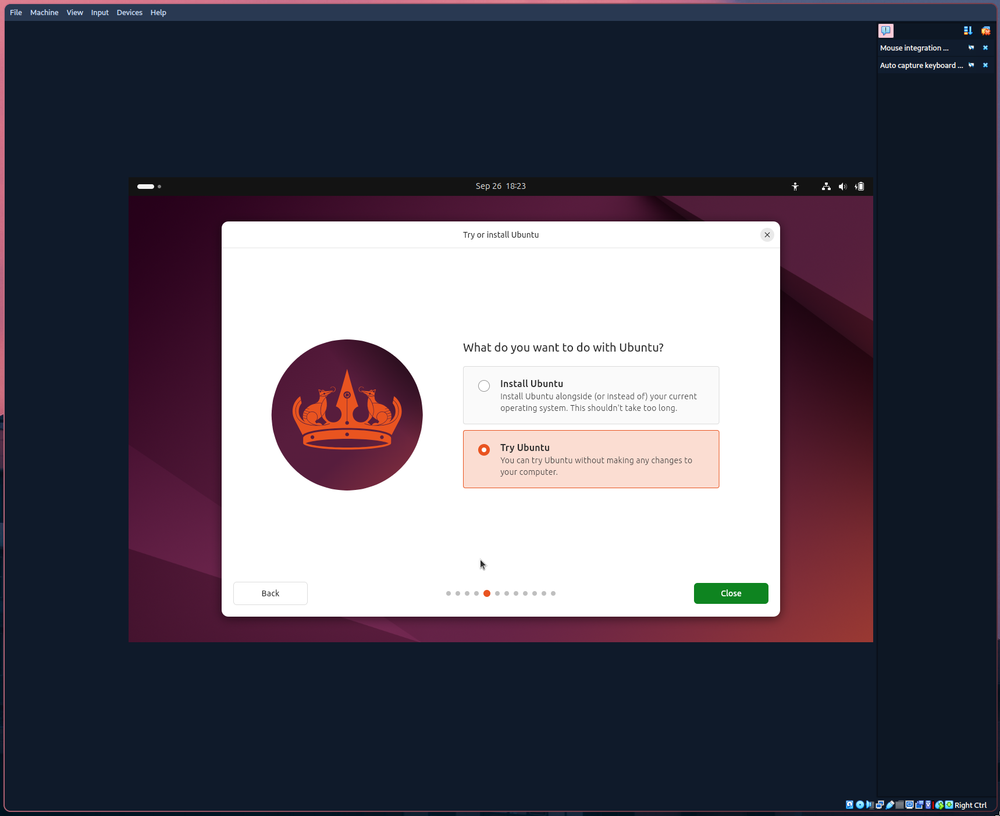

# Task 1: VM Deployment

1) Install virtual box:

I use arch linux, so the installation process looks like this:  
`yay -s virtualbox virtualbox-host-modules-arch`
```
❯ virtualbox --help   
...
Oracle VirtualBox Manager v7.1.0
```

2) Deploy a Virtual Machine:

- Add a new machine
- Enter the name of the machine, select the iso, choose the type (Linux), subtype (Ubuntu) and version (Ubuntu 64-bit)
- Choose "base memory" = ram and processors. I have chosen 4gb and 4 processes accordingly
- Choose hard disk size. I want it be 25Gigs and do not preallocate full size


- Now we are ready to run the machine.


# Task 2: System Information Tools

1) **Processor, RAM, and Network Information**
- Processor:
  `lscpu`
  ```
  Architecture:             x86_64
  CPU op-mode(s):         32-bit, 64-bit
  Address sizes:          48 bits physical, 48 bits virtual
  Byte Order:             Little Endian
  CPU(s):                   4
  On-line CPU(s) list:    0-3
  Vendor ID:                AuthenticAMD
  Model name:             AMD Ryzen 5 7640HS w/ Radeon 760M
  Graphics
  CPU family:           25
  Model:                116
  Thread(s) per core:   1
  Core(s) per socket:   4
  Socket(s):            1
  Stepping:             1
  BogoMIPS:             8583.19
  Flags:                fpu vme de pse tsc msr pae mce cx
  8 apic sep mtrr pge mca cmov pat
  pse36 clflush mmx fxsr sse sse2 h
  t syscall nx mmxext fxsr_opt rdts
  cp lm constant_tsc rep_good nopl
  nonstop_tsc cpuid extd_apicid tsc
  _known_freq pni pclmulqdq ssse3 f
  ma cx16 sse4_1 sse4_2 x2apic movb
  e popcnt aes xsave avx f16c rdran
  d hypervisor lahf_lm cmp_legacy c
  r8_legacy abm sse4a misalignsse 3
  dnowprefetch vmmcall fsgsbase bmi
  1 avx2 bmi2 invpcid rdseed adx cl
  flushopt sha_ni xsaveerptr arat f
  lush_l1d
  Virtualization features:  
  Hypervisor vendor:      KVM
  Virtualization type:    full
  Caches (sum of all):      
  L1d:                    128 KiB (4 instances)
  L1i:                    128 KiB (4 instances)
  L2:                     4 MiB (4 instances)
  L3:                     64 MiB (4 instances)
  NUMA:                     
  NUMA node(s):           1
  NUMA node0 CPU(s):      0-3
  Vulnerabilities:          
  Gather data sampling:   Not affected
  Itlb multihit:          Not affected
  L1tf:                   Not affected
  Mds:                    Not affected
  Meltdown:               Not affected
  Mmio stale data:        Not affected
  Reg file data sampling: Not affected
  Retbleed:               Not affected
  Spec rstack overflow:   Vulnerable: Safe RET, no microcod
  e
  Spec store bypass:      Not affected
  Spectre v1:             Mitigation; usercopy/swapgs barri
  ers and __user pointer sanitizati
  on
  Spectre v2:             Mitigation; Retpolines; STIBP dis
  abled; RSB filling; PBRSB-eIBRS N
  ot affected; BHI Not affected
  Srbds:                  Not affected
  Tsx async abort:        Not affected
  ```
  Virtual machine has 4 processors as expected. All the other specifications are the same as on the machine that runs
virtualbox.
- RAM:
`free -h`
```
               total        used        free      shared  buff/cache   available
Mem:           3.8Gi       2.1Gi       272Mi       213Mi       1.9Gi       1.7Gi
Swap:             0B          0B          0B
```
4 gigs of ram as expected
- Network:
`netstat -i`
```
Kernel Interface table
Iface             MTU    RX-OK RX-ERR RX-DRP RX-OVR    TX-OK TX-ERR TX-DRP TX-OVR Flg
enp0s3           1500    35153      0      0 0         13650      0      0      0 BMRU
lo              65536      624      0      0 0           624      0      0      0 LRU
```
The virtual machine has a network interface called enp0s3

2) **Operating System Specifications**
  
Command: `lsb_release -a`
   ```No LSB modules are available.
   Distributor ID: Ubuntu
   Description: Ubuntu 24.04.1 LTS
   Release: 24.04
   Codename: noble
   ```
No surprise that machine runs Ubuntu 24.04 because it was the iso image