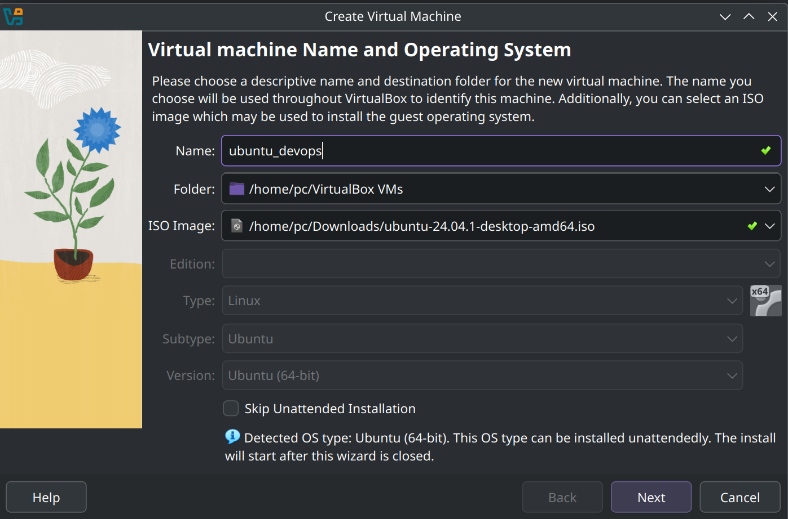
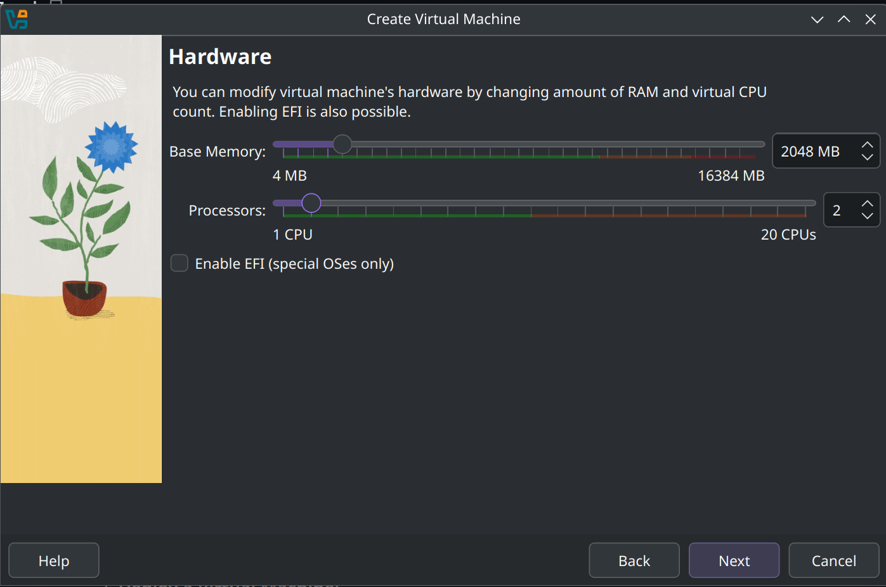
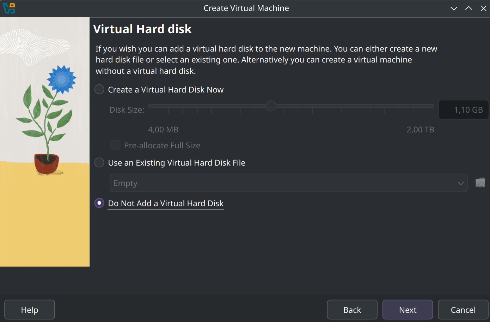
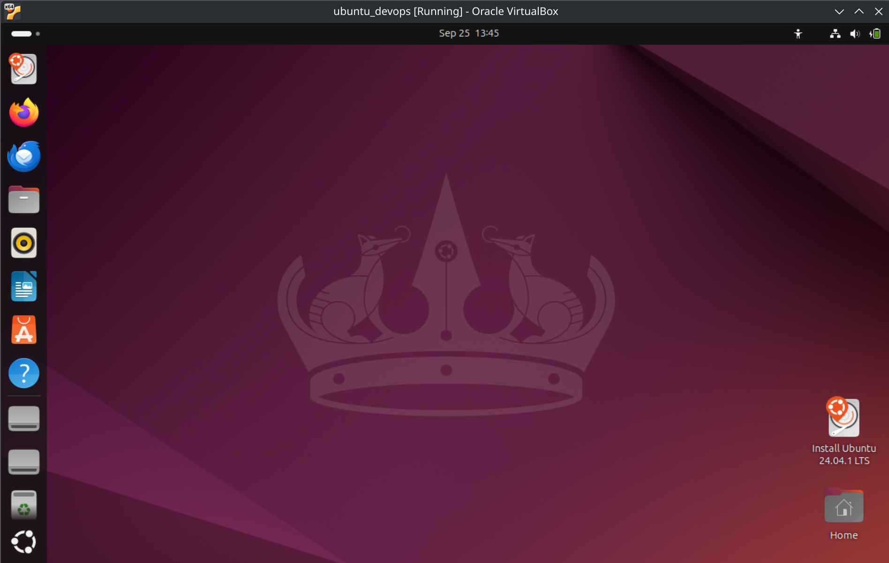
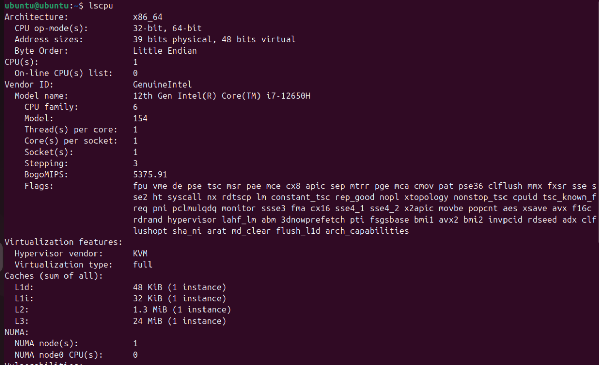
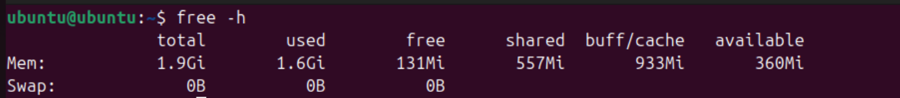
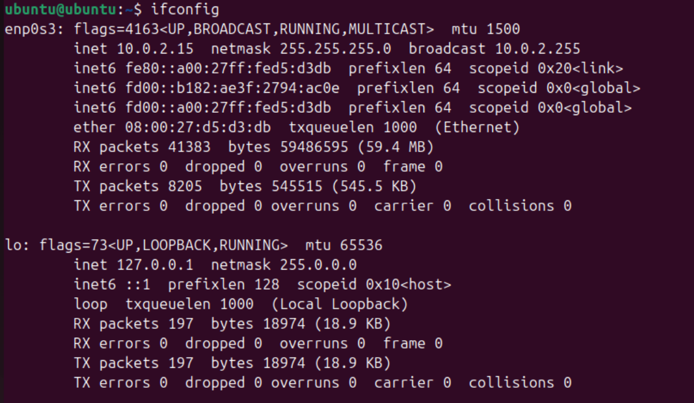
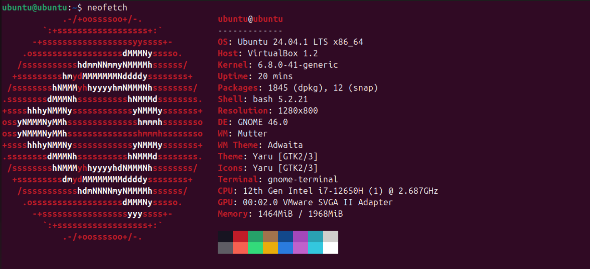
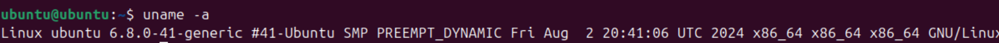

# Introduction to DevOps Lab 8
## Ruslan Izmailov B22-DS-01 

### Task 1: VM Deployment

#### Install VirtualBox:                
1) Installed by the guide for my OS (arch based). 
2) VirtualBox version: 7.1.0

#### Deploy a Virtual Machine:
##### Create new VM: 


##### Customize the VM settings: 




##### Take a screenshot of the VM running and include it in your report:    


### Task 2: System Information Tools
#### CPU: 
Name of the tool: ```lscpu``` (preinstalled)   
Command: ```lscpu```




#### RAM: 
Name of the tool: free (preinstalled)
Command: ```free -h```




#### Network: 
Name of the tool: net-tools
Install: ```sudo apt install net-tools```
Command: ifconfig




#### OS specifications: 
Name of the tool: neofetch
Intsall: ```sudo apt install neofetch``` 
Command: neofetch



Name of the tool: uname (preinstalled)
Command: uname -a
