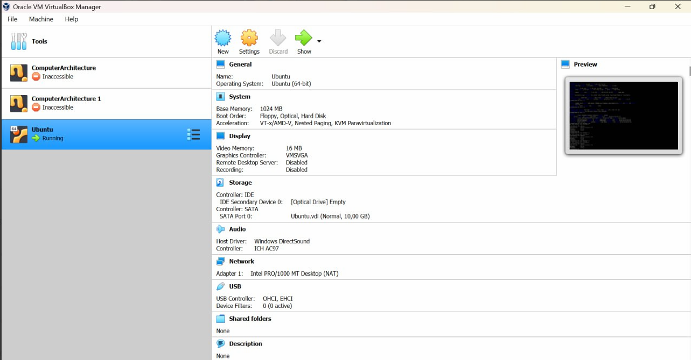
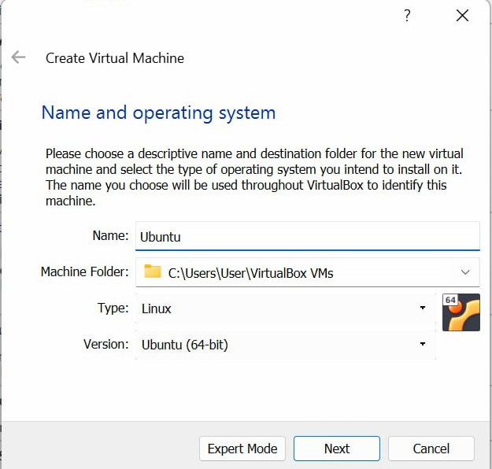
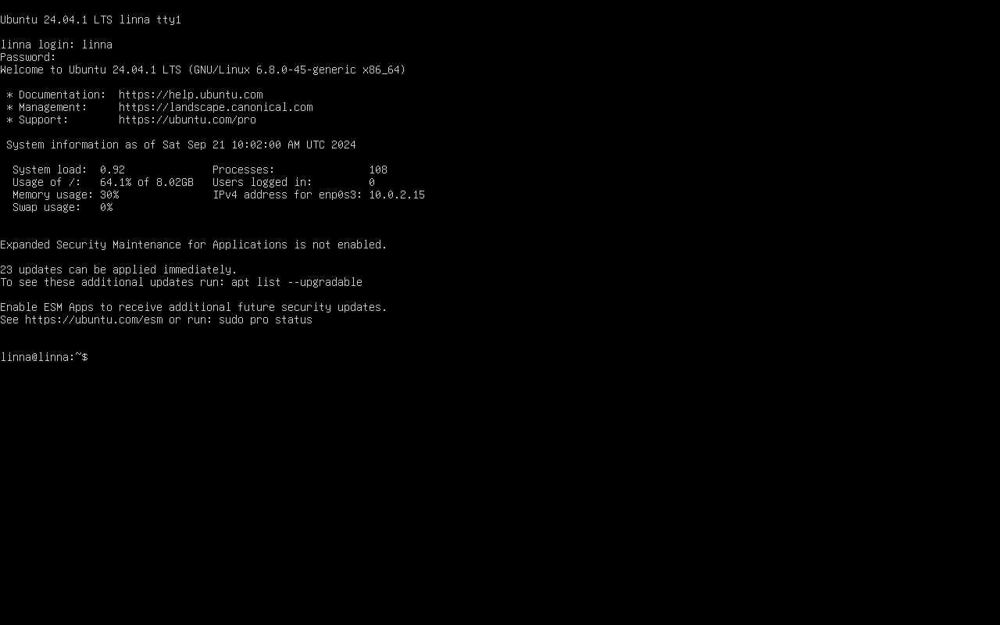
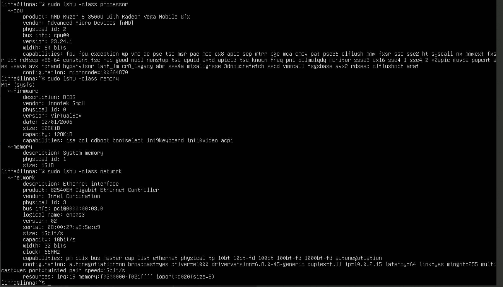
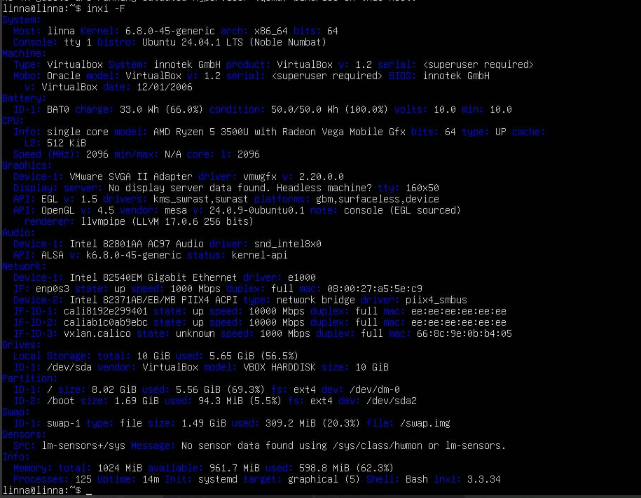
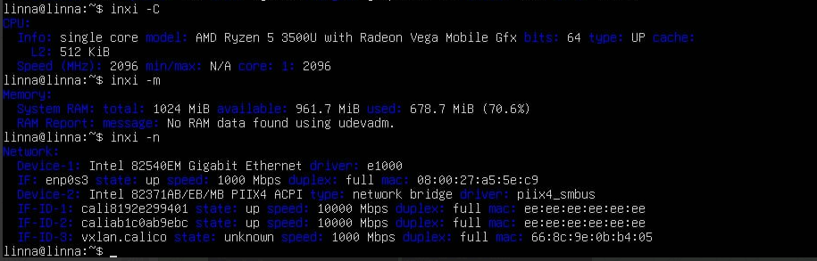
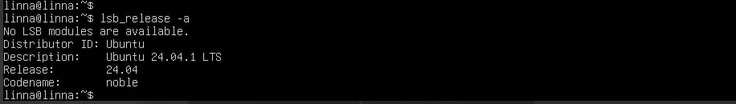

# Virtualization Lab

## Task 1: VM Deployment

1. **Install VirtualBox:**

The version of VirtualBox installed - OracleVM 7.1.

1. **Deploy a Virtual Machine:**

I installed Ubuntu 24.04 ISO from the official website. I will need it for further environment set up. 

To install Ubuntu on VirtualBox, I followed instructions from this [guide](https://hibbard.eu/install-ubuntu-virtual-box/)

1. After I started up VirtualBox, the VirtualBox Manager opened. ***(This screenshot was made after the full set up and Ubuntu installation)***



2. I created a new virtual machine with Ubuntu (`NEW` button in the interface). 



3. Next, I assigned the recommended memory size: **2048 MB** 

4. Hard Disk Configuration:

- Hard Disk File Type: Selected VDI (VirtualBox Disk Image).

- Storage Allocation: Chose "Dynamically allocated" to let the disk grow as needed.

- Disk Size: Set to 10GB, which is enough for an Ubuntu installation.


5. Start the VM   

Selected the newly created VM and clicked Start.

6. Selected the Ubuntu ISO File installed previously


7. Ubuntu installation
   
I followed these steps:

- Language Selection: Chose English.
  
- Installer Update: Installed the available updates.
  
- Keyboard Layout: Chose the appropriate keyboard layout.
  
- Network Setup: Allowed the default network interface configuration.
  
- Disk Setup: Let Ubuntu automatically configure the disk.

- Installation Completion: Finished the installation and rebooted the VM.

For most of the settings I chose default settings. 

Finally, my Ubuntu started in VM (no GUI):



## Task 2: System Information Tools

1. **Processor, RAM, and Network Information**

I used `lshw` or `inxi` to display processor, RAM, and network details.

### `lshw`

```
sudo apt update
sudo apt install lshw
```

To display the processor information I ran this command:

```
lshw -class processor
```

To display the RAM information I ran this command:

```
lshw -class memory
```

To display the Network information I ran this command:

```
lshw -class network
```

The outputs are as follows:




### Alternative - `inxi` 

```
sudo apt update
sudo apt install inxi
```

To display full system info with processor, RAM, and network, I ran: 

```
inxi -F
```
The output is:



**Observations:**

- The system's hostname is linna, and it is running Ubuntu 24.04.1 LTS.
- It is running Linux kernel version 6.8.0-45 for x86_64 architecture.
- The system is using a single virtual CPU core modeled after an AMD Ryzen 5 3500U.
- Speed: 2096 MHz with 1 core enabled.
- Memory: the VM has 1024 MiB (1 GiB) of memory, of which 598.8 MiB is in use, with 361.7 MiB available.

To display processor info only:

```
inxi -C
```

To display RAM info only:
```
inxi -m
```

To display network info only:
```
inxi -n
```

The output for these 3 commands:



2. **Operating System Specifications:**

Display OS-related info:

```
lsb_release -a
```


 
Ubuntu 24.04.1 LTS is running on VM.