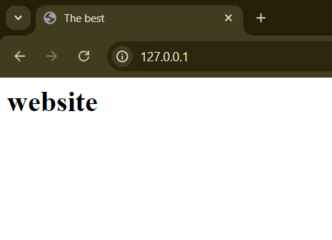

## Task 1
1. **List Containers**:

   ```bash
   docker ps -a
   CONTAINER ID   IMAGE  COMMAND  CREATED  STATUS  PORTS     NAMES
   b49207094245   vsc-overlord100-84508adbf0c8d486a69a5e02efb179cbd44173470da60b745aaf2c06d8f8a0ce            "/bin/sh -c 'echo Co…"   2 weeks ago    Exited (0) 8 days ago               objective_keldysh
   80181a94d769   ipfs/go-ipfs                                                                                "/sbin/tini -- /usr/…"   3 weeks ago    Exited (0) 3 weeks ago              ipfs_host
   cf187c1d2579   vsc-softoverlord100-fe14b5fb36b1276d0d5b05ca30160c794cdbf46fe336bdea84a4ce5b2e47b806        "/bin/sh -c 'echo Co…"   2 months ago   Exited (0) 2 months ago             hungry_booth
   8d50f81e54b3   vsc-test_mobile_platform-2b4212f5b3f03561a55479599a56038bde5b32edf7b3034ab6e81d918188f692   "/bin/sh -c 'echo Co…"   3 months ago   Exited (0) 2 months ago             frosty_moser
   ```
2. **Pull Latest Ubuntu Image**:

   - Use the appropriate command to pull the latest Ubuntu image from the Docker registry.

     ```sh
    docker pull ubuntu:latest
    latest: Pulling from library/ubuntu
    dafa2b0c44d2: Pull complete
    Digest: sha256:dfc10878be8d8fc9c61cbff33166cb1d1fe44391539243703c72766894fa834a
    Status: Downloaded newer image for ubuntu:latest
    docker.io/library/ubuntu:latest
     ```
3. **Run Container**:

   - Use the appropriate command to run a container using the Ubuntu image you just pulled.
    ```bash
    docker run -it --name ubuntu_container ubuntu:latest
    root@438ef21b8676:/#
    ```

4. **Remove Image**:
    ```bash
    docker rmi ubuntu:latest
    Error response from daemon: conflict: unable to remove repository reference "ubuntu:latest" (must force) - container 438ef21b8676 is using its referenced image b1e9cef3f297
    ```
    Removing image is prohibited while it is in use.


## Task 2
* **Create Image Archive**:
    ```sh
    docker save -o ubuntu_image.tar ubuntu:latest
    ```
* **Run Nginx Container**:
    ```sh
    docker run -d -p 80:80 --name my_website_container my_website:latest
    8c547a7c455d4c6c01a39dcc1dfe3dd871fe78b135b3cd31856100919a653615
    ```
* **Create HTML File**:
    ```sh
    docker cp index.html nginx_container:/usr/share/nginx/html/index.html
    Successfully copied 2.05kB to nginx_container:/usr/share/nginx/html/index.html
    PS C:\Users\y_pod\Desktop\F24-intro-labs> docker commit nginx_container my_website:latest
    sha256:9f0d88ea8342dffb4bda5fdda59227611f67991696eef16d63494117ccf878c6
    ```
* **Create Custom Image**:
  - Create a custom Docker image from the running container and name it `my_website`.
  - Tag the container with the `latest` tag.

    ```sh
    docker commit nginx_container my_website:latest
    ```
* **Remove Original Container**:
    ```sh
    docker rm -f nginx_container
    ```
* **Create New Container**:
    ```sh
    docker run -d -p 80:80 --name my_website_container my_website:latest
    ```
* **Test Web Server**:
    
* **Analyze Image Changes**:
    ```sh
    docker run -d -p 80:80 --name my_website_container my_website:latest
    8c547a7c455d4c6c01a39dcc1dfe3dd871fe78b135b3cd31856100919a653615
    PS C:\Users\y_pod\Desktop\F24-intro-labs> docker diff my_website_container
    C /run
    C /run/nginx.pid
    C /etc
    C /etc/nginx
    C /etc/nginx/conf.d
    C /etc/nginx/conf.d/default.conf
    ```


