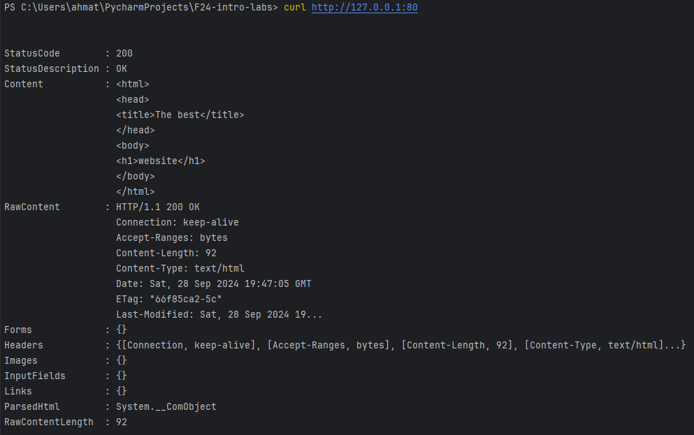
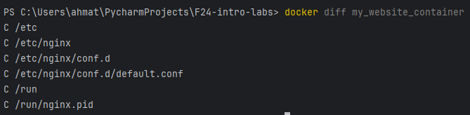

## Task 1: Container Management


1. **List Containers**:
     ```sh
     docker ps -a
     ```
   
2. **Pull Latest Ubuntu Image**:
     ```sh
     docker pull ubuntu:latest
     ```
    
3. **Run Container**:
     ```sh
     docker run -it --name ubuntu_container ubuntu:latest
     ```
4. **Remove Image**:
     ```sh
     docker rmi ubuntu:latest
     ```
    
    So firstly we need to remove the container first, and then we will be able to remove the image

## Task 2: Image and Container Operations

1. **Create Image Archive**:

     ```sh
     docker save -o ubuntu_image.tar ubuntu:latest
     ```

   Archived file size - 76.8 MiB. The original image size - 78.1MiB. The difference in, obviously, because of compression.
2. **Run Nginx Container**:
     ```sh
     docker run -d -p 80:80 --name nginx_container nginx
     ```
    

3. **Create HTML File**:
     ```html
     <html>
     <head>
     <title>The best</title>
     </head>
     <body>
     <h1>website</h1>
     </body>
     </html>
     ```
     ```sh
     docker cp index.html nginx_container:/usr/share/nginx/html/index.html
     ```
   
    

4. **Create Custom Image**:s
     ```sh
     docker commit nginx_container my_website:latest
     ```
    
5. **Remove Original Container**:
     ```sh
     docker rm -f nginx_container
     ```
   
   

6. **Create New Container**:
     ```sh
     docker run -d -p 80:80 --name my_website_container my_website:latest
     ```
   
7. **Test Web Server**:
     ```sh
     curl http://127.0.0.1:80
     ```
   
8. **Analyze Image Changes**:
     ```sh
     docker diff my_website_container
     ```
   

   As we can see, there are only changes in default config of nginx and its pid, other differences are related to the directory changes because of changes in this files.