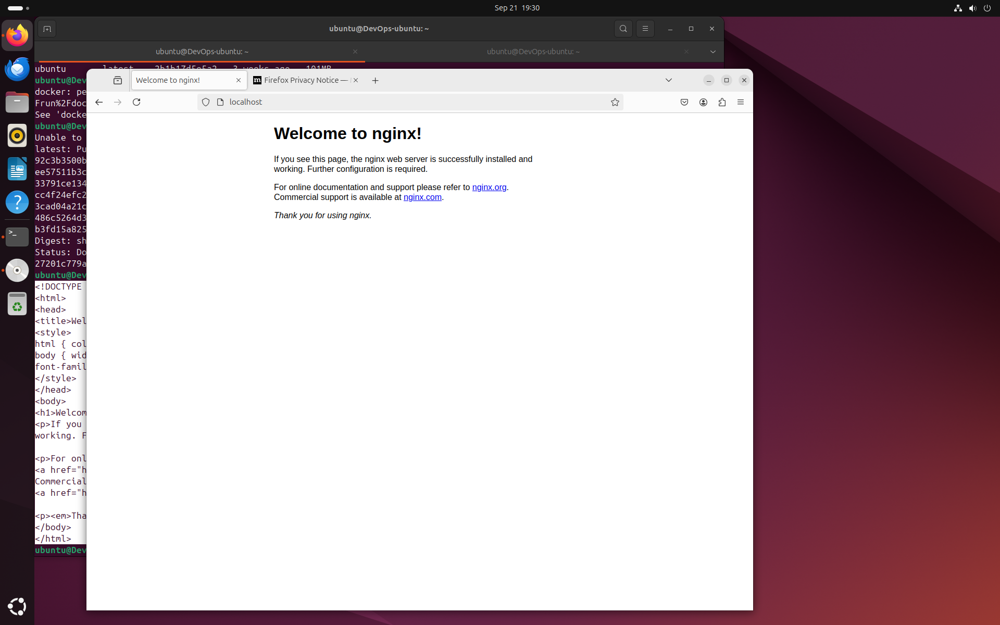
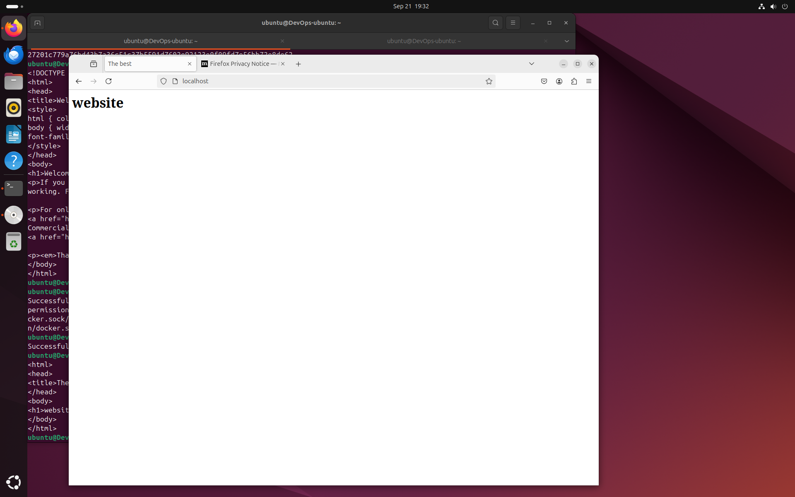

## Task 1

Install docker.

```
sudo apt-get update
sudo apt-get install ca-certificates curl
sudo install -m 0755 -d /etc/apt/keyrings
sudo curl -fsSL https://download.docker.com/linux/ubuntu/gpg -o /etc/apt/keyrings/docker.asc
sudo chmod a+r /etc/apt/keyrings/docker.asc

# Add the repository to Apt sources:
echo \
  "deb [arch=$(dpkg --print-architecture) signed-by=/etc/apt/keyrings/docker.asc] https://download.docker.com/linux/ubuntu \
  $(. /etc/os-release && echo "$VERSION_CODENAME") stable" | \
  sudo tee /etc/apt/sources.list.d/docker.list > /dev/null
sudo apt-get update
```

**Output**

```
Hit:1 http://ports.ubuntu.com/ubuntu-ports noble InRelease
Get:2 http://ports.ubuntu.com/ubuntu-ports noble-updates InRelease [126 kB]
Hit:3 http://ports.ubuntu.com/ubuntu-ports noble-backports InRelease
Hit:4 http://ports.ubuntu.com/ubuntu-ports noble-security InRelease
Get:5 http://ports.ubuntu.com/ubuntu-ports noble/main Icons (48x48) [106 kB]
Get:6 http://ports.ubuntu.com/ubuntu-ports noble/main Icons (64x64) [156 kB]
Get:7 http://ports.ubuntu.com/ubuntu-ports noble/main Icons (64x64@2) [21.8 kB]
Get:8 http://ports.ubuntu.com/ubuntu-ports noble/universe Icons (48x48) [3,717 kB]
Get:9 http://ports.ubuntu.com/ubuntu-ports noble/universe Icons (64x64) [7,747 kB]
Get:10 http://ports.ubuntu.com/ubuntu-ports noble/universe Icons (64x64@2) [75.0 kB]
Get:11 http://ports.ubuntu.com/ubuntu-ports noble/multiverse Icons (48x48) [56.1 kB]
Get:12 http://ports.ubuntu.com/ubuntu-ports noble/multiverse Icons (64x64) [186 kB]
Get:13 http://ports.ubuntu.com/ubuntu-ports noble/multiverse Icons (64x64@2) [904 B]
Get:14 http://ports.ubuntu.com/ubuntu-ports noble-updates/main Icons (48x48) [12.6 kB]
Get:15 http://ports.ubuntu.com/ubuntu-ports noble-updates/main Icons (64x64) [15.1 kB]
Get:16 http://ports.ubuntu.com/ubuntu-ports noble-updates/main Icons (64x64@2) [29 B]
Get:17 http://ports.ubuntu.com/ubuntu-ports noble-updates/restricted Icons (48x48) [29 B]
Get:18 http://ports.ubuntu.com/ubuntu-ports noble-updates/restricted Icons (64x64) [29 B]
Get:19 http://ports.ubuntu.com/ubuntu-ports noble-updates/restricted Icons (64x64@2) [29 B]
Get:20 http://ports.ubuntu.com/ubuntu-ports noble-updates/universe Icons (48x48) [15.6 kB]
Get:21 http://ports.ubuntu.com/ubuntu-ports noble-updates/universe Icons (64x64) [21.5 kB]
Get:22 http://ports.ubuntu.com/ubuntu-ports noble-updates/universe Icons (64x64@2) [29 B]
Get:23 http://ports.ubuntu.com/ubuntu-ports noble-updates/multiverse Icons (48x48) [29 B]
Get:24 http://ports.ubuntu.com/ubuntu-ports noble-updates/multiverse Icons (64x64) [29 B]
Get:25 http://ports.ubuntu.com/ubuntu-ports noble-updates/multiverse Icons (64x64@2) [29 B]
Get:26 http://ports.ubuntu.com/ubuntu-ports noble-backports/main Icons (48x48) [29 B]
Get:27 http://ports.ubuntu.com/ubuntu-ports noble-backports/main Icons (64x64) [29 B]
Get:28 http://ports.ubuntu.com/ubuntu-ports noble-backports/main Icons (64x64@2) [29 B]
Get:29 http://ports.ubuntu.com/ubuntu-ports noble-backports/restricted Icons (48x48) [29 B]
Get:30 http://ports.ubuntu.com/ubuntu-ports noble-backports/restricted Icons (64x64) [29 B]
Get:31 http://ports.ubuntu.com/ubuntu-ports noble-backports/restricted Icons (64x64@2) [29 B]
Get:32 http://ports.ubuntu.com/ubuntu-ports noble-backports/universe Icons (48x48) [29 B]
Get:33 http://ports.ubuntu.com/ubuntu-ports noble-backports/universe Icons (64x64) [2,900 B]
Get:34 http://ports.ubuntu.com/ubuntu-ports noble-backports/universe Icons (64x64@2) [29 B]
Get:35 http://ports.ubuntu.com/ubuntu-ports noble-backports/multiverse Icons (48x48) [29 B]
Get:36 http://ports.ubuntu.com/ubuntu-ports noble-backports/multiverse Icons (64x64) [29 B]
Get:37 http://ports.ubuntu.com/ubuntu-ports noble-backports/multiverse Icons (64x64@2) [29 B]
Get:38 http://ports.ubuntu.com/ubuntu-ports noble-security/main Icons (48x48) [9,524 B]
Get:39 http://ports.ubuntu.com/ubuntu-ports noble-security/main Icons (64x64) [11.2 kB]
Get:40 http://ports.ubuntu.com/ubuntu-ports noble-security/main Icons (64x64@2) [29 B]
Get:41 http://ports.ubuntu.com/ubuntu-ports noble-security/restricted Icons (48x48) [29 B]
Get:42 http://ports.ubuntu.com/ubuntu-ports noble-security/restricted Icons (64x64) [29 B]
Get:43 http://ports.ubuntu.com/ubuntu-ports noble-security/restricted Icons (64x64@2) [29 B]
Get:44 http://ports.ubuntu.com/ubuntu-ports noble-security/universe Icons (48x48) [3,763 B]
Get:45 http://ports.ubuntu.com/ubuntu-ports noble-security/universe Icons (64x64) [4,851 B]
Get:46 http://ports.ubuntu.com/ubuntu-ports noble-security/universe Icons (64x64@2) [29 B]
Get:47 http://ports.ubuntu.com/ubuntu-ports noble-security/multiverse Icons (48x48) [29 B]
Get:48 http://ports.ubuntu.com/ubuntu-ports noble-security/multiverse Icons (64x64) [29 B]
Get:49 http://ports.ubuntu.com/ubuntu-ports noble-security/multiverse Icons (64x64@2) [29 B]
Fetched 12.3 MB in 7s (1,745 kB/s)
Reading package lists... Done
Reading package lists... Done
Building dependency tree... Done
Reading state information... Done
ca-certificates is already the newest version (20240203).
ca-certificates set to manually installed.
curl is already the newest version (8.5.0-2ubuntu10.4).
curl set to manually installed.
0 upgraded, 0 newly installed, 0 to remove and 29 not upgraded.
Hit:1 http://ports.ubuntu.com/ubuntu-ports noble InRelease
Hit:2 http://ports.ubuntu.com/ubuntu-ports noble-updates InRelease
Get:3 https://download.docker.com/linux/ubuntu noble InRelease [48.8 kB]
Hit:4 http://ports.ubuntu.com/ubuntu-ports noble-backports InRelease
Hit:5 http://ports.ubuntu.com/ubuntu-ports noble-security InRelease
Get:6 https://download.docker.com/linux/ubuntu noble/stable arm64 Packages [15.3 kB]
Fetched 64.2 kB in 1s (77.8 kB/s)
Reading package lists... Done
```

Install docker packages.

```
sudo apt-get install docker-ce docker-ce-cli containerd.io docker-buildx-plugin docker-compose-plugin
```

**Output**

```
Reading package lists... Done
Building dependency tree... Done
Reading state information... Done
The following additional packages will be installed:
  docker-ce-rootless-extras libslirp0 pigz slirp4netns
Suggested packages:
  cgroupfs-mount | cgroup-lite
The following NEW packages will be installed:
  containerd.io docker-buildx-plugin docker-ce docker-ce-cli
  docker-ce-rootless-extras docker-compose-plugin libslirp0 pigz slirp4netns
0 upgraded, 9 newly installed, 0 to remove and 29 not upgraded.
Need to get 98.8 MB of archives.
After this operation, 380 MB of additional disk space will be used.
Do you want to continue? [Y/n] y
Get:1 http://ports.ubuntu.com/ubuntu-ports noble/universe arm64 pigz arm64 2.8-1 [60.7 kB]
Get:2 https://download.docker.com/linux/ubuntu noble/stable arm64 containerd.io arm64 1.7.22-1 [22.0 MB]
Get:3 http://ports.ubuntu.com/ubuntu-ports noble/main arm64 libslirp0 arm64 4.7.0-1ubuntu3 [61.8 kB]
Get:4 http://ports.ubuntu.com/ubuntu-ports noble/universe arm64 slirp4netns arm64 1.2.1-1build2 [34.3 kB]
Get:5 https://download.docker.com/linux/ubuntu noble/stable arm64 docker-buildx-plugin arm64 0.17.1-1~ubuntu.24.04~noble [27.8 MB]
Get:6 https://download.docker.com/linux/ubuntu noble/stable arm64 docker-ce-cli arm64 5:27.3.1-1~ubuntu.24.04~noble [13.6 MB]
Get:7 https://download.docker.com/linux/ubuntu noble/stable arm64 docker-ce arm64 5:27.3.1-1~ubuntu.24.04~noble [15.7 MB]
Get:8 https://download.docker.com/linux/ubuntu noble/stable arm64 docker-ce-rootless-extras arm64 5:27.3.1-1~ubuntu.24.04~noble [8,643 kB]
Get:9 https://download.docker.com/linux/ubuntu noble/stable arm64 docker-compose-plugin arm64 2.29.7-1~ubuntu.24.04~noble [10.9 MB]
Fetched 98.8 MB in 9s (10.8 MB/s)
Selecting previously unselected package pigz.
(Reading database ... 167384 files and directories currently installed.)
Preparing to unpack .../0-pigz_2.8-1_arm64.deb ...
Unpacking pigz (2.8-1) ...
Selecting previously unselected package containerd.io.
Preparing to unpack .../1-containerd.io_1.7.22-1_arm64.deb ...
Unpacking containerd.io (1.7.22-1) ...
Selecting previously unselected package docker-buildx-plugin.
Preparing to unpack .../2-docker-buildx-plugin_0.17.1-1~ubuntu.24.04~noble_arm64.deb ...
Unpacking docker-buildx-plugin (0.17.1-1~ubuntu.24.04~noble) ...
Selecting previously unselected package docker-ce-cli.
Preparing to unpack .../3-docker-ce-cli_5%3a27.3.1-1~ubuntu.24.04~noble_arm64.deb ...
Unpacking docker-ce-cli (5:27.3.1-1~ubuntu.24.04~noble) ...
Selecting previously unselected package docker-ce.
Preparing to unpack .../4-docker-ce_5%3a27.3.1-1~ubuntu.24.04~noble_arm64.deb ...
Unpacking docker-ce (5:27.3.1-1~ubuntu.24.04~noble) ...
Selecting previously unselected package docker-ce-rootless-extras.
Preparing to unpack .../5-docker-ce-rootless-extras_5%3a27.3.1-1~ubuntu.24.04~noble_arm64.deb ...
Unpacking docker-ce-rootless-extras (5:27.3.1-1~ubuntu.24.04~noble) ...
Selecting previously unselected package docker-compose-plugin.
Preparing to unpack .../6-docker-compose-plugin_2.29.7-1~ubuntu.24.04~noble_arm64.deb ...
Unpacking docker-compose-plugin (2.29.7-1~ubuntu.24.04~noble) ...
Selecting previously unselected package libslirp0:arm64.
Preparing to unpack .../7-libslirp0_4.7.0-1ubuntu3_arm64.deb ...
Unpacking libslirp0:arm64 (4.7.0-1ubuntu3) ...
Selecting previously unselected package slirp4netns.
Preparing to unpack .../8-slirp4netns_1.2.1-1build2_arm64.deb ...
Unpacking slirp4netns (1.2.1-1build2) ...
Setting up docker-buildx-plugin (0.17.1-1~ubuntu.24.04~noble) ...
Setting up containerd.io (1.7.22-1) ...
Created symlink /etc/systemd/system/multi-user.target.wants/containerd.service → /usr/lib/systemd/system/containerd.service.
Setting up docker-compose-plugin (2.29.7-1~ubuntu.24.04~noble) ...
Setting up docker-ce-cli (5:27.3.1-1~ubuntu.24.04~noble) ...
Setting up libslirp0:arm64 (4.7.0-1ubuntu3) ...
Setting up pigz (2.8-1) ...
Setting up docker-ce-rootless-extras (5:27.3.1-1~ubuntu.24.04~noble) ...
Setting up slirp4netns (1.2.1-1build2) ...
Setting up docker-ce (5:27.3.1-1~ubuntu.24.04~noble) ...
Created symlink /etc/systemd/system/multi-user.target.wants/docker.service → /usr/lib/systemd/system/docker.service.
Created symlink /etc/systemd/system/sockets.target.wants/docker.socket → /usr/lib/systemd/system/docker.socket.
Processing triggers for man-db (2.12.0-4build2) ...
Processing triggers for libc-bin (2.39-0ubuntu8.3) ...
Scanning processes...
Scanning processor microcode...
Scanning linux images...

Running kernel seems to be up-to-date.

The processor microcode seems to be up-to-date.

No services need to be restarted.

No containers need to be restarted.

No user sessions are running outdated binaries.

No VM guests are running outdated hypervisor (qemu) binaries on this host.
```

Docker was installed 🥳

1. List the containers.

```
sudo docker ps -a
```

**Output**

```
sudo docker ps -a
CONTAINER ID   IMAGE     COMMAND   CREATED   STATUS    PORTS     NAMES
```

There are no containers because I have just installed Docker.

2. Pull latest ubuntu image.

```
sudo docker pull ubuntu:latest
```

**Output**

```
latest: Pulling from library/ubuntu
6e59cb05818e: Pull complete
Digest: sha256:dfc10878be8d8fc9c61cbff33166cb1d1fe44391539243703c72766894fa834a
Status: Downloaded newer image for ubuntu:latest
docker.io/library/ubuntu:latest
```

3. Run the container.

```
docker run -it --name ubuntu_container ubuntu:latest
```

Details about the container.


4. Remove image.

```
sudo docker rmi ubuntu:latest
```

**Output**

```
Error response from daemon: conflict: unable to remove repository reference "ubuntu:latest" (must force) - container 831aa1b78d79 is using its referenced image 2b1b17d5e5a2
```

```
sudo docker ps -a
```

**Output**

```
CONTAINER ID   IMAGE           COMMAND       CREATED         STATUS                        PORTS     NAMES
831aa1b78d79   ubuntu:latest   "/bin/bash"   7 minutes ago   Exited (127) 53 seconds ago             ubuntu_container
```

## Task 2

1. Create an archive file from the latest ubuntu image.

```
docker save -o ubuntu_image.tar ubuntu:latest
```

2. Check the size of the archive file.

```
du -sh ubuntu_image.tar
```

**Output**

```
99M	  ubuntu_image.tar
```

3. Check the size of the original image.

```
sudo docker images
```

```
REPOSITORY   TAG       IMAGE ID       CREATED       SIZE
ubuntu       latest    2b1b17d5e5a2   3 weeks ago   101MB
```

**Explanation**

The sizes of the archive file and the original image are slightly different: 99 and 101 MB. This can be because of the metadata that is stored with the images and can be minimized in case of archivation. Also, it is possible that archive compresses some image layers.

4. Run nginx container.

```
sudo docker run -d -p 80:80 --name nginx_container nginx
```

**Output**

```
Unable to find image 'nginx:latest' locally
latest: Pulling from library/nginx
92c3b3500be6: Pull complete
ee57511b3c68: Pull complete
33791ce134bf: Pull complete
cc4f24efc205: Pull complete
3cad04a21c99: Pull complete
486c5264d3ad: Pull complete
b3fd15a82525: Pull complete
Digest: sha256:04ba374043ccd2fc5c593885c0eacddebabd5ca375f9323666f28dfd5a9710e3
Status: Downloaded newer image for nginx:latest
27201c779a76bd43b7a36c51c37b5591d7602e92123e0f09fd7e56bb72e8de62
```

It works.

```
curl localhost
```

**Output**

```
<!DOCTYPE html>
<html>
<head>
<title>Welcome to nginx!</title>
<style>
html { color-scheme: light dark; }
body { width: 35em; margin: 0 auto;
font-family: Tahoma, Verdana, Arial, sans-serif; }
</style>
</head>
<body>
<h1>Welcome to nginx!</h1>
<p>If you see this page, the nginx web server is successfully installed and
working. Further configuration is required.</p>

<p>For online documentation and support please refer to
<a href="http://nginx.org/">nginx.org</a>.<br/>
Commercial support is available at
<a href="http://nginx.com/">nginx.com</a>.</p>

<p><em>Thank you for using nginx.</em></p>
</body>
</html>
```

 5. Then, I created html file.

```
nano index.html
```

Added the following content.

```
<html>
<head>
<title>The best</title>
</head>
<body>
<h1>website</h1>
</body>
</html>
```

6. Copy the HTML file to the container to serve as an index file.

```
sudo docker cp index.html nginx_container:/usr/share/nginx/html/index.html
```

**Output**

```
Successfully copied 2.05kB to nginx_container:/usr/share/nginx/html/index.html
```

Check that the page was changed.

```
curl localhost
```

**Output**

```
<html>
<head>
<title>The best</title>
</head>
<body>
<h1>website</h1>
</body>
</html>
```



7. Create a custom Docker image from the running container.

```
sudo docker commit nginx_container my_website:latest
```

**Output**

```
sha256:d44138d012842cf2a5b8bf8fa551f8de2001f7b806aa6e83a37bf73370b32042
```

8. Remove nginx_container.

```
sudo docker rm -f nginx_container
```

**Output**

```
nginx_container
```

Check that it was removed.

```
sudo docker ps -a
```

**Output**

```
CONTAINER ID   IMAGE           COMMAND       CREATED          STATUS                        PORTS     NAMES
831aa1b78d79   ubuntu:latest   "/bin/bash"   25 minutes ago   Exited (127) 19 minutes ago             ubuntu_container
```

9. Create new container using the custom image.

```
sudo docker run -d -p 80:80 --name my_website_container my_website:latest
```

```
01296f757e38be5bccc9d16762163e0dfce6295e4ad21a243e1bf405aafb4b19
```

10. Access the webserver.

```
curl http://127.0.0.1:80
```

**Output**

```
<html>
<head>
<title>The best</title>
</head>
<body>
<h1>website</h1>
</body>
</html>
```

11. Check image changes.

```
sudo docker diff my_website_container
```

**Output**

```
C /etc
C /etc/nginx
C /etc/nginx/conf.d
C /etc/nginx/conf.d/default.conf
C /run
C /run/nginx.pid
```

`C` means changed. The change of the files listed above shows that some configurations and files were changed when we modified the index file.
