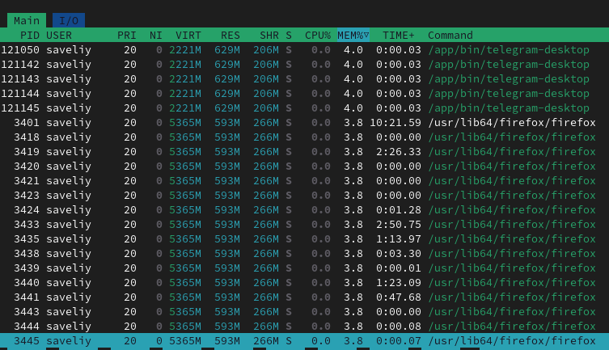

# Containerization

### listing the containers
 

### Latest ubuntu version

### Running the ubuntu container

### Attempting to remove the container

Alternative: Deleting from the GUI

# Image and Container operations
### Saving the ubuntu image
> docker save -o ubuntu_image.tar ubuntu:latest
size of the tar file: `09/26/2024  14:37        80,630,784 ubuntu_image.tar`
almost double the size of the original image 

### Running nginx container

### using the image container to display an html file:

From the documentation:

Based on the output of docker diff, we can see that no files were added or deleted. Furthermore, we see the list of files that have been modified.