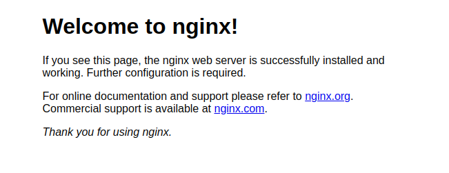

# Containers Lab - Docker

## Task 1. Container Management 

1. **List Containers**
   
Firstly, I listed the Docker containers presented in my environment:

```
$ docker ps -a

CONTAINER ID   IMAGE         COMMAND    CREATED      STATUS                  PORTS     NAMES
2c1df150f6b6   hello-world   "/hello"   6 days ago   Exited (0) 6 days ago             funny_gates
9be7cdc9b375   hello-world   "/hello"   6 days ago   Exited (0) 6 days ago             objective_hawking
```


2. **Pull Latest Ubuntu Image**
   
```
$ docker pull ubuntu:latest

latest: Pulling from library/ubuntu
dafa2b0c44d2: Pull complete 
Digest: sha256:dfc10878be8d8fc9c61cbff33166cb1d1fe44391539243703c72766894fa834a
Status: Downloaded newer image for ubuntu:latest
docker.io/library/ubuntu:latest
```

3. **Run Container**
   
```
$ docker run -it --name ubuntu_container ubuntu:latest

root@7e98e3c62d93:/# 
```

Let's exit the container and list the existing containers:

```
$ docker ps -a

CONTAINER ID   IMAGE               COMMAND                  CREATED          STATUS                     PORTS     NAMES
40c58ad3b40a   ubuntu:latest       "/bin/bash"              10 seconds ago   Exited (0) 5 seconds ago             ubuntu_container
2c1df150f6b6   hello-world         "/hello"                 6 days ago       Exited (0) 6 days ago                funny_gates
9be7cdc9b375   hello-world         "/hello"                 6 days ago       Exited (0) 6 days ago                objective_hawking

```


**Observations:** 

The container was started in interactive mode (`-it`). It means that I have an interactive shell inside the container and can run commands within the Ubuntu environment.

The container's ID is `7e98e3c62d93`. 

Inside the container, I have access to the Ubuntu environment, where I can install software, modify files, and perform operations as if I was working on a regular Ubuntu machine.

4. **Remove Image**

```
$ docker rmi ubuntu:latest

Error response from daemon: conflict: unable to remove repository reference "ubuntu:latest" (must force) - container b801238e6f14 is using its referenced image b1e9cef3f297
```
So, let's firstly remove the container:
```
$ docker rm ubuntu_container

ubuntu_container
```

And after that, remove the image:

```
$ docker rmi ubuntu:latest

Untagged: ubuntu:latest
Untagged: ubuntu@sha256:dfc10878be8d8fc9c61cbff33166cb1d1fe44391539243703c72766894fa834a
Deleted: sha256:b1e9cef3f2977f8bdd19eb9ae04f83b315f80fe4f5c5651fedf41482c12432f7
Deleted: sha256:b15b682e901dd27efdf436ce837a94c729c0b78c44431d5b5ca3ccca1bed40da
kate@linna:~$ 
```

I checked the containers now:

```
$ docker ps -a

CONTAINER ID   IMAGE         COMMAND    CREATED      STATUS                  PORTS     NAMES
2c1df150f6b6   hello-world   "/hello"   6 days ago   Exited (0) 6 days ago             funny_gates
9be7cdc9b375   hello-world   "/hello"   6 days ago   Exited (0) 6 days ago             objective_hawking

$ docker images
REPOSITORY    TAG       IMAGE ID       CREATED          SIZE
nginx         latest    39286ab8a5e1   5 weeks ago      188MB
hello-world   latest    d2c94e258dcb   16 months ago    13.3kB
```

The container and the image were deleted successfully.

# Task 2: Image and Container Operations

1. **Create Image Archive:**

I pulled the latest Ubuntu image and created an archive file from it:

```
docker save -o ubuntu_image.tar ubuntu:latest
```

Let's compare the size of the archive with the size of the image:

```
$ docker images

REPOSITORY    TAG       IMAGE ID       CREATED         SIZE
ubuntu        latest    b1e9cef3f297   3 weeks ago     78.1MB
```

Size of the image - 78.1MB,

```
$ ls -lh ubuntu_image.tar 

-rw------- 1 kate kate 77M сен 20 22:19 ubuntu_image.tar
```

Size of the archive - 77MB.

The size of the archive is a bit smaller.


2. **Run Nginx Container:**

```
$ docker run -d -p 80:80 --name nginx_container nginx

80cdc103b8623108312a2512ccc39b9d9db280c6b39e70fcd4043dee5bd593bc
```
This command runs a Docker container in a detached mode (`-d`), which means that it runs in the backgrgound and does not block my terminal. 

Let's verify that Nginx is running by visiting: `http://localhost`

And after checking `http://localhost`, I see this:



3. **Create HTML file**
   
I created `.html` file, which you can find in the same submission8 folder.

Copy the HTML file to the container at the appropriate location to serve as an index file. Inside the directory with `index.html` file I ran this command:

```
$ docker cp index.html nginx_container:/usr/share/nginx/html/index.html

Successfully copied 2.05kB to nginx_container:/usr/share/nginx/html/index.html
```

Now, after checking `http://localhost`, I see this:


4. **Create Custom Image:**

Next, I created a custom Docker image with the `latest` tag. 

```
$ docker commit nginx_container my_website:latest

sha256:0201e69e8601d0f0af0fbea9b043073ac7914ff2333e4538ea2cd1b4f1725dab
```

5. **Remove Original Container:**

```
docker rm -f nginx_container
```

6. **Create New Container**

```   
$ docker run -d -p 80:80 --name my_website_container my_website:latest

45d82269fe01a34f00b9d1abaf326175b870ff7e9d027e30dce862760c26bc96
```

7. **Test Web Server**

I faced the problem while launching this command (the output was empty):

`$ curl http://127.0.0.1:80`

So, in another terminal I ran the following commands:

```
$ docker exec -it 45d82269fe01 bash

root@645f6c83a472:/# curl http://127.0.0.1:80

<html>
    <head>
        <title>The best</title>
    </head>
    <body>
        <h1>Website</h1>
    </body>
</html>root@645f6c83a472:/# 

```

***Alternative way.***

Tested Nginx Locally in the Container.

```
$ docker exec -it my_website_container curl http://localhost
```

The output:

```
<html>
    <head>
        <title>The best</title>These
    </head>
    <body>
        <h1>Website</h1>
    </body>
</html>
```

8. **Analyze Image Changes**

```
$ docker diff my_website_container

C /run
C /run/nginx.pid
C /etc
C /etc/nginx
C /etc/nginx/conf.d
C /etc/nginx/conf.d/default.conf
```

In this outout, `C` stands for `Changed`.

We can see that the changes correspond to starting the Nginx server and copying a new `index.html` file into the container. Nginx modifies its configuration and runtime files (such as `nginx.pid` and default config) when it starts or when its contents change.

After I finished this lab, I stopped all the containers launched with this command:

```
$ docker stop $(docker ps -aq)

```