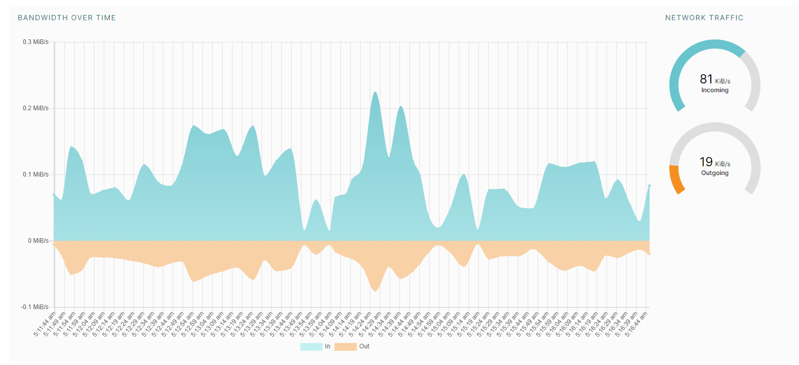
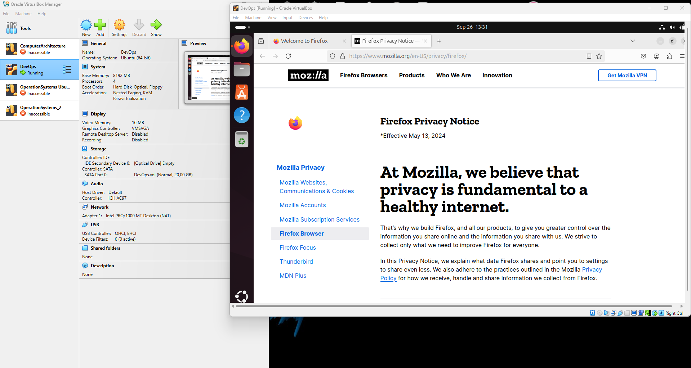
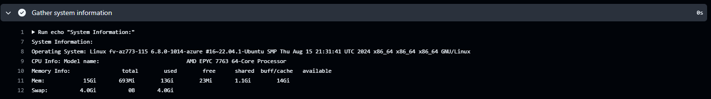

# CI/CD Lab - GitHub Actions

## Task 1: Create Your First GitHub Actions Pipeline

1. **Read the Official Guide**:
   - Follow the official GitHub Actions [quickstart guide](https://docs.github.com/en/actions/quickstart).
   - Document all your observations, key concepts, and steps you followed in a Markdown file named `submission9.md` in the lab folder.

2. **Observe the Workflow Execution**:
   - Push some changes to your repository and observe the GitHub Actions workflow execution.
   - Document the output, any errors encountered, and any observations in the same `submission9.md` file.

   **Observations**:
   
   I've created a file named `.github/workflows/github-actions-demo.yml` in `Lab9` branch.

   Then, I pasted a code there:
    ```yaml
    name: GitHub Actions Demo
    run-name: ${{ github.actor }} is testing out GitHub Actions 🚀
    on: [push]
    jobs:
    Explore-GitHub-Actions:
        runs-on: ubuntu-latest
        steps:
        - run: echo "🎉 The job was automatically triggered by a ${{ github.event_name }} event."
        - run: echo "🐧 This job is now running on a ${{ runner.os }} server hosted by GitHub!"
        - run: echo "🔎 The name of your branch is ${{ github.ref }} and your repository is ${{ github.repository }}."
        - name: Check out repository code
            uses: actions/checkout@v4
        - run: echo "💡 The ${{ github.repository }} repository has been cloned to the runner."
        - run: echo "🖥️ The workflow is now ready to test your code on the runner."
        - name: List files in the repository
            run: |
            ls ${{ github.workspace }}
        - run: echo "🍏 This job's status is ${{ job.status }}."
    ```

    I've commited changes in `Lab9` branch and went to `Actions`

    Then I went to `GitHub Actions Demo` and after choosing my action, I clicked `Explore-GitHub-Actions` job.

    There was some info on how each of the steps was processed:
    

## Task 2: Gathering System Information and Manual Triggering

**Objective**: Extend your workflow to include manual triggering and system information gathering.

1. **Configure a Manual Trigger**:
   - Extend your existing GitHub Actions workflow to include a [manual trigger](https://docs.github.com/en/actions/using-workflows/triggering-a-workflow#defining-inputs-for-manually-triggered-workflows).
   - Inputs for manually triggered workflows are not needed, so you can skip them.
   - Document the changes made to the workflow file in the same `submission9.md` file.
   - Refer to the [official documentation](https://docs.github.com/en/actions/using-workflows/manually-running-a-workflow) if you face any issues.

   I've extended my workflow:

    ```yml
    name: GitHub Actions Demo
    run-name: ${{ github.actor }} is testing out GitHub Actions 🚀
    on:
    push:
    workflow_dispatch:  # Added this line to enable manual triggering

    jobs:
    Explore-GitHub-Actions:
        runs-on: ubuntu-latest
        steps:
        - run: echo "🎉 The job was automatically triggered by a ${{ github.event_name }} event."
        - run: echo "🐧 This job is now running on a ${{ runner.os }} server hosted by GitHub!"
        - run: echo "🔎 The name of your branch is ${{ github.ref }} and your repository is ${{ github.repository }}."
        - name: Check out repository code
            uses: actions/checkout@v4
        - run: echo "💡 The ${{ github.repository }} repository has been cloned to the runner."
        - run: echo "🖥️ The workflow is now ready to test your code on the runner."
        - name: List files in the repository
            run: |
            ls ${{ github.workspace }}
        - run: echo "🍏 This job's status is ${{ job.status }}."
    ```

    I did not have the button `Run workflow` untill I merged `Lab9` and `master`.

    

2. **Gather System Information**:
   - Modify your workflow to include an additional step for gathering system information.
   - Use the appropriate actions and steps to collect information about the runner, hardware specifications, and operating system details.
   - Document the changes made to the workflow file and the gathered system information in the same `submission9.md` file.

   I extended my workflow like this:
   ```yml
    name: GitHub Actions Demo
    run-name: ${{ github.actor }} is testing out GitHub Actions 🚀
    on:
    push:
    workflow_dispatch:  # Add this line to enable manual triggering

    jobs:
    Explore-GitHub-Actions:
        runs-on: ubuntu-latest
        steps:
        - run: echo "🎉 The job was automatically triggered by a ${{ github.event_name }} event."
        - run: echo "🐧 This job is now running on a ${{ runner.os }} server hosted by GitHub!"
        - run: echo "🔎 The name of your branch is ${{ github.ref }} and your repository is ${{ github.repository }}."
        - name: Check out repository code
            uses: actions/checkout@v4
        - run: echo "💡 The ${{ github.repository }} repository has been cloned to the runner."
        - run: echo "🖥️ The workflow is now ready to test your code on the runner."
        - name: List files in the repository
            run: |
            ls ${{ github.workspace }}
        - run: echo "🍏 This job's status is ${{ job.status }}."
        - name: Gather system information
            run: |
            echo "System Information:"
            echo "Operating System: $(uname -a)"
            echo "CPU Info: $(lscpu | grep 'Model name')"
            echo "Memory Info: $(free -h)"
    ```

    So, now I can gather server's system info:
    