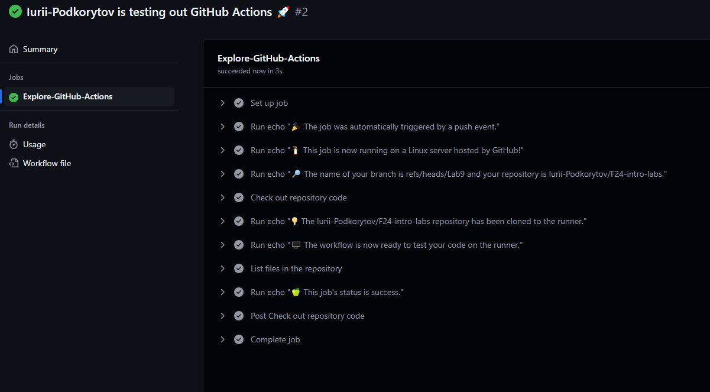
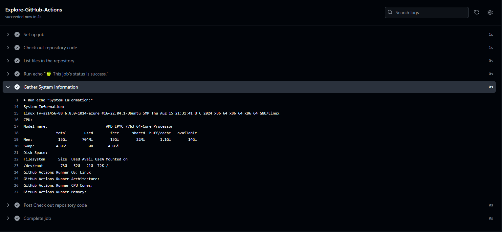
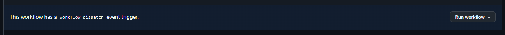

## Task 1: GitHub Actions

1. **Created a workflow file:** **I created a file named** **.github/workflows/main.yml** **in my repository with the provided workflow YAML code. I made sure to follow the syntax closely as described in the documentation.**
2. **Pushed the file:** **I committed and pushed the** **main.yml** **file to the repository. This triggered the workflow.**

**2. Observing Workflow Execution:**

**After pushing the** **.yml** **file, the GitHub Actions workflow began execution automatically. I could observe its progress in the "Actions" tab of the repository.**

## Task 2: Gathering System Information and Manual Triggering

To be able to manually triger a workflow, I added `workflow_dispatch` to the "on" section. However, for it to work the workflow must be on default branch.

