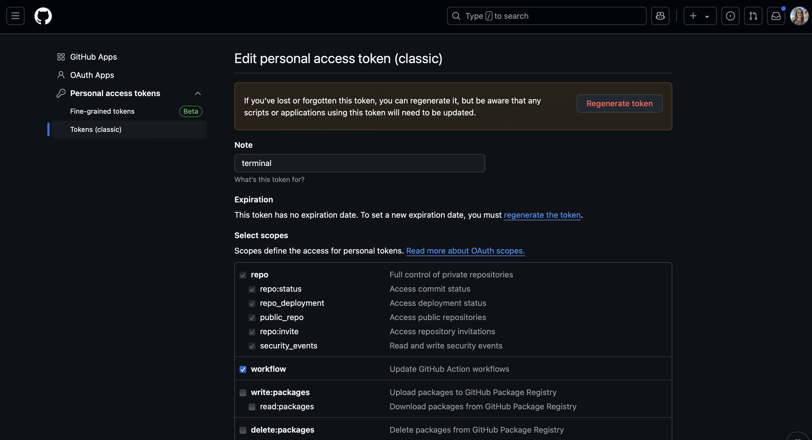
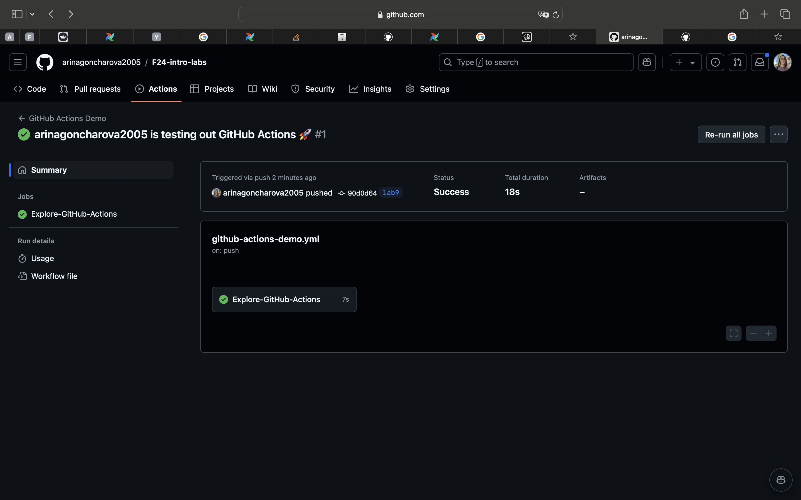
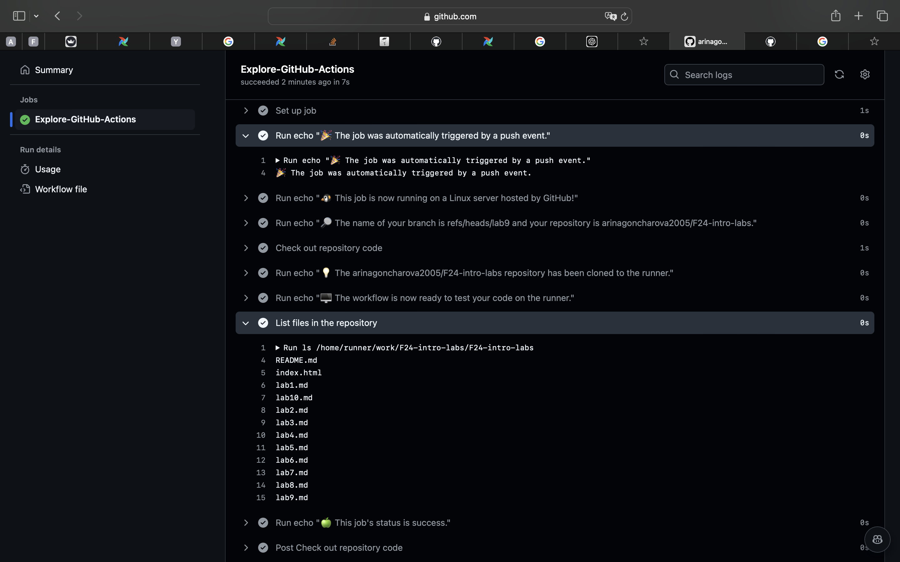
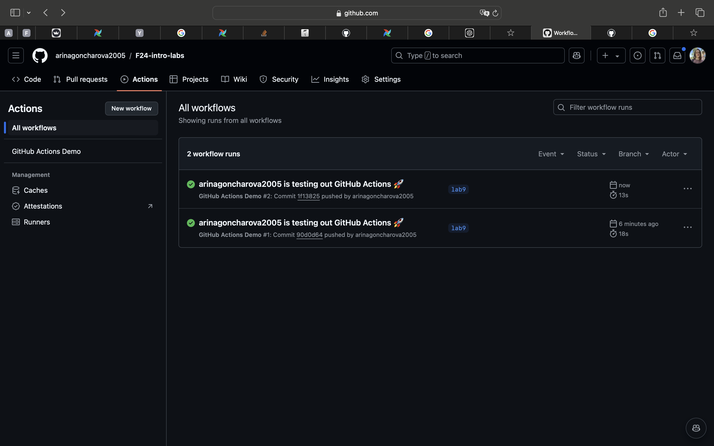
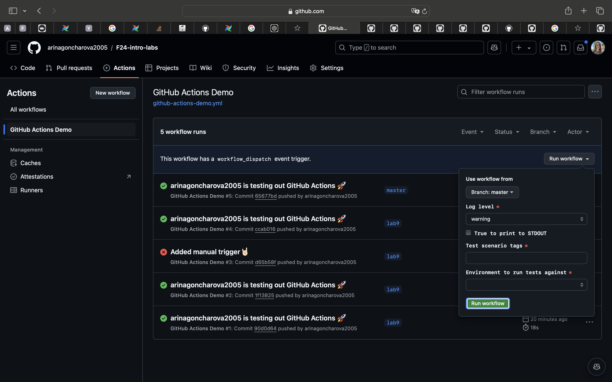
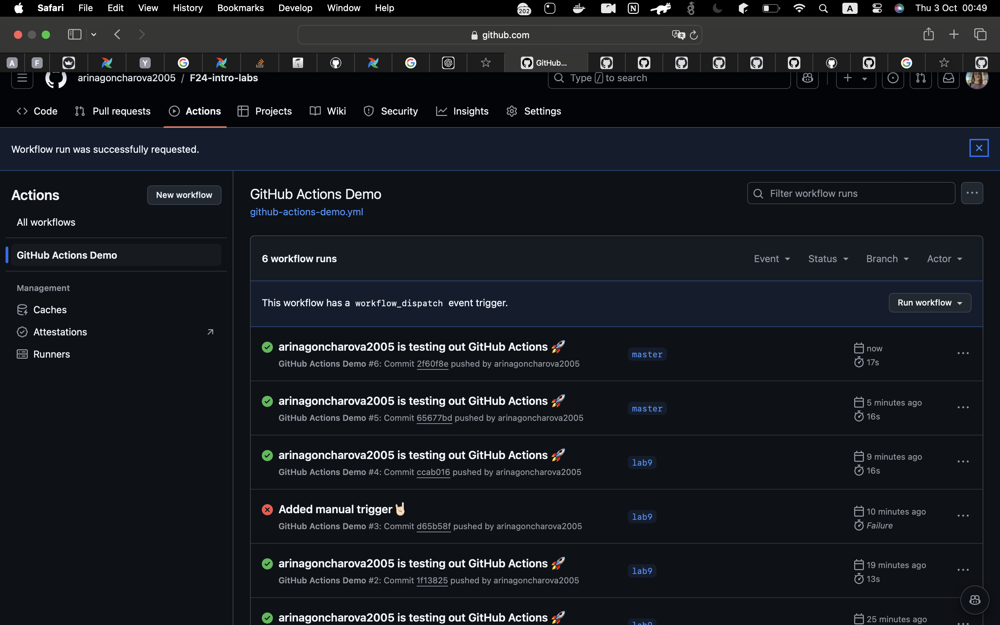
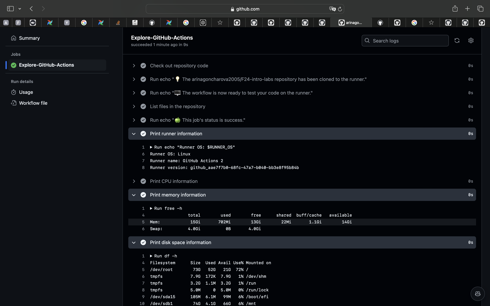

## Task 1

I followed the guide from the link: https://docs.github.com/en/actions/writing-workflows/quickstart.

1. Created directory `.github/workflows` and file `github-actions-demo.yml` inside it with the following content:

```
name: GitHub Actions Demo
run-name: ${{ github.actor }} is testing out GitHub Actions 🚀
on: [push]
jobs:
  Explore-GitHub-Actions:
    runs-on: ubuntu-latest
    steps:
      - run: echo "🎉 The job was automatically triggered by a ${{ github.event_name }} event."
      - run: echo "🐧 This job is now running on a ${{ runner.os }} server hosted by GitHub!"
      - run: echo "🔎 The name of your branch is ${{ github.ref }} and your repository is ${{ github.repository }}."
      - name: Check out repository code
        uses: actions/checkout@v4
      - run: echo "💡 The ${{ github.repository }} repository has been cloned to the runner."
      - run: echo "🖥️ The workflow is now ready to test your code on the runner."
      - name: List files in the repository
        run: |
          ls ${{ github.workspace }}
      - run: echo "🍏 This job's status is ${{ job.status }}."

```

3. Commited and pushed the directory to the branch lab9 on GitHub.

```
git add .github/
git commit -m "added directory"
git push origin lab9
```

4. Faced an error and modified settings of my terminal token.



5. Successfully pushed the changes.

The result was the following



6. Then, I pushed new file `submission9.md` and workflow was runned automatically and successfully 🥳

```
git add .
git commit -m "Added some changes <0001f929>"
git push origin lab9
```



## Task 2

1. To add a manual trigger I modified the content of `github-actions-demo.yml` file.

The content became the following:

```
name: GitHub Actions Demo
run-name: ${{ github.actor }} is testing out GitHub Actions 🚀
on:
  - push
  - workflow_dispatch:
    inputs:
      logLevel:
        description: "Log level"
        required: true
        default: "warning"
        type: choice
        options:
          - info
          - warning
          - debug
      print_tags:
        description: "True to print to STDOUT"
        required: true
        type: boolean
      tags:
        description: "Test scenario tags"
        required: true
        type: string
      environment:
        description: "Environment to run tests against"
        type: environment
        required: true

jobs:
  Explore-GitHub-Actions:
    runs-on: ubuntu-latest
    steps:
      - run: echo "🎉 The job was automatically triggered by a ${{ github.event_name }} event."
      - run: echo "🐧 This job is now running on a ${{ runner.os }} server hosted by GitHub!"
      - run: echo "🔎 The name of your branch is ${{ github.ref }} and your repository is ${{ github.repository }}."
      - name: Check out repository code
        uses: actions/checkout@v4
      - run: echo "💡 The ${{ github.repository }} repository has been cloned to the runner."
      - run: echo "🖥️ The workflow is now ready to test your code on the runner."
      - name: List files in the repository
        run: |
          ls ${{ github.workspace }}
      - run: echo "🍏 This job's status is ${{ job.status }}."
```

2. Then I merged the `lab9` branch into `master` because in the documentation it was stated that workflow file should be on the default branch.
3. I tried to run trigger but the last input did not allow me to choose the text. In the task it was stated that inputs for manually triggered workflows are not needed, therefore I removed them.

With inputs:

Removed inputs from the `github-actions-demo.yml`.

```
name: GitHub Actions Demo
run-name: ${{ github.actor }} is testing out GitHub Actions 🚀
on:
  push:
    branches:
      - '**'

  workflow_dispatch:

jobs:
  Explore-GitHub-Actions:
    runs-on: ubuntu-latest
    steps:
      - run: echo "🎉 The job was automatically triggered by a ${{ github.event_name }} event."
      - run: echo "🐧 This job is now running on a ${{ runner.os }} server hosted by GitHub!"
      - run: echo "🔎 The name of your branch is ${{ github.ref }} and your repository is ${{ github.repository }}."
      - name: Check out repository code
        uses: actions/checkout@v4
      - run: echo "💡 The ${{ github.repository }} repository has been cloned to the runner."
      - run: echo "🖥️ The workflow is now ready to test your code on the runner."
      - name: List files in the repository
        run: |
          ls ${{ github.workspace }}
      - run: echo "🍏 This job's status is ${{ job.status }}."
```

Successfully triggered after removing inputs:


4. To get the runner, hardware specifications, and operating system information I modified the content of the `github-actions-demo.yml`.
   The content became the following:

```
name: GitHub Actions Demo
run-name: ${{ github.actor }} is testing out GitHub Actions 🚀
on:
  push:
    branches:
      - '**'

  workflow_dispatch:

jobs:
  Explore-GitHub-Actions:
    runs-on: ubuntu-latest
    steps:
      - run: echo "🎉 The job was automatically triggered by a ${{ github.event_name }} event."
      - run: echo "🐧 This job is now running on a ${{ runner.os }} server hosted by GitHub!"
      - run: echo "🔎 The name of your branch is ${{ github.ref }} and your repository is ${{ github.repository }}."
      - name: Check out repository code
        uses: actions/checkout@v4
      - run: echo "💡 The ${{ github.repository }} repository has been cloned to the runner."
      - run: echo "🖥️ The workflow is now ready to test your code on the runner."
      - name: List files in the repository
        run: |
          ls ${{ github.workspace }}
      - run: echo "🍏 This job's status is ${{ job.status }}."

      - name: Print runner information
        run: |
          echo "Runner OS: $RUNNER_OS"
          echo "Runner name: $RUNNER_NAME"
          echo "Runner version: $RUNNER_TRACKING_ID"

      - name: Print CPU information
        run: lscpu

      - name: Print memory information
        run: free -h

      - name: Print disk space information
        run: df -h

      - name: Print OS version information
        run: uname -a
```

### Gathered system information
1. Information about the runner.
```
Runner OS: Linux
Runner name: GitHub Actions 2
Runner version: github_aae7f7b0-68fc-47a7-b040-bb3e8f95b84b
```
2. Information about hardware.

CPU
```
Architecture:                         x86_64
CPU op-mode(s):                       32-bit, 64-bit
Address sizes:                        48 bits physical, 48 bits virtual
Byte Order:                           Little Endian
CPU(s):                               4
On-line CPU(s) list:                  0-3
Vendor ID:                            AuthenticAMD
Model name:                           AMD EPYC 7763 64-Core Processor
CPU family:                           25
Model:                                1
Thread(s) per core:                   2
Core(s) per socket:                   2
Socket(s):                            1
Stepping:                             1
BogoMIPS:                             4890.86
Flags:                                fpu vme de pse tsc msr pae mce cx8 apic sep mtrr pge mca cmov pat pse36 clflush mmx fxsr sse sse2 ht syscall nx mmxext fxsr_opt pdpe1gb rdtscp lm constant_tsc rep_good nopl tsc_reliable nonstop_tsc cpuid extd_apicid aperfmperf pni pclmulqdq ssse3 fma cx16 pcid sse4_1 sse4_2 movbe popcnt aes xsave avx f16c rdrand hypervisor lahf_lm cmp_legacy svm cr8_legacy abm sse4a misalignsse 3dnowprefetch osvw topoext vmmcall fsgsbase bmi1 avx2 smep bmi2 erms invpcid rdseed adx smap clflushopt clwb sha_ni xsaveopt xsavec xgetbv1 xsaves user_shstk clzero xsaveerptr rdpru arat npt nrip_save tsc_scale vmcb_clean flushbyasid decodeassists pausefilter pfthreshold v_vmsave_vmload umip vaes vpclmulqdq rdpid fsrm
Virtualization:                       AMD-V
Hypervisor vendor:                    Microsoft
Virtualization type:                  full
L1d cache:                            64 KiB (2 instances)
L1i cache:                            64 KiB (2 instances)
L2 cache:                             1 MiB (2 instances)
L3 cache:                             32 MiB (1 instance)
NUMA node(s):                         1
NUMA node0 CPU(s):                    0-3
Vulnerability Gather data sampling:   Not affected
Vulnerability Itlb multihit:          Not affected
Vulnerability L1tf:                   Not affected
Vulnerability Mds:                    Not affected
Vulnerability Meltdown:               Not affected
Vulnerability Mmio stale data:        Not affected
Vulnerability Reg file data sampling: Not affected
Vulnerability Retbleed:               Not affected
Vulnerability Spec rstack overflow:   Vulnerable: Safe RET, no microcode
Vulnerability Spec store bypass:      Vulnerable
Vulnerability Spectre v1:             Mitigation; usercopy/swapgs barriers and __user pointer sanitization
Vulnerability Spectre v2:             Mitigation; Retpolines; STIBP disabled; RSB filling; PBRSB-eIBRS Not affected; BHI Not affected
Vulnerability Srbds:                  Not affected
Vulnerability Tsx async abort:        Not affected
```
Memory
```
              total        used        free      shared  buff/cache   available
Mem:            15Gi       702Mi        13Gi        22Mi       1.1Gi        14Gi
Swap:          4.0Gi          0B       4.0Gi
```
Disk space
```
Filesystem      Size  Used Avail Use% Mounted on
/dev/root        73G   52G   21G  72% /
tmpfs           7.9G  172K  7.9G   1% /dev/shm
tmpfs           3.2G  1.1M  3.2G   1% /run
tmpfs           5.0M     0  5.0M   0% /run/lock
/dev/sda15      105M  6.1M   99M   6% /boot/efi
/dev/sdb1        74G  4.1G   66G   6% /mnt
tmpfs           1.6G   12K  1.6G   1% /run/user/1001
```
3. Information about operating system.
```
Linux fv-az847-394 6.8.0-1014-azure #16~22.04.1-Ubuntu SMP Thu Aug 15 21:31:41 UTC 2024 x86_64 x86_64 x86_64 GNU/Linux
```
