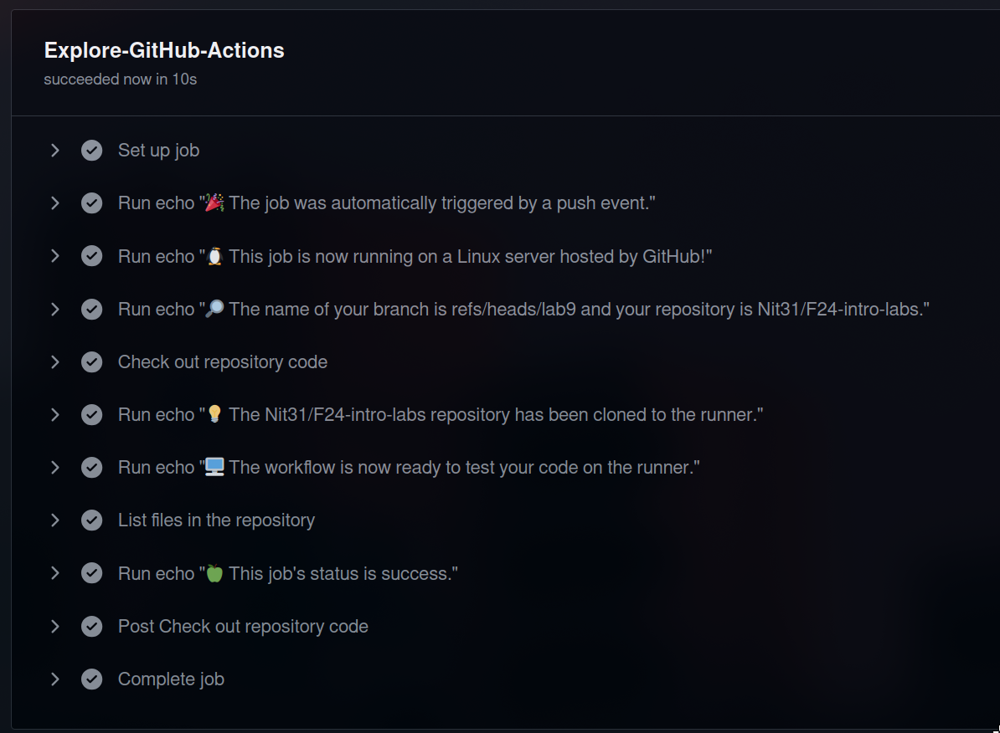

# Task 1: Create GitHub Actions Pipeline

1) I have created `.github/workflows/github-actions-demo.yml` file in the root directory of the repository.
2) Filled in the config provided in the tutorial
```
name: GitHub Actions Demo
run-name: ${{ github.actor }} is testing out GitHub Actions 🚀
on: [push]
jobs:
  Explore-GitHub-Actions:
    runs-on: ubuntu-latest
    steps:
      - run: echo "🎉 The job was automatically triggered by a ${{ github.event_name }} event."
      - run: echo "🐧 This job is now running on a ${{ runner.os }} server hosted by GitHub!"
      - run: echo "🔎 The name of your branch is ${{ github.ref }} and your repository is ${{ github.repository }}."
      - name: Check out repository code
        uses: actions/checkout@v4
      - run: echo "💡 The ${{ github.repository }} repository has been cloned to the runner."
      - run: echo "🖥️ The workflow is now ready to test your code on the runner."
      - name: List files in the repository
        run: |
          ls ${{ github.workspace }}
      - run: echo "🍏 This job's status is ${{ job.status }}."
```

This GitHub Actions workflow triggers on a push event and runs on an Ubuntu server. It checks out the repository code, 
displays information about the event, runner, branch, and repository, lists the repository files, and reports the job's status.

3) Commited and pushed the changes
4) Test has been performed in 21 seconds and passed. In each cell I could see the output


# Task 2: Gathering System Information and Manual Triggering

1) Configuring manual triggering

I have added a workflow_dispatch event, which allows the workflow to be triggered manually in addition to the push event
```
...
on:
  push:
  workflow_dispatch:  # Added to allow manual triggering
...
```
Now I can trigger the workflow manually in the Actions tab.

2) Gather System Information
```
...
- name: Gather system information
run: |
  echo "Collecting system information..."
  echo "OS and Kernel Version:"
  uname -a
  echo "Disk Space Information:"
  df -h
  echo "CPU Information:"
  lscpu
...
```

The output is as follows: