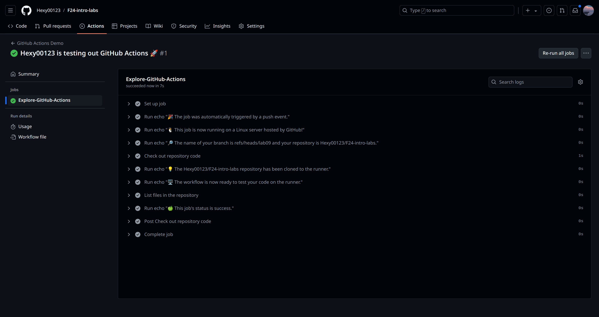

# Introduction to DevOps Lab 9
## Ruslan Izmailov B22-DS-01 

### Task 1: Create Your First GitHub Actions Pipeline

#### 1. Create directory to pipeline configs: 
```sh
> mkdir -p .github/workflows 
```

#### 2. Create pipeline config: 
```sh
touch .github/workflows/github-actions-demo.yml
```

#### 3. Write a pipeline: 
Just put the following content to github-actions-demo.yml.  

```sh
name: GitHub Actions Demo
run-name: ${{ github.actor }} is testing out GitHub Actions 🚀
on: [push]
jobs:
  Explore-GitHub-Actions:
    runs-on: ubuntu-latest
    steps:
      - run: echo "🎉 The job was automatically triggered by a ${{ github.event_name }} event."
      - run: echo "🐧 This job is now running on a ${{ runner.os }} server hosted by GitHub!"
      - run: echo "🔎 The name of your branch is ${{ github.ref }} and your repository is ${{ github.repository }}."
      - name: Check out repository code
        uses: actions/checkout@v4
      - run: echo "💡 The ${{ github.repository }} repository has been cloned to the runner."
      - run: echo "🖥️ The workflow is now ready to test your code on the runner."
      - name: List files in the repository
        run: |
          ls ${{ github.workspace }}
      - run: echo "🍏 This job's status is ${{ job.status }}."
```

#### 4. Key concepts: 
1. Automation: With help of GitHub actions there can be automated lots of development processes such as code testing, ml-models validation, deployment. 

2. Workflows: A workflow is a configurable automated process that will run one or more jobs. Workflows are defined by a YAML files in repository and will run by the specified trigger. 

3. Jobs: A job is a set of steps in a workflow that is executed on the same runner using the same evironment. There can be defined some dependencies between jobs and created a build matrices for jobs (e.g. test code in several OS types).


#### 5. Results: 



### Task 2: Gathering System Information and Manual Triggering

#### 1. Setup manual trigger

To setup manual trigger, I have replaced the section: 
```yaml
on: [push] 
```  
on: 
```yaml
on: 
  workflow_dispatch:
```

#### 2. Gather System Information:

To add additional step, I have added one more step for the existing job: 

```yaml
- name: Get System Information
    run: |
        echo "Runner:"
        uname -a
        echo "Hardware:"
        sudo lshw -short
        echo "Operating system:"
        lsb_release -a
```

#### 3. Solving problems: 
After I pushed step 2 the button to mannually trigeger workflow does not appear. Then I found that workflow should be in the master branch, so I copied it there.  