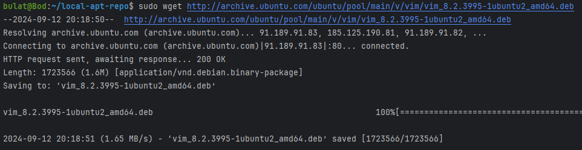
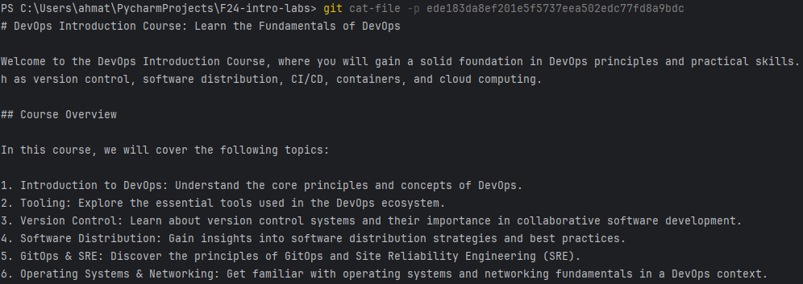

## Task 1: Create Your First GitHub Actions Pipeline
### Steps:
1. I have created .github/workflows/github-actions-demo.yml in separate branch (after that merged to master for the 2 task) with the following content:
```yaml
name: GitHub Actions Demo
run-name: ${{ github.actor }} is testing out GitHub Actions 🚀
on: [push]
jobs:
  Explore-GitHub-Actions:
    runs-on: ubuntu-latest
    steps:
      - run: echo "🎉 The job was automatically triggered by a ${{ github.event_name }} event."
      - run: echo "🐧 This job is now running on a ${{ runner.os }} server hosted by GitHub!"
      - run: echo "🔎 The name of your branch is ${{ github.ref }} and your repository is ${{ github.repository }}."
      - name: Check out repository code
        uses: actions/checkout@v4
      - run: echo "💡 The ${{ github.repository }} repository has been cloned to the runner."
      - run: echo "🖥️ The workflow is now ready to test your code on the runner."
      - name: List files in the repository
        run: |
          ls ${{ github.workspace }}
      - run: echo "🍏 This job's status is ${{ job.status }}."
```

2. Then I click "Propose changes" button and go to Actions page:


3. Then I pushed 'test.py' file with hello world inside:

It creates an action with the same jobs:


### Key concepts:
GitHub Actions is a CI/CD platform for automating build, test, and deployment pipelines. It allows workflows* to run tests on repository changes or deploy merged pull requests.

* **Workflows:** A workflow is an automated, configurable process that runs one or more jobs*. Defined in YAML files within the repository, workflows are triggered based on specific conditions.


* **Jobs:** A job consists of a series of steps within a workflow, executed on the runner.

## Task 2: Gathering System Information and Manual Triggering

1. **Configure a Manual Trigger**:

I decided to add trigger on 'on' list:
Now I have this button!
Which typically triggers the same jobs:

2. **Gather System Information**:

I just added one more job with multiple commands in run for collecting and printing needed information:


The output:


...

