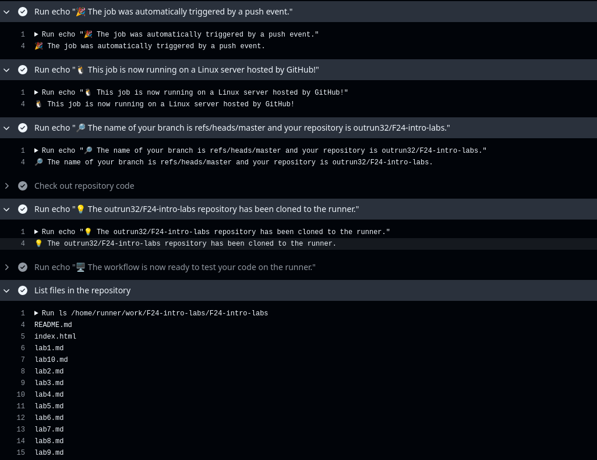

# Creating simple GitHub actions Pipeline

Following the Github's tutorial, I set up a sample worklflow and commited it's creation directly to main branch using GitHub's GUI. Upon it's commit, the action of commiting the workflow triggered the workflow itself and we can observe the execution in GitHub:


As we can see, it has different outputs such as list of files in repository, the authors name and etc. It doesn't seem to have any errors.

# Adding a manual trigger

I have modified the github-actions-demo.yml to add manual trigger and system info:

```yml
name: GitHub Actions Demo
run-name: ${{ github.actor }} is testing out GitHub Actions 🚀
on: [push, workflow_dispatch]
jobs:
  Explore-GitHub-Actions:
    runs-on: ubuntu-latest
    steps:
      - run: echo "🎉 The job was automatically triggered by a ${{ github.event_name }} event."
      - run: echo "🐧 This job is now running on a ${{ runner.os }} server hosted by GitHub!"
      - run: echo "🔎 The name of your branch is ${{ github.ref }} and your repository is ${{ github.repository }}."
      - name: Check out repository code
        uses: actions/checkout@v4
      - run: echo "💡 The ${{ github.repository }} repository has been cloned to the runner."
      - run: echo "🖥️ The workflow is now ready to test your code on the runner."
      - name: List files in the repository
        run: |
          ls ${{ github.workspace }}
      - run: echo "🍏 This job's status is ${{ job.status }}."
      - name: Gather system information
        run: |
          echo "🌐 Gathering system information..."
          uname -a
          lscpu
          free -h
          df -h
```

Upon analyzing the output in github, we can see the system information which executed the workflow:

```
Linux fv-az1778-763 6.8.0-1014-azure #16~22.04.1-Ubuntu SMP Thu Aug 15 21:31:41 UTC 2024 x86_64 x86_64 x86_64 GNU/Linux
Architecture:                         x86_64
CPU op-mode(s):                       32-bit, 64-bit
```
Which seems to be a simple Azure container.