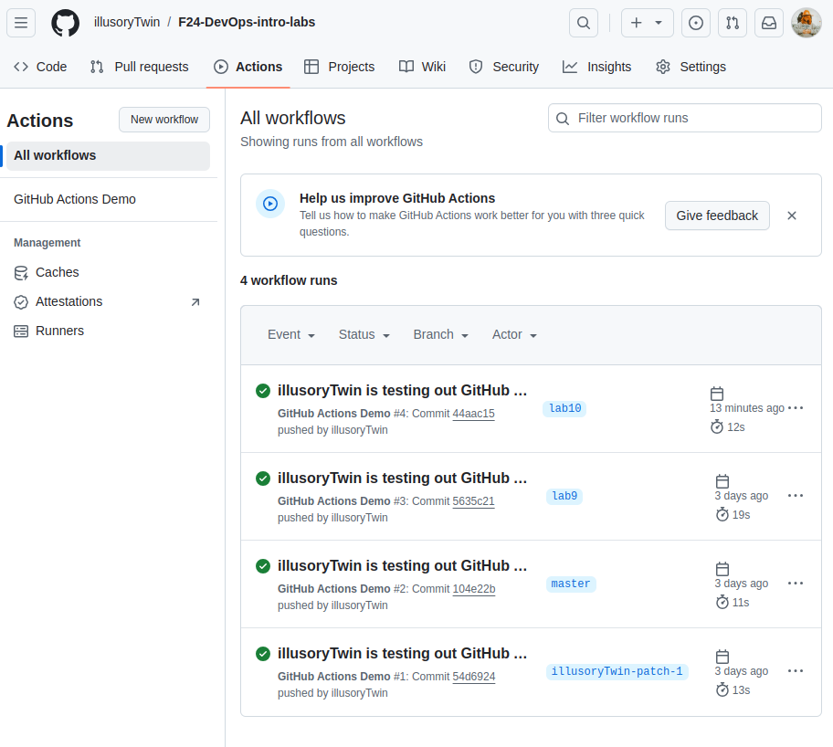
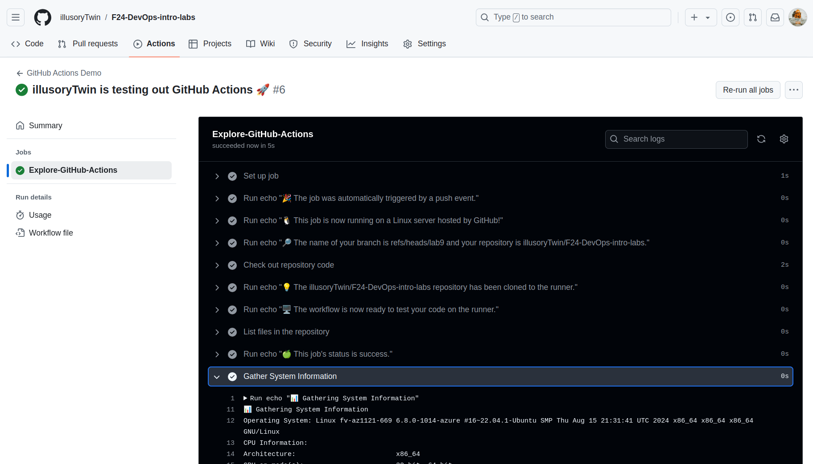
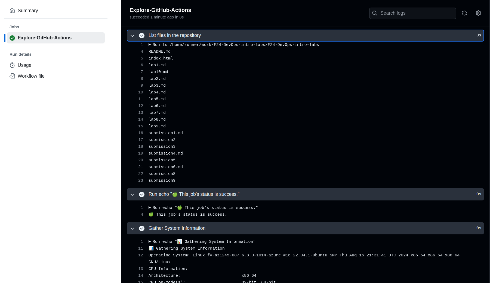
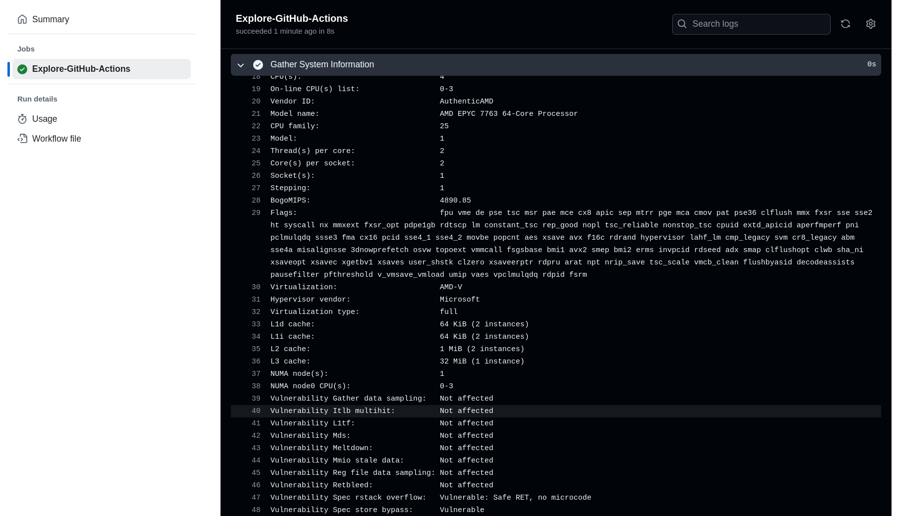
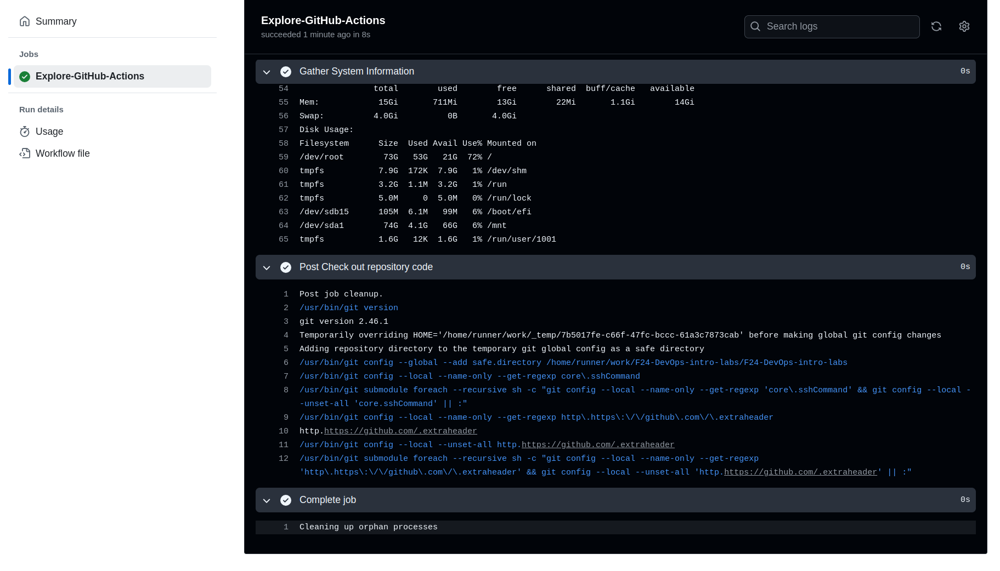
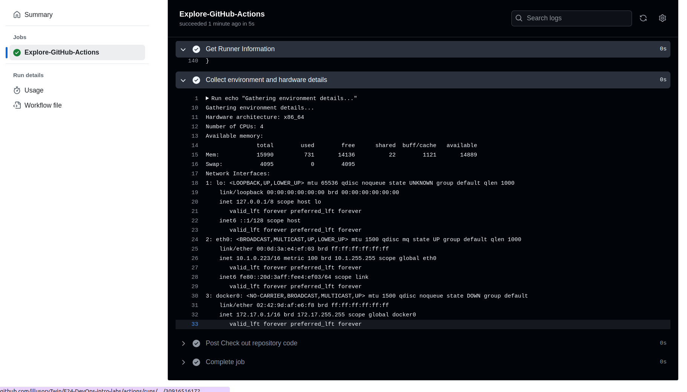
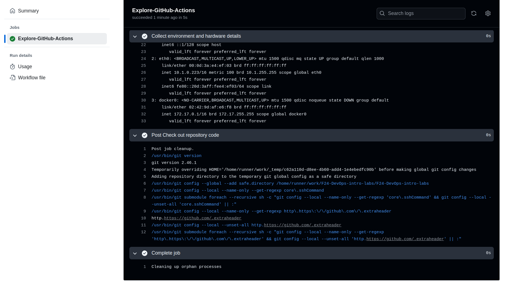

# CI/CD Lab - GitHub Actions

## Task 1 - Create Your First GitHub Actions Pipeline

For setting up GitHub actions pipeline I followed instructions from here:

https://docs.github.com/en/actions/writing-workflows/quickstart

I created `.github/workflows/github-actions-demo.yml` file with the following content:

```
name: GitHub Actions Demo
run-name: ${{ github.actor }} is testing out GitHub Actions 🚀
on: [push]
jobs:
  Explore-GitHub-Actions:
    runs-on: ubuntu-latest
    steps:
      - run: echo "🎉 The job was automatically triggered by a ${{ github.event_name }} event."
      - run: echo "🐧 This job is now running on a ${{ runner.os }} server hosted by GitHub!"
      - run: echo "🔎 The name of your branch is ${{ github.ref }} and your repository is ${{ github.repository }}."
      - name: Check out repository code
        uses: actions/checkout@v4
      - run: echo "💡 The ${{ github.repository }} repository has been cloned to the runner."
      - run: echo "🖥️ The workflow is now ready to test your code on the runner."
      - name: List files in the repository
        run: |
          ls ${{ github.workspace }}
      - run: echo "🍏 This job's status is ${{ job.status }}."

```

After this, I can check the workflow results in github repository page.



And logs as well:


The workflow ran successfully without any errors.

## Task 2 - Gathering System Information and Manual Triggering

In this task, I was supposed to include manual triggering and system information gathering in my workflow.

**Manual triggering** in GitHub Actions refers to the ability to run a workflow manually through the GitHub UI (by clicking buttons in the GitHub UI). It can be set with `workflow_dispatch`.

So, the current version of the workflow is as follows:

```
name: GitHub Actions Demo
run-name: ${{ github.actor }} is testing out GitHub Actions 🚀
on: 
  push:
  workflow_dispatch:

jobs:
  Explore-GitHub-Actions:
    runs-on: ubuntu-latest
    steps:
      - run: echo "🎉 The job was automatically triggered by a ${{ github.event_name }} event."
      - run: echo "🐧 This job is now running on a ${{ runner.os }} server hosted by GitHub!"
      - run: echo "🔎 The name of your branch is ${{ github.ref }} and your repository is ${{ github.repository }}."
      - name: Check out repository code
        uses: actions/checkout@v4
      - run: echo "💡 The ${{ github.repository }} repository has been cloned to the runner."
      - run: echo "🖥️ The workflow is now ready to test your code on the runner."
      - name: List files in the repository
        run: |
          ls ${{ github.workspace }}
      - run: echo "🍏 This job's status is ${{ job.status }}."

      # Gather system information
      - name: Gather System Information
        run: |
          echo "📊 Gathering System Information"
          echo "Operating System: $(uname -a)"
          echo "CPU Information:"
          lscpu
          echo "Memory Information:"
          free -h
          echo "Disk Usage:"
          df -h
      
      # Collect detailed information about the GitHub runner
      - name: Get Runner Information
        uses: actions/github-script@v6
        with:
          script: |
            console.log("Runner Context: ");
            console.log(JSON.stringify(process.env, null, 2));
      
      # Use action to gather hardware and environment details
      - name: Collect environment and hardware details
        run: |
          echo "Gathering environment details..."
          echo "Hardware architecture: $(uname -m)"
          echo "Number of CPUs: $(nproc)"
          echo "Available memory:"
          free -m
          echo "Network Interfaces:"
          ip addr
```

The changes I made:

- **Manual triggering** (`workflow_dispatch`)
  
The `on` section now includes `workflow_dispatch` to allow for manual workflow execution in addition to the push event.

- **System information gathering** 
Added functionality to:

  - Retrieve OS details using `uname -a`.
  - Print CPU information using `lscpu`.
  - Show memory information using `free -h`.
  - Display disk space usage using `df -h`.


Also, added functionality to:

  - Print detailed environment information from the GitHub runner context, like environment variables.
  - Print Hardware and Environment Details:
  Gather hardware architecture (`uname -m`), the number of CPUs (`nproc`), available memory (`free -m`), and network interfaces (`ip addr`).


So, now I see the following output of the workflow:








### Brief summary of the workflow results:

**System Information:**

OS: Ubuntu 22.04 running on Linux kernel 6.8.0-1014-azure.

CPU: AMD EPYC 7763 with 4 virtual CPUs (2 cores per socket, 2 threads per core).

Memory: 15 GB total, 722 MB used, 13 GB free.

Disk Usage:
Root partition: 73 GB total, 53 GB used (72%).
Swap: 4 GB available, unused.

**CPU Vulnerabilities:**

Not affected by most common vulnerabilities like Spectre, Meltdown, and others, except for Spectre v1 and Spectre v2, which are mitigated.

**Virtualization:**

The system is virtualized on Azure with full virtualization using AMD-V.


**The workflow ran successfully, gathering system metrics, and printing the environment variables for the runner used in the GitHub Actions workflow.**


