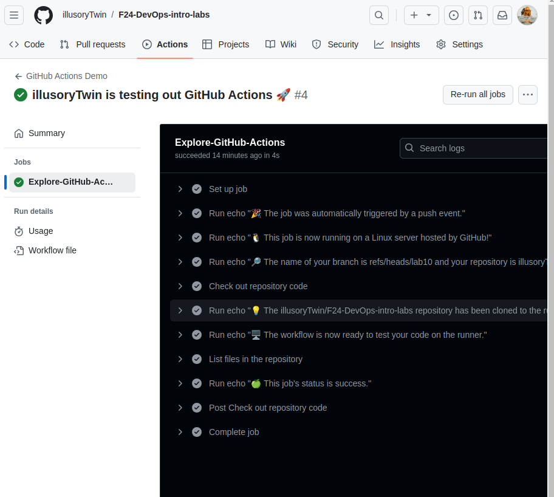

# CI/CD Lab - GitHub Actions

## Task 1 - Create Your First GitHub Actions Pipeline

For setting up GitHub actions pipeline I followed instructions from here:

https://docs.github.com/en/actions/writing-workflows/quickstart

I created `.github/workflows/github-actions-demo.yml` file with the following content:

```
name: GitHub Actions Demo
run-name: ${{ github.actor }} is testing out GitHub Actions 🚀
on: [push]
jobs:
  Explore-GitHub-Actions:
    runs-on: ubuntu-latest
    steps:
      - run: echo "🎉 The job was automatically triggered by a ${{ github.event_name }} event."
      - run: echo "🐧 This job is now running on a ${{ runner.os }} server hosted by GitHub!"
      - run: echo "🔎 The name of your branch is ${{ github.ref }} and your repository is ${{ github.repository }}."
      - name: Check out repository code
        uses: actions/checkout@v4
      - run: echo "💡 The ${{ github.repository }} repository has been cloned to the runner."
      - run: echo "🖥️ The workflow is now ready to test your code on the runner."
      - name: List files in the repository
        run: |
          ls ${{ github.workspace }}
      - run: echo "🍏 This job's status is ${{ job.status }}."

```

After this, I can check the workflow results in github repository page.


And logs as well:



## Task 2 - Gathering System Information and Manual Triggering

In this task, I was supposed to include manual triggering and system information gathering in my workflow.


So, the current version of the workflow is as follows:

```
name: GitHub Actions Demo
run-name: ${{ github.actor }} is testing out GitHub Actions 🚀
on: 
  push:
  workflow_dispatch:

jobs:
  Explore-GitHub-Actions:
    runs-on: ubuntu-latest
    steps:
      - run: echo "🎉 The job was automatically triggered by a ${{ github.event_name }} event."
      - run: echo "🐧 This job is now running on a ${{ runner.os }} server hosted by GitHub!"
      - run: echo "🔎 The name of your branch is ${{ github.ref }} and your repository is ${{ github.repository }}."
      - name: Check out repository code
        uses: actions/checkout@v4
      - run: echo "💡 The ${{ github.repository }} repository has been cloned to the runner."
      - run: echo "🖥️ The workflow is now ready to test your code on the runner."
      - name: List files in the repository
        run: |
          ls ${{ github.workspace }}
      - run: echo "🍏 This job's status is ${{ job.status }}."

      # Gather system information
      - name: Gather System Information
        run: |
          echo "📊 Gathering System Information"
          echo "Operating System: $(uname -a)"
          echo "CPU Information:"
          lscpu
          echo "Memory Information:"
          free -h
          echo "Disk Usage:"
          df -h
```

The changes I made:

- **Manual triggering** (`workflow_dispatch`)
  
The `on` section now includes `workflow_dispatch` to allow for manual workflow execution in addition to the push event.

- **System information gathering** 
Added functionality to:

  - Retrieve OS details using `uname -a`.
  - Print CPU information using `lscpu`.
  - Show memory information using `free -h`.
  - Display disk space usage using `df -h`.